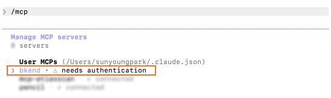
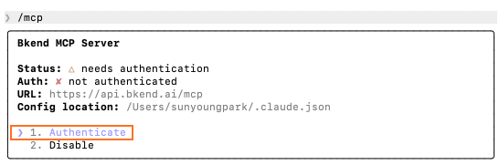
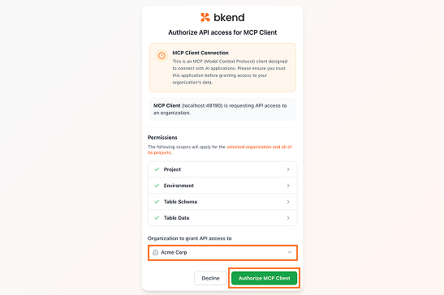
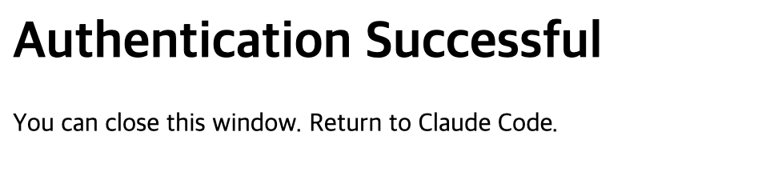
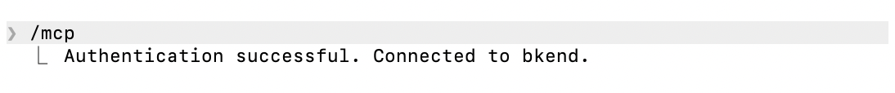

# bkend MCP 서버 설정


💡 AI 도구에 bkend MCP 서버를 설치하고 인증하는 방법을 안내합니다.


## 사전 준비

- bkend 계정 및 Organization ([빠른 시작 가이드](../getting-started/02-quickstart.md)에서 생성)
- AI 도구 설치 (Claude Code, Cursor, VS Code 등)

***

## 1단계: MCP 서버 추가하기 (설치)



터미널에서 다음 명령을 실행하세요:

```bash
claude mcp add --scope user bkend --transport http https://api.bkend.ai/mcp
```

또는 `.mcp.json` 파일에 직접 추가할 수 있습니다:

```json
{
  "mcpServers": {
    "bkend": {
      "type": "http",
      "url": "https://api.bkend.ai/mcp"
    }
  }
}
```



Cursor MCP 설정 파일을 여세요:



```text
~/.cursor/mcp.json
```


```text
{프로젝트 루트}/.cursor/mcp.json
```



다음 내용을 추가하세요:

```json
{
  "mcpServers": {
    "mcp-bkend": {
      "type": "http",
      "url": "https://api.bkend.ai/mcp"
    }
  }
}
```

파일을 저장한 후 Cursor를 재시작하세요.



VS Code `settings.json`에 다음 내용을 추가하세요:

```json
{
  "mcp": {
    "servers": {
      "mcp-bkend": {
        "type": "http",
        "url": "https://api.bkend.ai/mcp"
      }
    }
  }
}
```



stdio 방식만 지원하는 도구에서는 `mcp-remote`를 사용하세요:

```json
{
  "mcpServers": {
    "bkend": {
      "command": "mcp-remote",
      "args": [
        "https://api.bkend.ai/mcp"
      ]
    }
  }
}
```


💡 `mcp-remote`는 Node.js 18 이상이 필요합니다.


MCP를 지원하는 도구에서는 URL만으로도 연결할 수 있습니다:

```text
https://api.bkend.ai/mcp
```



***

## 2단계: 인증하기

MCP 서버를 설정한 후 인증이 필요합니다.



일반 터미널(IDE 확장이 아닌)에서 다음을 실행하세요:

```bash
claude /mcp
```

**bkend** 서버를 선택한 후, **Authenticate**를 선택하여 인증을 시작하세요.

<figure><figcaption><p>bkend 서버의 "needs authentication" 상태</p></figcaption></figure>

<figure><figcaption><p>"Authenticate"를 선택하여 시작</p></figcaption></figure>



AI Chat에서 bkend 관련 요청을 하면 브라우저가 자동으로 열려 인증이 시작됩니다.



### 인증 흐름

인증이 시작되면:

1. **브라우저가 자동으로 열립니다**
2. bkend에 **로그인**하세요
3. **Organization을 선택**하고 권한을 승인하세요
4. **도구로 돌아가세요** — 연결이 활성화됩니다

<figure><figcaption><p>Organization을 선택하고 권한을 승인</p></figcaption></figure>

<figure><figcaption><p>인증 성공 — 이 창을 닫아도 됩니다</p></figcaption></figure>

<figure><figcaption><p>터미널에서 "Connected to bkend" 확인</p></figcaption></figure>


💡 인증 프로토콜(OAuth 2.1, 토큰 관리)에 대한 상세 내용은 [OAuth 2.1 인증](05-oauth.md)을 참고하세요.


***

## 3단계: 연결 확인하기

AI 도구에 다음과 같이 요청하세요:

```text
"bkend에 연결된 프로젝트 목록을 보여줘"
```

프로젝트 목록이 표시되면 설정이 완료된 것입니다.

***

## 설정 관리하기

### 등록된 MCP 서버 확인하기 (Claude Code)

```bash
claude mcp list
```

### MCP 서버 제거하기 (Claude Code)

```bash
claude mcp remove bkend
```

### MCP 서버 업데이트하기 (Claude Code)

```bash
claude mcp remove bkend
claude mcp add --scope user bkend --transport http https://api.bkend.ai/mcp
```

***

## 문제 해결

| 증상 | 해결 방법 |
|------|----------|
| `/mcp`에서 **failed** 표시 | URL이 올바른지 확인한 후, 서버를 제거하고 다시 추가하세요 |
| 브라우저가 열리지 않음 | `/mcp`에서 **Authenticate**를 선택했는지 확인하세요 |
| **needs authentication**이 계속 표시 | 브라우저에서 로그인과 Organization 선택을 완료하세요 |
| **Token expired** 오류 | Refresh Token이 만료(30일)된 경우입니다. 도구를 재시작하면 재인증이 자동으로 진행됩니다 |
| 도구가 표시되지 않음 | bkend 콘솔에서 Organization이 있는지 확인하세요. 서버를 제거하고 다시 추가하세요 |
| VPN/방화벽 차단 | `https://api.bkend.ai/mcp`에 대한 HTTPS 아웃바운드 연결이 허용되는지 확인하세요 |
| `mcp-remote` 연결 실패 | Node.js 18 이상이 설치되어 있는지 확인하세요: `npx mcp-remote --version` |


⚠️ 회사 네트워크나 VPN 환경에서는 `https://api.bkend.ai/mcp`에 대한 HTTPS 아웃바운드 연결이 차단될 수 있습니다. 연결 실패 시 네트워크 관리자에게 해당 도메인의 허용 여부를 확인하세요.


***

## 다음 단계

- [사용법](03-usage.md) — 프롬프트 예시와 모범 사례
- [OAuth 2.1 인증](05-oauth.md) — 인증 흐름 상세
- [MCP 도구 개요](01-overview.md) — 제공되는 도구와 리소스
