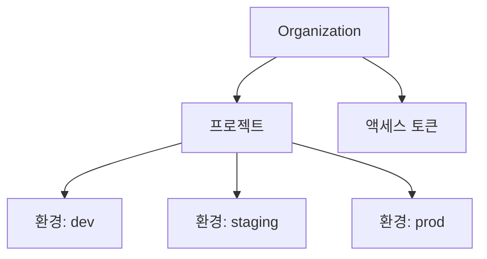
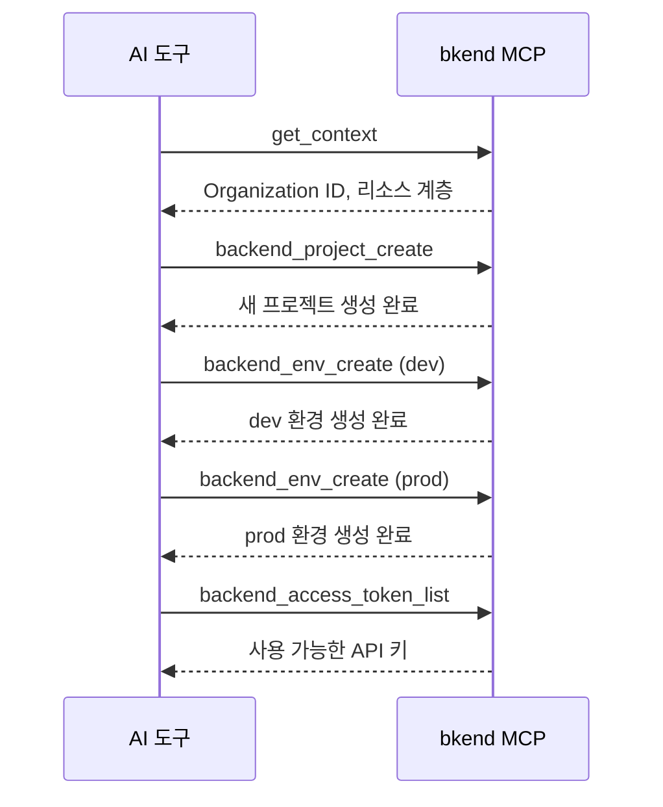

# 프로젝트 도구


💡 Organization, 프로젝트, 환경, 액세스 토큰을 관리하는 MCP 도구를 안내합니다.


## 개요

프로젝트 도구는 bkend의 리소스 계층(Organization > 프로젝트 > 환경)을 관리합니다. 모든 도구는 `backend_` 접두사를 사용합니다.



***

## Organization 도구

### backend_org_list

접근 가능한 Organization 목록을 조회합니다.

| 항목 | 값 |
|------|-----|
| 파라미터 | 없음 |

### backend_org_get

특정 Organization의 상세 정보를 조회합니다.

| 파라미터 | 타입 | 필수 | 설명 |
|----------|------|:----:|------|
| `organizationId` | string | Yes | Organization ID |

***

## 프로젝트 도구

### backend_project_list

현재 사용자가 접근 가능한 프로젝트 목록을 조회합니다.

| 항목 | 값 |
|------|-----|
| 파라미터 | 없음 (Organization 기준으로 자동 필터링) |

### backend_project_get

프로젝트 상세 정보를 조회합니다.

| 파라미터 | 타입 | 필수 | 설명 |
|----------|------|:----:|------|
| `projectId` | string | Yes | 프로젝트 ID |

### backend_project_create

새 프로젝트를 생성합니다.

| 파라미터 | 타입 | 필수 | 설명 |
|----------|------|:----:|------|
| `body` | object | Yes | 프로젝트 생성 데이터 |

#### body 구조

```json
{
  "body": {
    "organizationId": "org_abc123",
    "slug": "my-app",
    "name": "My App",
    "primaryCloud": "aws",
    "primaryRegion": "ap-northeast-2"
  }
}
```

| 필드 | 타입 | 필수 | 설명 |
|------|------|:----:|------|
| `organizationId` | string | Yes | Organization ID |
| `slug` | string | Yes | URL 친화적 고유 슬러그 |
| `name` | string | Yes | 프로젝트 이름 |
| `primaryCloud` | string | Yes | 클라우드 제공자 (`aws`, `gcp`, `azu`) |
| `primaryRegion` | string | Yes | 배포 리전 |
| `description` | string | | 프로젝트 설명 |

### backend_project_update

프로젝트 정보를 수정합니다.

| 파라미터 | 타입 | 필수 | 설명 |
|----------|------|:----:|------|
| `projectId` | string | Yes | 프로젝트 ID |
| `body` | object | | 수정할 필드 |

```json
{
  "projectId": "proj_xyz789",
  "body": {
    "name": "새 프로젝트 이름",
    "description": "수정된 설명"
  }
}
```

***

## 환경 도구

### backend_env_list

현재 사용자가 접근 가능한 환경 목록을 조회합니다.

| 항목 | 값 |
|------|-----|
| 파라미터 | 없음 (Organization 기준으로 자동 필터링) |

### backend_env_get

환경 상세 정보를 조회합니다.

| 파라미터 | 타입 | 필수 | 설명 |
|----------|------|:----:|------|
| `environmentId` | string | Yes | 환경 ID |

### backend_env_create

새 환경을 생성합니다.

| 파라미터 | 타입 | 필수 | 설명 |
|----------|------|:----:|------|
| `body` | object | Yes | 환경 생성 데이터 |

```json
{
  "body": {
    "projectId": "proj_xyz789",
    "environment": "dev",
    "environmentType": "dev"
  }
}
```

| 필드 | 타입 | 필수 | 설명 |
|------|------|:----:|------|
| `projectId` | string | Yes | 프로젝트 ID |
| `environment` | string | Yes | 환경 이름 (예: `dev`, `staging`, `prod`) |
| `environmentType` | string | Yes | 타입 (`dev`, `staging`, `prod`, `custom`) |

***

## 액세스 토큰 도구

### backend_access_token_list

Organization의 액세스 토큰 목록을 조회합니다.

| 항목 | 값 |
|------|-----|
| 파라미터 | 없음 (Organization 기준으로 자동 필터링) |

### backend_access_token_get

액세스 토큰 상세 정보를 조회합니다. 보안을 위해 토큰 값은 포함되지 않습니다.

| 파라미터 | 타입 | 필수 | 설명 |
|----------|------|:----:|------|
| `accessTokenId` | string | Yes | 액세스 토큰 ID |


💡 액세스 토큰은 콘솔에서 생성하고 관리합니다. MCP는 토큰 정보에 대한 읽기 전용 접근만 제공합니다.


***

## 사용 흐름

일반적인 프로젝트 설정 흐름:



***

## 다음 단계

- [테이블 도구](04-table-tools.md) — 테이블, 필드, 인덱스 관리
- [데이터 도구](05-data-tools.md) — REST API를 통한 데이터 CRUD
- [컨텍스트](02-context.md) — ID 조회 방법
