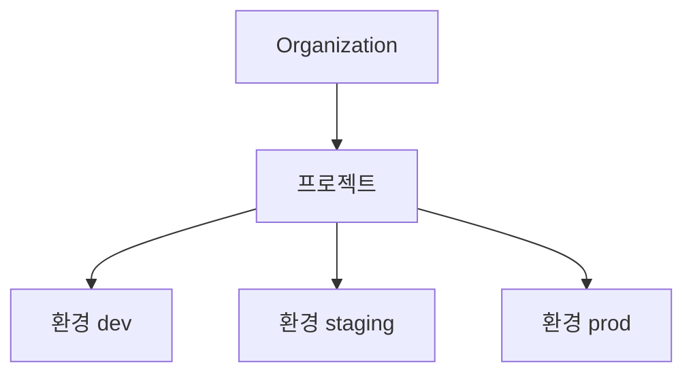
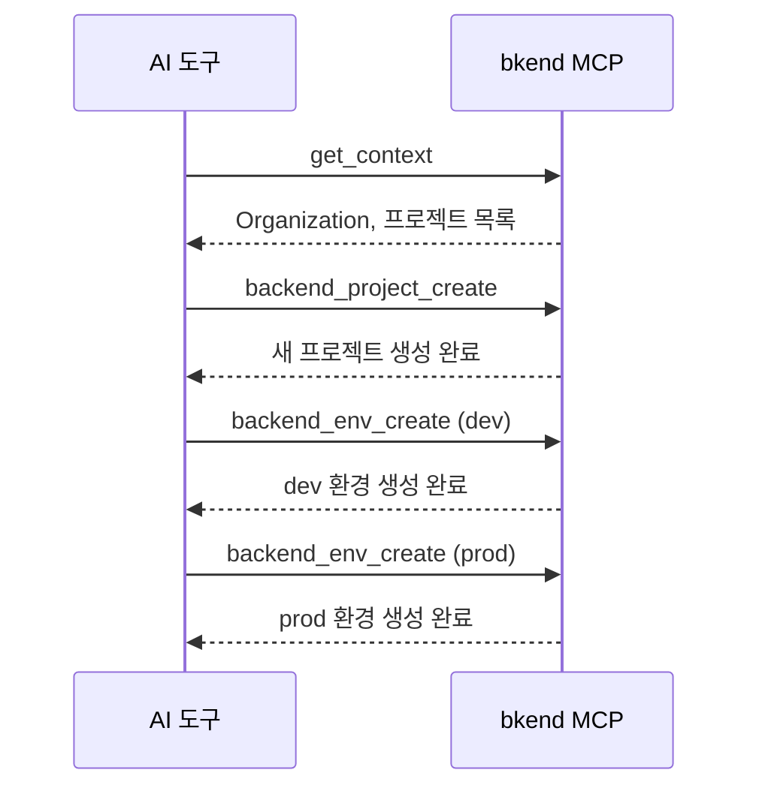

# 프로젝트 도구


💡 Organization, 프로젝트, 환경을 관리하는 MCP 도구를 안내합니다.


## 개요

프로젝트 도구는 bkend의 리소스 계층(Organization → 프로젝트 → 환경)을 관리합니다. 모든 도구는 `backend_` 접두사를 사용합니다.



***

## Organization 도구

### backend_org_list

접근 가능한 Organization 목록을 조회합니다.

| 항목 | 값 |
|------|-----|
| 파라미터 | 없음 |

#### 응답 예시

```json
{
  "organizations": [
    {
      "id": "org_abc123",
      "name": "My Organization",
      "plan": "pro"
    }
  ]
}
```

***

## 프로젝트 도구

### backend_project_list

Organization의 프로젝트 목록을 조회합니다.

| 파라미터 | 타입 | 필수 | 설명 |
|----------|------|:----:|------|
| `organizationId` | string | ✅ | Organization ID |

### backend_project_get

프로젝트 상세 정보를 조회합니다.

| 파라미터 | 타입 | 필수 | 설명 |
|----------|------|:----:|------|
| `organizationId` | string | ✅ | Organization ID |
| `projectId` | string | ✅ | 프로젝트 ID |

### backend_project_create

새 프로젝트를 생성합니다.

| 파라미터 | 타입 | 필수 | 설명 |
|----------|------|:----:|------|
| `organizationId` | string | ✅ | Organization ID |
| `name` | string | ✅ | 프로젝트 이름 |
| `description` | string | | 프로젝트 설명 |

### backend_project_update

프로젝트 정보를 수정합니다.

| 파라미터 | 타입 | 필수 | 설명 |
|----------|------|:----:|------|
| `organizationId` | string | ✅ | Organization ID |
| `projectId` | string | ✅ | 프로젝트 ID |
| `name` | string | | 변경할 이름 |
| `description` | string | | 변경할 설명 |

### backend_project_delete

프로젝트를 삭제합니다.

| 파라미터 | 타입 | 필수 | 설명 |
|----------|------|:----:|------|
| `organizationId` | string | ✅ | Organization ID |
| `projectId` | string | ✅ | 프로젝트 ID |


⚠️ 프로젝트를 삭제하면 포함된 모든 환경, 테이블, 데이터가 영구적으로 삭제됩니다. 이 작업은 되돌릴 수 없습니다.


***

## 환경 도구

### backend_env_list

프로젝트의 환경 목록을 조회합니다.

| 파라미터 | 타입 | 필수 | 설명 |
|----------|------|:----:|------|
| `organizationId` | string | ✅ | Organization ID |
| `projectId` | string | ✅ | 프로젝트 ID |

### backend_env_get

환경 상세 정보를 조회합니다.

| 파라미터 | 타입 | 필수 | 설명 |
|----------|------|:----:|------|
| `organizationId` | string | ✅ | Organization ID |
| `projectId` | string | ✅ | 프로젝트 ID |
| `environmentId` | string | ✅ | 환경 ID |

### backend_env_create

새 환경을 생성합니다.

| 파라미터 | 타입 | 필수 | 설명 |
|----------|------|:----:|------|
| `organizationId` | string | ✅ | Organization ID |
| `projectId` | string | ✅ | 프로젝트 ID |
| `name` | string | ✅ | 환경 이름 (`dev`, `staging`, `prod` 등) |

***

## 사용 흐름

일반적인 프로젝트 관리 흐름:



***

## 다음 단계

- [테이블 도구](04-table-tools.md) — 테이블, 필드, 인덱스 관리
- [데이터 도구](05-data-tools.md) — 데이터 CRUD 작업
- [컨텍스트](02-context.md) — ID 조회 방법
