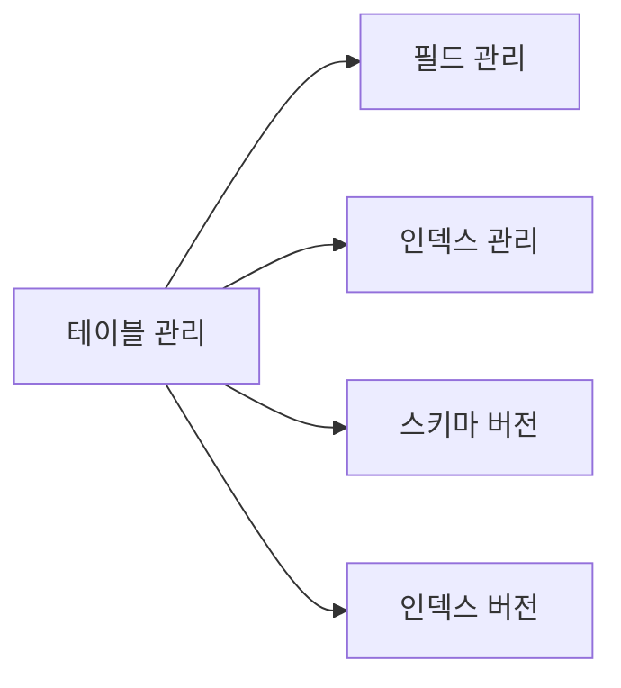
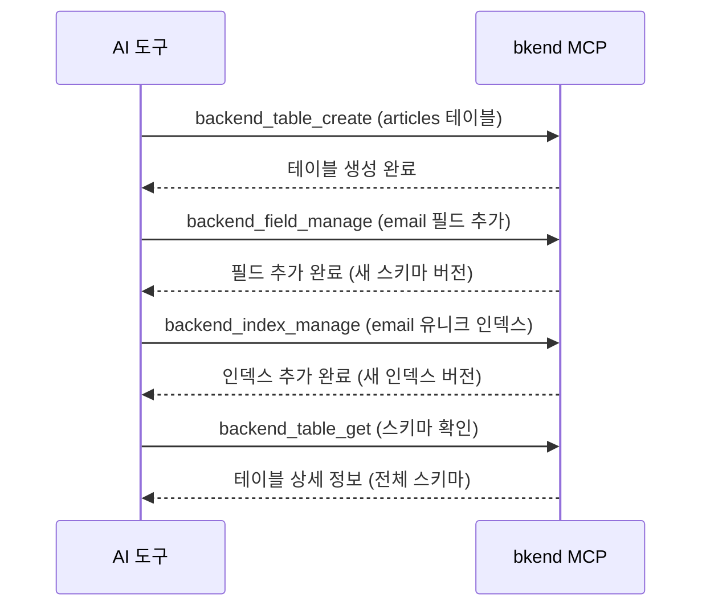

# 테이블 도구


💡 테이블, 필드, 인덱스, 스키마 버전을 관리하는 MCP 도구를 안내합니다.


## 개요

테이블 도구는 데이터베이스의 구조를 관리합니다. 테이블 생성부터 필드 추가, 인덱스 설정, 버전 이력 조회까지 수행합니다.



***

## 테이블 도구

### backend_table_list

현재 사용자가 접근 가능한 테이블 목록을 조회합니다.

| 항목 | 값 |
|------|-----|
| 파라미터 | 없음 (Organization 기준으로 자동 필터링) |

### backend_table_get

테이블 상세 정보(전체 스키마 정의, 문서 수 포함)를 조회합니다.

| 파라미터 | 타입 | 필수 | 설명 |
|----------|------|:----:|------|
| `tableId` | string | Yes | 테이블 ID |

### backend_table_create

새 테이블을 생성합니다.

| 파라미터 | 타입 | 필수 | 설명 |
|----------|------|:----:|------|
| `body` | object | Yes | 테이블 생성 데이터 |

#### body 구조

```json
{
  "body": {
    "projectId": "proj_xyz789",
    "environment": "dev",
    "tableName": "articles",
    "schema": {
      "title": { "bsonType": "string" },
      "content": { "bsonType": "string" },
      "published": { "bsonType": "bool" }
    }
  }
}
```

| 필드 | 타입 | 필수 | 설명 |
|------|------|:----:|------|
| `projectId` | string | Yes | 프로젝트 ID |
| `environment` | string | Yes | 환경 이름 |
| `tableName` | string | Yes | 테이블 이름 (최대 64자) |
| `schema` | object | Yes | 테이블 스키마 (BSON 스키마 형식) |
| `displayName` | string | | 표시 이름 |
| `description` | string | | 테이블 설명 |

### backend_table_update

테이블 메타데이터를 수정합니다.

| 파라미터 | 타입 | 필수 | 설명 |
|----------|------|:----:|------|
| `tableId` | string | Yes | 테이블 ID |
| `body` | object | | 수정할 필드 |

```json
{
  "tableId": "tbl_abc123",
  "body": {
    "displayName": "블로그 글",
    "description": "블로그 글 테이블"
  }
}
```


💡 테이블 필드를 수정하려면 `backend_table_update` 대신 `backend_field_manage`를 사용하세요.


***

## 필드 도구

### backend_field_manage

테이블의 필드를 추가, 수정, 삭제합니다. 새 스키마 버전을 생성합니다.

| 파라미터 | 타입 | 필수 | 설명 |
|----------|------|:----:|------|
| `tableId` | string | Yes | 테이블 ID |
| `body` | object | | 필드 관리 작업 |

#### 필드 추가 예시

```json
{
  "tableId": "tbl_abc123",
  "body": {
    "fieldsToAddOrUpdate": {
      "email": { "bsonType": "string" },
      "age": { "bsonType": "int" }
    },
    "requiredFieldsToAdd": ["email"]
  }
}
```

#### 필드 삭제 예시

```json
{
  "tableId": "tbl_abc123",
  "body": {
    "fieldsToRemove": ["temporaryField"],
    "requiredFieldsToRemove": ["temporaryField"]
  }
}
```

| 필드 | 타입 | 설명 |
|------|------|------|
| `fieldsToAddOrUpdate` | object | 추가 또는 수정할 필드 (BSON 스키마 형식) |
| `fieldsToRemove` | string[] | 삭제할 필드 이름 |
| `requiredFieldsToAdd` | string[] | 필수 목록에 추가할 필드 이름 |
| `requiredFieldsToRemove` | string[] | 필수 목록에서 제거할 필드 이름 |

***

## 인덱스 도구

### backend_index_manage

테이블의 인덱스를 추가하거나 삭제합니다. 새 인덱스 버전을 생성합니다.

| 파라미터 | 타입 | 필수 | 설명 |
|----------|------|:----:|------|
| `tableId` | string | Yes | 테이블 ID |
| `body` | object | | 인덱스 관리 작업 |

#### 인덱스 추가 예시

```json
{
  "tableId": "tbl_abc123",
  "body": {
    "indexesToAddOrUpdate": [
      {
        "name": "email_unique",
        "fields": { "email": 1 },
        "unique": true
      }
    ]
  }
}
```

#### 인덱스 삭제 예시

```json
{
  "tableId": "tbl_abc123",
  "body": {
    "indexesToRemove": ["email_unique"]
  }
}
```

| 필드 | 타입 | 설명 |
|------|------|------|
| `indexesToAddOrUpdate` | array | 추가 또는 수정할 인덱스 |
| `indexesToRemove` | string[] | 삭제할 인덱스 이름 |

각 인덱스 객체:

| 필드 | 타입 | 필수 | 설명 |
|------|------|:----:|------|
| `name` | string | Yes | 인덱스 이름 |
| `fields` | object | Yes | 인덱스 필드 (`1` 오름차순, `-1` 내림차순) |
| `unique` | boolean | | 유니크 여부 (기본: false) |
| `sparse` | boolean | | 스파스 여부 (기본: false) |

***

## 버전 도구

스키마와 인덱스 변경 이력을 조회합니다.

### backend_schema_version_list

테이블의 스키마 버전 목록을 조회합니다.

| 파라미터 | 타입 | 필수 | 설명 |
|----------|------|:----:|------|
| `tableId` | string | Yes | 테이블 ID |
| `page` | number | | 페이지 번호 |
| `limit` | number | | 페이지당 항목 수 |

### backend_index_version_list

테이블의 인덱스 버전 목록을 조회합니다.

| 파라미터 | 타입 | 필수 | 설명 |
|----------|------|:----:|------|
| `tableId` | string | Yes | 테이블 ID |
| `page` | number | | 페이지 번호 |
| `limit` | number | | 페이지당 항목 수 |

***

## 사용 흐름



***

## 다음 단계

- [데이터 도구](05-data-tools.md) — REST API를 통한 데이터 CRUD
- [프로젝트 도구](03-project-tools.md) — 환경 관리
- [MCP 도구 개요](01-overview.md) — 전체 도구 분류
