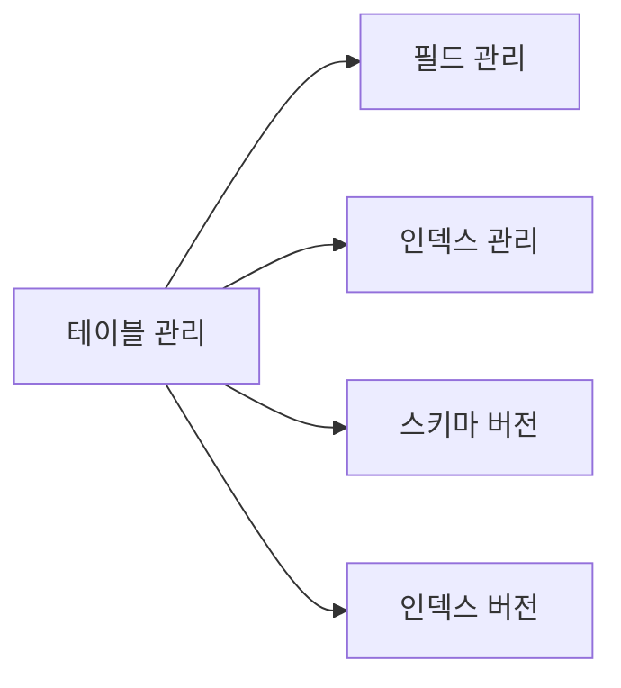
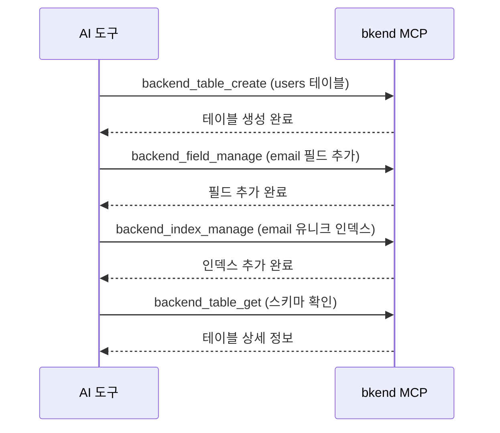

# 테이블 도구


💡 테이블, 필드, 인덱스, 스키마 버전을 관리하는 MCP 도구를 안내합니다.


## 개요

테이블 도구는 데이터베이스의 구조를 관리합니다. 테이블 생성부터 필드 추가, 인덱스 설정, 스키마 버전 관리까지 수행합니다.



***

## 테이블 도구

### backend_table_list

환경의 테이블 목록을 조회합니다.

| 파라미터 | 타입 | 필수 | 설명 |
|----------|------|:----:|------|
| `organizationId` | string | ✅ | Organization ID |
| `projectId` | string | ✅ | 프로젝트 ID |
| `environmentId` | string | ✅ | 환경 ID |

### backend_table_get

테이블 상세 정보(필드, 인덱스 포함)를 조회합니다.

| 파라미터 | 타입 | 필수 | 설명 |
|----------|------|:----:|------|
| `organizationId` | string | ✅ | Organization ID |
| `projectId` | string | ✅ | 프로젝트 ID |
| `environmentId` | string | ✅ | 환경 ID |
| `tableId` | string | ✅ | 테이블 ID |

### backend_table_create

새 테이블을 생성합니다.

| 파라미터 | 타입 | 필수 | 설명 |
|----------|------|:----:|------|
| `organizationId` | string | ✅ | Organization ID |
| `projectId` | string | ✅ | 프로젝트 ID |
| `environmentId` | string | ✅ | 환경 ID |
| `name` | string | ✅ | 테이블 이름 |
| `fields` | array | ✅ | 필드 배열 |

#### fields 배열 구조

```json
{
  "fields": [
    {
      "name": "title",
      "type": "string",
      "required": true
    },
    {
      "name": "content",
      "type": "string",
      "required": false
    },
    {
      "name": "published",
      "type": "boolean",
      "defaultValue": false
    }
  ]
}
```

#### 지원 필드 타입

| 타입 | 설명 | 예시 |
|------|------|------|
| `string` | 문자열 | 이름, 이메일, 제목 |
| `number` | 숫자 | 가격, 수량, 나이 |
| `boolean` | 참/거짓 | 활성 상태, 공개 여부 |
| `date` | 날짜/시간 | 생성일, 수정일 |
| `object` | JSON 객체 | 메타데이터, 설정 |
| `array` | JSON 배열 | 태그, 카테고리 |
| `reference` | 다른 테이블 참조 | 작성자, 카테고리 |

### backend_table_delete

테이블을 삭제합니다.

| 파라미터 | 타입 | 필수 | 설명 |
|----------|------|:----:|------|
| `organizationId` | string | ✅ | Organization ID |
| `projectId` | string | ✅ | 프로젝트 ID |
| `environmentId` | string | ✅ | 환경 ID |
| `tableId` | string | ✅ | 테이블 ID |


⚠️ 테이블을 삭제하면 포함된 모든 데이터가 영구적으로 삭제됩니다. 이 작업은 되돌릴 수 없습니다.


***

## 필드 도구

### backend_field_manage

테이블의 필드를 추가, 수정, 삭제합니다.

| 파라미터 | 타입 | 필수 | 설명 |
|----------|------|:----:|------|
| `organizationId` | string | ✅ | Organization ID |
| `projectId` | string | ✅ | 프로젝트 ID |
| `environmentId` | string | ✅ | 환경 ID |
| `tableId` | string | ✅ | 테이블 ID |
| `action` | string | ✅ | `add`, `update`, `delete` |
| `field` | object | ✅ | 필드 정보 |

#### 필드 추가 예시

```json
{
  "action": "add",
  "field": {
    "name": "email",
    "type": "string",
    "required": true,
    "unique": true
  }
}
```

#### 필드 수정 예시

```json
{
  "action": "update",
  "field": {
    "name": "email",
    "required": false
  }
}
```

***

## 인덱스 도구

### backend_index_manage

테이블의 인덱스를 추가하거나 삭제합니다.

| 파라미터 | 타입 | 필수 | 설명 |
|----------|------|:----:|------|
| `organizationId` | string | ✅ | Organization ID |
| `projectId` | string | ✅ | 프로젝트 ID |
| `environmentId` | string | ✅ | 환경 ID |
| `tableId` | string | ✅ | 테이블 ID |
| `action` | string | ✅ | `add`, `delete` |
| `index` | object | ✅ | 인덱스 정보 |

#### 인덱스 추가 예시

```json
{
  "action": "add",
  "index": {
    "fields": ["email"],
    "unique": true
  }
}
```

***

## 스키마 버전 도구

스키마 변경 이력을 관리합니다.

### backend_schema_version_list

스키마 버전 목록을 조회합니다.

| 파라미터 | 타입 | 필수 | 설명 |
|----------|------|:----:|------|
| `organizationId` | string | ✅ | Organization ID |
| `projectId` | string | ✅ | 프로젝트 ID |
| `environmentId` | string | ✅ | 환경 ID |
| `tableId` | string | ✅ | 테이블 ID |

### backend_schema_version_get

특정 스키마 버전의 상세 정보를 조회합니다.

| 파라미터 | 타입 | 필수 | 설명 |
|----------|------|:----:|------|
| `organizationId` | string | ✅ | Organization ID |
| `projectId` | string | ✅ | 프로젝트 ID |
| `environmentId` | string | ✅ | 환경 ID |
| `tableId` | string | ✅ | 테이블 ID |
| `versionId` | string | ✅ | 버전 ID |

### backend_schema_version_apply

특정 스키마 버전을 적용(롤백)합니다.

| 파라미터 | 타입 | 필수 | 설명 |
|----------|------|:----:|------|
| `organizationId` | string | ✅ | Organization ID |
| `projectId` | string | ✅ | 프로젝트 ID |
| `environmentId` | string | ✅ | 환경 ID |
| `tableId` | string | ✅ | 테이블 ID |
| `versionId` | string | ✅ | 적용할 버전 ID |

***

## 인덱스 버전 도구

인덱스 변경 이력을 관리합니다.

### backend_index_version_list

인덱스 버전 목록을 조회합니다.

| 파라미터 | 타입 | 필수 | 설명 |
|----------|------|:----:|------|
| `organizationId` | string | ✅ | Organization ID |
| `projectId` | string | ✅ | 프로젝트 ID |
| `environmentId` | string | ✅ | 환경 ID |
| `tableId` | string | ✅ | 테이블 ID |

### backend_index_version_get

특정 인덱스 버전의 상세 정보를 조회합니다.

| 파라미터 | 타입 | 필수 | 설명 |
|----------|------|:----:|------|
| `organizationId` | string | ✅ | Organization ID |
| `projectId` | string | ✅ | 프로젝트 ID |
| `environmentId` | string | ✅ | 환경 ID |
| `tableId` | string | ✅ | 테이블 ID |
| `versionId` | string | ✅ | 버전 ID |

***

## 사용 흐름



***

## 다음 단계

- [데이터 도구](05-data-tools.md) — 데이터 CRUD 작업
- [프로젝트 도구](03-project-tools.md) — 환경 관리
- [MCP 도구 개요](01-overview.md) — 전체 도구 분류
