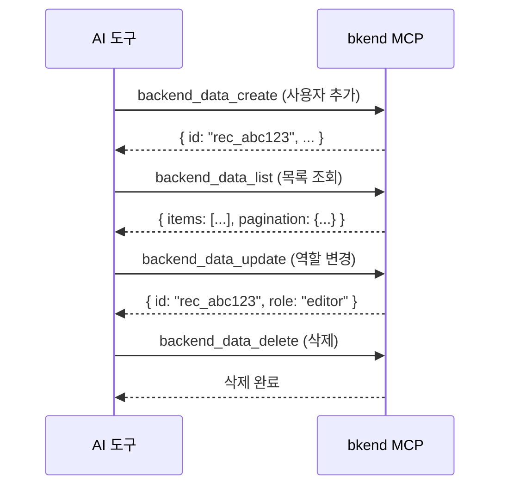

# 데이터 도구


💡 데이터 조회, 생성, 수정, 삭제를 수행하는 MCP 도구를 안내합니다.


## 개요

데이터 도구는 테이블의 데이터를 CRUD(생성, 조회, 수정, 삭제)합니다. 5개의 도구로 구성됩니다.

| 도구 | 설명 |
|------|------|
| `backend_data_list` | 데이터 목록 조회 (필터, 정렬, 페이징) |
| `backend_data_get` | 단건 데이터 조회 |
| `backend_data_create` | 데이터 생성 |
| `backend_data_update` | 데이터 수정 |
| `backend_data_delete` | 데이터 삭제 |

***

## backend_data_list

데이터 목록을 조회합니다. 필터, 정렬, 페이징을 지원합니다.

### 파라미터

| 파라미터 | 타입 | 필수 | 설명 |
|----------|------|:----:|------|
| `organizationId` | string | ✅ | Organization ID |
| `projectId` | string | ✅ | 프로젝트 ID |
| `environmentId` | string | ✅ | 환경 ID |
| `tableId` | string | ✅ | 테이블 ID |
| `page` | number | | 페이지 번호 (기본: 1) |
| `limit` | number | | 페이지당 항목 수 (기본: 20, 최대: 100) |
| `sortBy` | string | | 정렬 필드 |
| `sortDirection` | string | | `asc` 또는 `desc` (기본: `desc`) |
| `andFilters` | object | | AND 조건 필터 |
| `orFilters` | array | | OR 조건 필터 |

### 필터 사용법

#### AND 필터

모든 조건을 동시에 만족하는 데이터를 조회합니다.

```json
{
  "andFilters": {
    "role": "admin",
    "status": "active"
  }
}
```

#### OR 필터

하나 이상의 조건을 만족하는 데이터를 조회합니다.

```json
{
  "orFilters": [
    { "role": "admin" },
    { "role": "editor" }
  ]
}
```

#### 연산자 필터

```json
{
  "andFilters": {
    "age": { "$gte": 20 },
    "status": { "$ne": "deleted" }
  }
}
```

| 연산자 | 설명 | 예시 |
|--------|------|------|
| `$eq` | 같음 | `{ "$eq": "admin" }` |
| `$ne` | 같지 않음 | `{ "$ne": "deleted" }` |
| `$gt` | 초과 | `{ "$gt": 100 }` |
| `$gte` | 이상 | `{ "$gte": 20 }` |
| `$lt` | 미만 | `{ "$lt": 50 }` |
| `$lte` | 이하 | `{ "$lte": 100 }` |
| `$in` | 포함 | `{ "$in": ["admin", "editor"] }` |
| `$nin` | 미포함 | `{ "$nin": ["deleted"] }` |

### 응답 구조

```json
{
  "items": [
    {
      "id": "rec_abc123",
      "name": "홍길동",
      "email": "hong@example.com",
      "role": "admin",
      "createdAt": "2025-01-01T00:00:00Z",
      "updatedAt": "2025-01-01T00:00:00Z"
    }
  ],
  "pagination": {
    "page": 1,
    "limit": 20,
    "total": 45,
    "totalPages": 3
  }
}
```


⚠️ 응답의 목록 데이터는 `items` 배열에, 페이징 정보는 `pagination` 객체에 포함됩니다. ID 필드는 `id`입니다.


***

## backend_data_get

단건 데이터를 조회합니다.

### 파라미터

| 파라미터 | 타입 | 필수 | 설명 |
|----------|------|:----:|------|
| `organizationId` | string | ✅ | Organization ID |
| `projectId` | string | ✅ | 프로젝트 ID |
| `environmentId` | string | ✅ | 환경 ID |
| `tableId` | string | ✅ | 테이블 ID |
| `recordId` | string | ✅ | 레코드 ID |

### 응답 구조

```json
{
  "id": "rec_abc123",
  "name": "홍길동",
  "email": "hong@example.com",
  "role": "admin",
  "createdAt": "2025-01-01T00:00:00Z",
  "updatedAt": "2025-01-01T00:00:00Z"
}
```

***

## backend_data_create

데이터를 생성합니다.

### 파라미터

| 파라미터 | 타입 | 필수 | 설명 |
|----------|------|:----:|------|
| `organizationId` | string | ✅ | Organization ID |
| `projectId` | string | ✅ | 프로젝트 ID |
| `environmentId` | string | ✅ | 환경 ID |
| `tableId` | string | ✅ | 테이블 ID |
| `data` | object | ✅ | 생성할 데이터 |

### 사용 예시

```json
{
  "organizationId": "org_abc123",
  "projectId": "proj_xyz789",
  "environmentId": "env_dev001",
  "tableId": "tbl_users",
  "data": {
    "name": "홍길동",
    "email": "hong@example.com",
    "role": "admin"
  }
}
```

***

## backend_data_update

데이터를 수정합니다. 전달한 필드만 수정됩니다 (Partial Update).

### 파라미터

| 파라미터 | 타입 | 필수 | 설명 |
|----------|------|:----:|------|
| `organizationId` | string | ✅ | Organization ID |
| `projectId` | string | ✅ | 프로젝트 ID |
| `environmentId` | string | ✅ | 환경 ID |
| `tableId` | string | ✅ | 테이블 ID |
| `recordId` | string | ✅ | 레코드 ID |
| `data` | object | ✅ | 수정할 데이터 (변경할 필드만) |

### 사용 예시

```json
{
  "recordId": "rec_abc123",
  "data": {
    "role": "editor"
  }
}
```

***

## backend_data_delete

데이터를 삭제합니다.

### 파라미터

| 파라미터 | 타입 | 필수 | 설명 |
|----------|------|:----:|------|
| `organizationId` | string | ✅ | Organization ID |
| `projectId` | string | ✅ | 프로젝트 ID |
| `environmentId` | string | ✅ | 환경 ID |
| `tableId` | string | ✅ | 테이블 ID |
| `recordId` | string | ✅ | 레코드 ID |


⚠️ 삭제된 데이터는 복구할 수 없습니다.


***

## CRUD 흐름 예시



***

## 다음 단계

- [테이블 도구](04-table-tools.md) — 테이블 구조 관리
- [인증 도구](06-auth-tools.md) — 인증 구현 가이드
- [MCP 도구 개요](01-overview.md) — 전체 도구 분류
