# 데이터 도구


💡 AI 도구에서 데이터 CRUD 작업을 수행하는 방법을 안내합니다. 데이터 CRUD는 전용 MCP 도구가 아닌 REST API를 사용합니다.


## 개요

bkend MCP 서버에는 데이터 CRUD 전용 도구가 없습니다. 대신 AI 도구가 `search_docs`로 데이터 작업 문서를 검색하고, REST API 호출 코드를 생성합니다.

```mermaid
flowchart LR
    A[AI에 데이터 작업 요청] --> B[search_docs로 문서 검색]
    B --> C[데이터베이스 가이드 반환]
    C --> D[REST API 코드 생성]
```



***

## AI 도구에서 사용하기

AI 도구에 자연어로 요청하면 데이터 작업 코드를 생성합니다.

```text
"모든 글을 날짜순으로 조회해줘"

"새 사용자 레코드를 생성해줘"

"사용자의 역할을 editor로 변경해줘"

"이 ID의 글을 삭제해줘"
```

***

## 주요 데이터 REST API 엔드포인트

모든 데이터 작업은 동적 테이블 엔드포인트 패턴을 사용합니다: `/v1/data/{tableName}`

### CRUD 작업

| 엔드포인트 | 메서드 | 설명 |
|-----------|:------:|------|
| `/v1/data/{tableName}` | GET | 레코드 목록 조회 (필터, 정렬, 페이징) |
| `/v1/data/{tableName}/{id}` | GET | 단건 레코드 조회 |
| `/v1/data/{tableName}` | POST | 레코드 생성 |
| `/v1/data/{tableName}/{id}` | PATCH | 레코드 수정 |
| `/v1/data/{tableName}/{id}` | DELETE | 레코드 삭제 |

***

## 필터링

### AND 필터

모든 조건을 동시에 만족하는 데이터를 조회합니다.

```bash
curl -X GET "https://api-client.bkend.ai/v1/data/users?andFilters=%7B%22role%22%3A%22admin%22%7D" \
  -H "X-API-Key: {pk_publishable_key}" \
  -H "Authorization: Bearer {accessToken}"
```

### 정렬과 페이징

```bash
curl -X GET "https://api-client.bkend.ai/v1/data/articles?sortBy=createdAt&sortDirection=desc&page=1&limit=20" \
  -H "X-API-Key: {pk_publishable_key}" \
  -H "Authorization: Bearer {accessToken}"
```

| 파라미터 | 설명 |
|----------|------|
| `sortBy` | 정렬 필드 |
| `sortDirection` | `asc` 또는 `desc` |
| `page` | 페이지 번호 (기본: 1) |
| `limit` | 페이지당 항목 수 (기본: 20) |
| `andFilters` | AND 조건 필터 JSON 문자열 |

***

## 코드 생성 예시

AI 도구에 "모든 글을 조회해줘"라고 요청하면 다음과 같은 코드를 생성합니다:



```typescript
const response = await fetch(
  "https://api-client.bkend.ai/v1/data/articles?sortBy=createdAt&sortDirection=desc",
  {
    headers: {
      "X-API-Key": PUBLISHABLE_KEY,
      "Authorization": `Bearer ${accessToken}`,
    },
  }
);

const { items, pagination } = await response.json();
```


```bash
curl -X GET "https://api-client.bkend.ai/v1/data/articles?sortBy=createdAt&sortDirection=desc" \
  -H "X-API-Key: {pk_publishable_key}" \
  -H "Authorization: Bearer {accessToken}"
```



### 응답 구조

```json
{
  "items": [
    {
      "id": "rec_abc123",
      "title": "내 글",
      "createdAt": "2025-01-01T00:00:00Z",
      "updatedAt": "2025-01-01T00:00:00Z"
    }
  ],
  "pagination": {
    "page": 1,
    "limit": 20,
    "total": 45,
    "totalPages": 3
  }
}
```


⚠️ 목록 데이터는 `items` 배열에, 페이징 정보는 `pagination` 객체에 포함됩니다. ID 필드는 `id`입니다.


***

## 다음 단계

- [테이블 도구](04-table-tools.md) — MCP를 통한 테이블 구조 관리
- [인증 도구](06-auth-tools.md) — 인증 구현 가이드
- [데이터베이스 개요](../database/01-overview.md) — 데이터베이스 상세 가이드
