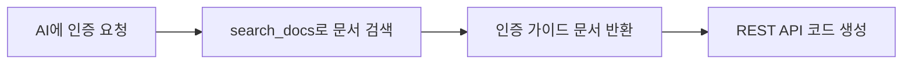

# 인증 도구


💡 AI 도구에서 인증(Auth) 기능을 구현하는 방법을 안내합니다. 인증은 MCP 도구가 아닌 REST API를 사용합니다.


## 개요

bkend MCP 서버에는 인증 전용 도구가 없습니다. 대신 AI 도구가 `search_docs`로 인증 문서를 검색하고, REST API 호출 코드를 자동으로 생성합니다.



***

## AI 도구에서 사용하기

AI 도구에 자연어로 요청하면 인증 코드를 생성합니다.

```text
"이메일 회원가입과 로그인 기능을 구현해줘"

"소셜 로그인(Google, GitHub)을 추가해줘"

"토큰 갱신 로직을 만들어줘"
```

***

## 내장 문서

`search_docs`가 검색하는 인증 관련 내장 문서:

| 문서 ID | 내용 |
|---------|------|
| `3_howto_implement_auth` | 인증 구현 가이드 (회원가입, 로그인, 토큰 관리) |
| `6_code_examples_auth` | 인증 코드 예제 (이메일, 소셜, 매직링크) |

***

## 주요 인증 REST API

AI 도구가 코드를 생성할 때 사용하는 주요 엔드포인트:

### 이메일 인증

| 엔드포인트 | 메서드 | 설명 |
|-----------|:------:|------|
| `/v1/auth/email/signup` | POST | 이메일 회원가입 |
| `/v1/auth/email/login` | POST | 이메일 로그인 |
| `/v1/auth/email/verify` | POST | 이메일 인증 확인 |
| `/v1/auth/email/verify/resend` | POST | 인증 이메일 재발송 |

### 소셜 인증

| 엔드포인트 | 메서드 | 설명 |
|-----------|:------:|------|
| `/v1/auth/social/{provider}/authorize` | GET | 소셜 로그인 시작 |
| `/v1/auth/social/{provider}/callback` | GET | 소셜 로그인 콜백 |

### 토큰 관리

| 엔드포인트 | 메서드 | 설명 |
|-----------|:------:|------|
| `/v1/auth/refresh` | POST | 토큰 갱신 |
| `/v1/auth/logout` | POST | 로그아웃 |

### 비밀번호 관리

| 엔드포인트 | 메서드 | 설명 |
|-----------|:------:|------|
| `/v1/auth/password/forgot` | POST | 비밀번호 재설정 요청 |
| `/v1/auth/password/reset` | POST | 비밀번호 재설정 |
| `/v1/auth/password/change` | POST | 비밀번호 변경 |

### 사용자 관리

| 엔드포인트 | 메서드 | 설명 |
|-----------|:------:|------|
| `/v1/users/me` | GET | 내 정보 조회 |
| `/v1/users/me` | PATCH | 내 정보 수정 |
| `/v1/users/me/avatar` | PUT | 프로필 이미지 변경 |

***

## 코드 생성 예시

AI 도구가 "이메일 로그인 기능을 만들어줘"라고 요청하면 다음과 같은 코드를 생성합니다:



```typescript
const response = await fetch(
  "https://api-client.bkend.ai/v1/auth/email/login",
  {
    method: "POST",
    headers: {
      "Content-Type": "application/json",
      "X-Project-Id": PROJECT_ID,
      "X-Environment": "dev",
    },
    body: JSON.stringify({
      email: "user@example.com",
      password: "password123",
      method: "password",
    }),
  }
);

const { accessToken, refreshToken } = await response.json();
```


```bash
curl -X POST https://api-client.bkend.ai/v1/auth/email/login \
  -H "Content-Type: application/json" \
  -H "X-Project-Id: {PROJECT_ID}" \
  -H "X-Environment: dev" \
  -d '{
    "email": "user@example.com",
    "password": "password123",
    "method": "password"
  }'
```




💡 모든 인증 API 호출에는 `X-Project-Id`와 `X-Environment` 헤더가 필요합니다. 인증 후 발급받은 JWT를 `Authorization: Bearer {accessToken}` 헤더로 전달하세요.


***

## 다음 단계

- [스토리지 도구](07-storage-tools.md) — 파일 업로드/다운로드 구현
- [데이터 도구](05-data-tools.md) — 데이터 CRUD 작업
- [인증 개요](../authentication/01-overview.md) — 인증 상세 가이드
