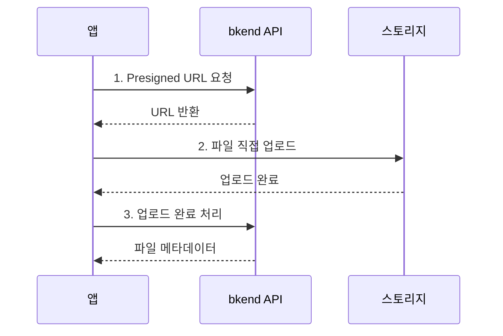

# 스토리지 도구


💡 AI 도구에서 파일 업로드/다운로드 기능을 구현하는 방법을 안내합니다. 스토리지는 MCP 도구가 아닌 REST API를 사용합니다.


## 개요

bkend MCP 서버에는 스토리지 전용 도구가 없습니다. 대신 AI 도구가 `search_docs`로 스토리지 문서를 검색하고, REST API 호출 코드를 자동으로 생성합니다.


***

## AI 도구에서 사용하기

AI 도구에 자연어로 요청하면 스토리지 코드를 생성합니다.

```text
"이미지 업로드 기능을 구현해줘"

"파일 다운로드 URL을 가져오는 코드를 만들어줘"

"프로필 이미지 업로드 컴포넌트를 만들어줘"
```

***

## 주요 스토리지 REST API

AI 도구가 코드를 생성할 때 사용하는 주요 엔드포인트:

### Presigned URL

| 엔드포인트 | 메서드 | 설명 |
|-----------|:------:|------|
| `/v1/files/presigned-url` | POST | 업로드용 Presigned URL 발급 |
| `/v1/files/{fileId}/download-url` | GET | 다운로드 URL 발급 |

### 파일 관리

| 엔드포인트 | 메서드 | 설명 |
|-----------|:------:|------|
| `/v1/files` | GET | 파일 목록 조회 |
| `/v1/files/{fileId}` | GET | 파일 메타데이터 조회 |
| `/v1/files/{fileId}` | DELETE | 파일 삭제 |
| `/v1/files/{fileId}/complete` | POST | 업로드 완료 처리 |
| `/v1/files/{fileId}/visibility` | PATCH | 파일 공개 범위 변경 |

### 멀티파트 업로드

| 엔드포인트 | 메서드 | 설명 |
|-----------|:------:|------|
| `/v1/files/multipart/initiate` | POST | 멀티파트 업로드 시작 |
| `/v1/files/multipart/{uploadId}/part-url` | POST | 파트 업로드 URL 발급 |
| `/v1/files/multipart/{uploadId}/complete` | POST | 멀티파트 업로드 완료 |
| `/v1/files/multipart/{uploadId}/abort` | POST | 멀티파트 업로드 취소 |

### 버킷 관리

| 엔드포인트 | 메서드 | 설명 |
|-----------|:------:|------|
| `/v1/files/buckets` | GET | 버킷 목록 조회 |

***

## 업로드 흐름

파일 업로드는 3단계로 진행됩니다:



***

## 코드 생성 예시

AI 도구가 "이미지 업로드 기능을 만들어줘"라고 요청하면 다음과 같은 코드를 생성합니다:



```typescript
// 1. Presigned URL 발급
const presignedResponse = await fetch(
  "https://api-client.bkend.ai/v1/files/presigned-url",
  {
    method: "POST",
    headers: {
      "Content-Type": "application/json",
      "X-API-Key": PUBLISHABLE_KEY,
      "Authorization": `Bearer ${accessToken}`,
    },
    body: JSON.stringify({
      filename: "profile.jpg",
      contentType: "image/jpeg",
    }),
  }
);
const { fileId, url } = await presignedResponse.json();

// 2. 파일 직접 업로드
await fetch(url, {
  method: "PUT",
  headers: { "Content-Type": "image/jpeg" },
  body: file,
});

// 3. 업로드 완료 처리
await fetch(
  `https://api-client.bkend.ai/v1/files/${fileId}/complete`,
  {
    method: "POST",
    headers: {
      "X-API-Key": PUBLISHABLE_KEY,
      "Authorization": `Bearer ${accessToken}`,
    },
  }
);
```


```bash
# 1. Presigned URL 발급
curl -X POST https://api-client.bkend.ai/v1/files/presigned-url \
  -H "Content-Type: application/json" \
  -H "X-API-Key: {pk_publishable_key}" \
  -H "Authorization: Bearer {ACCESS_TOKEN}" \
  -d '{"filename": "profile.jpg", "contentType": "image/jpeg"}'

# 2. 파일 업로드 (반환된 URL 사용)
curl -X PUT "{PRESIGNED_URL}" \
  -H "Content-Type: image/jpeg" \
  --data-binary @profile.jpg

# 3. 업로드 완료 처리
curl -X POST https://api-client.bkend.ai/v1/files/{FILE_ID}/complete \
  -H "X-API-Key: {pk_publishable_key}" \
  -H "Authorization: Bearer {ACCESS_TOKEN}"
```



***

## 파일 공개 범위

| 레벨 | 설명 |
|------|------|
| `public` | 누구나 접근 가능 |
| `private` | 업로드한 사용자만 접근 가능 |
| `protected` | 인증된 사용자만 접근 가능 |
| `shared` | 특정 사용자와 공유 |

***


⚠️ AI 도구가 생성한 파일 업로드 코드에서 Presigned URL의 만료 시간에 주의하세요. URL 발급 후 즉시 업로드해야 합니다.


## 다음 단계

- [인증 도구](06-auth-tools.md) — 인증 구현 가이드
- [MCP 리소스](08-resources.md) — 리소스 URI와 조회 방법
- [스토리지 개요](../storage/01-overview.md) — 스토리지 상세 가이드
