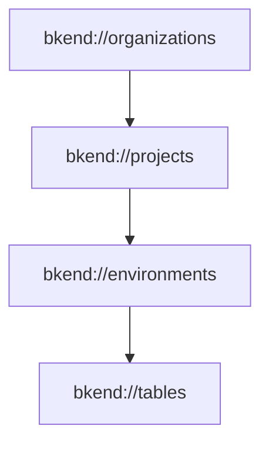
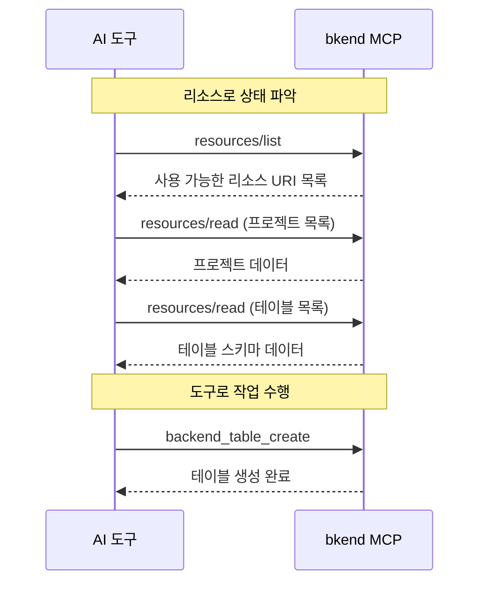

# MCP 리소스


💡 MCP 리소스(Resources)를 통해 bkend의 현재 상태를 읽기 전용으로 조회하는 방법을 안내합니다.


## 개요

MCP 리소스는 도구(Tools)와 달리 **읽기 전용**입니다. `bkend://` URI 스키마를 사용하여 Organization, 프로젝트, 환경, 테이블의 현재 상태를 조회합니다. MCP가 활성화된 GET 엔드포인트에서 자동으로 생성됩니다.



***

## 리소스 URI

### Organization 리소스

```text
bkend://organizations
bkend://organizations/{organizationId}
```

Organization 목록 또는 특정 Organization의 상세 정보를 반환합니다.

### 프로젝트 리소스

```text
bkend://projects
bkend://projects/{projectId}
```

프로젝트 목록 또는 특정 프로젝트의 상세 정보를 반환합니다.

### 환경 리소스

```text
bkend://environments
bkend://environments/{environmentId}
```

환경 목록 또는 특정 환경의 상세 정보를 반환합니다.

### 테이블 리소스

```text
bkend://tables
bkend://tables/{tableId}
```

테이블 목록 또는 특정 테이블(스키마 포함)의 상세 정보를 반환합니다.

### 스키마 및 인덱스 버전 리소스

```text
bkend://tables/{tableId}/schema/versions
bkend://tables/{tableId}/indexes/versions
```

특정 테이블의 스키마 또는 인덱스 버전 목록을 반환합니다.

### 액세스 토큰 리소스

```text
bkend://access-tokens
bkend://access-tokens/{accessTokenId}
```

액세스 토큰 목록 또는 특정 토큰의 상세 정보를 반환합니다.

***

## MCP 메서드

### resources/list

사용 가능한 리소스 URI 목록을 조회합니다.

```json
{
  "method": "resources/list"
}
```

#### 응답 예시

```json
{
  "resources": [
    {
      "uri": "bkend://organizations",
      "name": "Organization",
      "description": "접근 가능한 Organization 목록 조회",
      "mimeType": "application/json"
    },
    {
      "uri": "bkend://projects",
      "name": "Project",
      "description": "접근 가능한 프로젝트 목록 조회",
      "mimeType": "application/json"
    }
  ]
}
```

### resources/read

특정 리소스의 데이터를 읽습니다.

```json
{
  "method": "resources/read",
  "params": {
    "uri": "bkend://projects"
  }
}
```

#### 응답 예시

```json
{
  "contents": [
    {
      "uri": "bkend://projects",
      "mimeType": "application/json",
      "text": "{\"items\":[{\"id\":\"proj_xyz789\",\"name\":\"my-app\"}],\"pagination\":{...}}"
    }
  ]
}
```

***

## 캐싱

MCP 리소스는 성능을 위해 캐싱됩니다.

| 항목 | 값 |
|------|-----|
| 범위 | Organization 단위 |


💡 리소스 데이터는 캐시됩니다. 새 리소스를 생성한 직후에는 목록에 즉시 반영되지 않을 수 있습니다.


***

## 리소스 vs 도구

| 구분 | 리소스 (Resources) | 도구 (Tools) |
|------|-------------------|-------------|
| 용도 | 상태 조회 | 작업 실행 |
| 권한 | 읽기 전용 | 읽기/쓰기 |
| 호출 방식 | URI 기반 (`bkend://...`) | 함수 호출 (`backend_*`) |
| 캐싱 | 있음 | 없음 |
| 예시 | 프로젝트 목록 조회 | 테이블 생성 |

### 언제 리소스를 사용하나요?

- AI 도구가 **현재 상태를 파악**할 때 (어떤 프로젝트가 있는지, 어떤 테이블이 있는지)
- **자동 완성**이나 **컨텍스트 제공**을 위해 배경 정보가 필요할 때

### 언제 도구를 사용하나요?

- **데이터를 변경**할 때 (테이블 생성, 필드 수정, 인덱스 관리)
- **특정 작업을 수행**할 때 (문서 검색, 프로젝트 생성)

***

## 사용 흐름



***

## 다음 단계

- [MCP 도구 개요](01-overview.md) — 전체 도구 분류
- [API 레퍼런스](09-api-reference.md) — 도구 입출력 스키마
- [MCP 프로토콜 이해](../ai-tools/02-mcp-protocol.md) — MCP 프로토콜 상세
