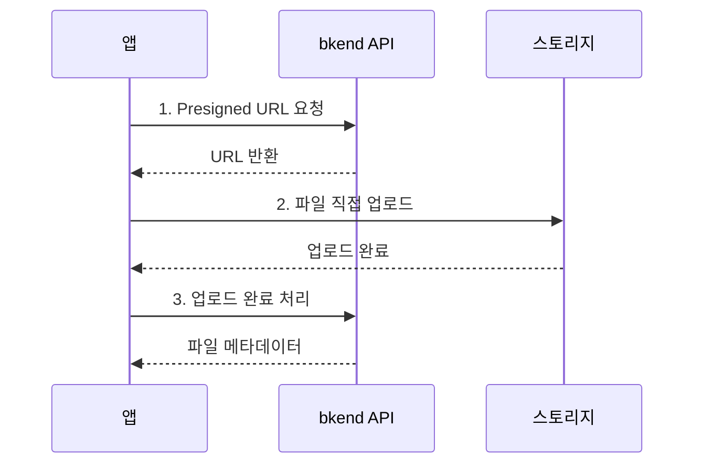

# REST API 코드 생성


💡 Auth, Storage, 데이터 CRUD는 전용 MCP 도구가 없습니다. 대신 AI 도구가 `search_docs`로 문서를 검색하고 REST API 코드를 자동으로 생성합니다.


## 개요

AI 도구에 Auth, Storage, 데이터 CRUD 기능 구현을 요청하면 다음 패턴으로 동작합니다:


***

## 데이터 CRUD

### AI 도구에서 사용하기

```text
"모든 글을 날짜순으로 조회해줘"

"새 사용자 레코드를 생성해줘"

"사용자의 역할을 editor로 변경해줘"

"이 ID의 글을 삭제해줘"
```

### 주요 엔드포인트

모든 데이터 작업은 동적 테이블 엔드포인트 패턴을 사용합니다: `/v1/data/{tableName}`

| 엔드포인트 | 메서드 | 설명 |
|-----------|:------:|------|
| `/v1/data/{tableName}` | GET | 레코드 목록 조회 (필터, 정렬, 페이징) |
| `/v1/data/{tableName}/{id}` | GET | 단건 레코드 조회 |
| `/v1/data/{tableName}` | POST | 레코드 생성 |
| `/v1/data/{tableName}/{id}` | PATCH | 레코드 수정 |
| `/v1/data/{tableName}/{id}` | DELETE | 레코드 삭제 |

### 필터링, 정렬, 페이징

| 파라미터 | 설명 |
|----------|------|
| `sortBy` | 정렬 필드 |
| `sortDirection` | `asc` 또는 `desc` |
| `page` | 페이지 번호 (기본: 1) |
| `limit` | 페이지당 항목 수 (기본: 20) |
| `andFilters` | AND 조건 필터 JSON 문자열 |

### 코드 예시



```typescript
const response = await fetch(
  "https://api-client.bkend.ai/v1/data/articles?sortBy=createdAt&sortDirection=desc",
  {
    headers: {
      "X-API-Key": PUBLISHABLE_KEY,
      "Authorization": `Bearer ${accessToken}`,
    },
  }
);

const { items, pagination } = await response.json();
```


```bash
curl -X GET "https://api-client.bkend.ai/v1/data/articles?sortBy=createdAt&sortDirection=desc" \
  -H "X-API-Key: {pk_publishable_key}" \
  -H "Authorization: Bearer {accessToken}"
```



### 응답 구조

```json
{
  "items": [
    {
      "id": "rec_abc123",
      "title": "My Article",
      "createdAt": "2025-01-01T00:00:00Z",
      "updatedAt": "2025-01-01T00:00:00Z"
    }
  ],
  "pagination": {
    "page": 1,
    "limit": 20,
    "total": 45,
    "totalPages": 3
  }
}
```


⚠️ 목록 데이터는 `items` 배열에, 페이징 정보는 `pagination` 객체에 포함됩니다. ID 필드는 `id`입니다.


***

## Auth

### AI 도구에서 사용하기

```text
"이메일 회원가입과 로그인 기능을 구현해줘"

"소셜 로그인(Google, GitHub)을 추가해줘"

"토큰 갱신 로직을 만들어줘"
```

### 주요 엔드포인트

#### 이메일 인증

| 엔드포인트 | 메서드 | 설명 |
|-----------|:------:|------|
| `/v1/auth/email/signup` | POST | 이메일 회원가입 |
| `/v1/auth/email/signin` | POST | 이메일 로그인 |
| `/v1/auth/email/verify/send` | POST | 이메일 인증 발송 |
| `/v1/auth/email/verify/confirm` | POST | 이메일 인증 확인 |
| `/v1/auth/email/verify/resend` | POST | 인증 이메일 재발송 |

#### 소셜 인증 (OAuth)

| 엔드포인트 | 메서드 | 설명 |
|-----------|:------:|------|
| `/v1/auth/{provider}/callback` | GET | OAuth 콜백 처리 (리다이렉트) |
| `/v1/auth/{provider}/callback` | POST | OAuth 콜백 처리 (API 플로우) |

#### 토큰 관리

| 엔드포인트 | 메서드 | 설명 |
|-----------|:------:|------|
| `/v1/auth/me` | GET | 내 정보 조회 |
| `/v1/auth/refresh` | POST | 토큰 갱신 |
| `/v1/auth/signout` | POST | 로그아웃 |

#### 비밀번호 관리

| 엔드포인트 | 메서드 | 설명 |
|-----------|:------:|------|
| `/v1/auth/password/reset/request` | POST | 비밀번호 재설정 요청 |
| `/v1/auth/password/reset/confirm` | POST | 비밀번호 재설정 확인 |
| `/v1/auth/password/change` | POST | 비밀번호 변경 |

#### 사용자 관리

| 엔드포인트 | 메서드 | 설명 |
|-----------|:------:|------|
| `/v1/users/{userId}` | GET | 사용자 정보 조회 |
| `/v1/users/{userId}` | PATCH | 사용자 정보 수정 |
| `/v1/users/{userId}/avatar/upload-url` | POST | 프로필 이미지 업로드 URL 생성 |

### 코드 예시



```typescript
const response = await fetch(
  "https://api-client.bkend.ai/v1/auth/email/signin",
  {
    method: "POST",
    headers: {
      "Content-Type": "application/json",
      "X-API-Key": PUBLISHABLE_KEY,
    },
    body: JSON.stringify({
      email: "user@example.com",
      password: "password123",
      method: "password",
    }),
  }
);

const { accessToken, refreshToken } = await response.json();
```


```bash
curl -X POST https://api-client.bkend.ai/v1/auth/email/signin \
  -H "Content-Type: application/json" \
  -H "X-API-Key: {pk_publishable_key}" \
  -d '{
    "email": "user@example.com",
    "password": "password123",
    "method": "password"
  }'
```




💡 모든 인증 API 호출에는 `X-API-Key` 헤더가 필요합니다. 인증 후 발급받은 JWT를 `Authorization: Bearer {accessToken}` 헤더로 전달하세요.


***

## Storage

### AI 도구에서 사용하기

```text
"이미지 업로드 기능을 구현해줘"

"파일 다운로드 URL을 가져오는 코드를 만들어줘"

"프로필 이미지 업로드 컴포넌트를 만들어줘"
```

### 주요 엔드포인트

#### Presigned URL

| 엔드포인트 | 메서드 | 설명 |
|-----------|:------:|------|
| `/v1/files/presigned-url` | POST | 업로드용 Presigned URL 발급 |
| `/v1/files/{fileId}/download-url` | GET | 다운로드 URL 발급 |

#### 파일 관리

| 엔드포인트 | 메서드 | 설명 |
|-----------|:------:|------|
| `/v1/files` | GET | 파일 목록 조회 |
| `/v1/files/{fileId}` | GET | 파일 메타데이터 조회 |
| `/v1/files/{fileId}` | DELETE | 파일 삭제 |
| `/v1/files/{fileId}/complete` | POST | 업로드 완료 처리 |
| `/v1/files/{fileId}/visibility` | PATCH | 파일 공개 범위 변경 |

#### 멀티파트 업로드

| 엔드포인트 | 메서드 | 설명 |
|-----------|:------:|------|
| `/v1/files/multipart/initiate` | POST | 멀티파트 업로드 시작 |
| `/v1/files/multipart/{uploadId}/part-url` | POST | 파트 업로드 URL 발급 |
| `/v1/files/multipart/{uploadId}/complete` | POST | 멀티파트 업로드 완료 |
| `/v1/files/multipart/{uploadId}/abort` | POST | 멀티파트 업로드 취소 |

#### 버킷 관리

| 엔드포인트 | 메서드 | 설명 |
|-----------|:------:|------|
| `/v1/files/buckets` | GET | 버킷 목록 조회 |

### 업로드 흐름



### 코드 예시



```typescript
// 1. Presigned URL 발급
const presignedResponse = await fetch(
  "https://api-client.bkend.ai/v1/files/presigned-url",
  {
    method: "POST",
    headers: {
      "Content-Type": "application/json",
      "X-API-Key": PUBLISHABLE_KEY,
      "Authorization": `Bearer ${accessToken}`,
    },
    body: JSON.stringify({
      filename: "profile.jpg",
      contentType: "image/jpeg",
    }),
  }
);
const { fileId, url } = await presignedResponse.json();

// 2. 파일 직접 업로드
await fetch(url, {
  method: "PUT",
  headers: { "Content-Type": "image/jpeg" },
  body: file,
});

// 3. 업로드 완료 처리
await fetch(
  `https://api-client.bkend.ai/v1/files/${fileId}/complete`,
  {
    method: "POST",
    headers: {
      "X-API-Key": PUBLISHABLE_KEY,
      "Authorization": `Bearer ${accessToken}`,
    },
  }
);
```


```bash
# 1. Presigned URL 발급
curl -X POST https://api-client.bkend.ai/v1/files/presigned-url \
  -H "Content-Type: application/json" \
  -H "X-API-Key: {pk_publishable_key}" \
  -H "Authorization: Bearer {ACCESS_TOKEN}" \
  -d '{"filename": "profile.jpg", "contentType": "image/jpeg"}'

# 2. 파일 업로드 (반환된 URL 사용)
curl -X PUT "{PRESIGNED_URL}" \
  -H "Content-Type: image/jpeg" \
  --data-binary @profile.jpg

# 3. 업로드 완료 처리
curl -X POST https://api-client.bkend.ai/v1/files/{FILE_ID}/complete \
  -H "X-API-Key: {pk_publishable_key}" \
  -H "Authorization: Bearer {ACCESS_TOKEN}"
```



### 파일 공개 범위

| 레벨 | 설명 |
|------|------|
| `public` | 누구나 접근 가능 |
| `private` | 업로드한 사용자만 접근 가능 |
| `protected` | 인증된 사용자만 접근 가능 |
| `shared` | 특정 사용자와 공유 |


⚠️ AI 도구가 생성한 파일 업로드 코드에서 Presigned URL의 만료 시간에 주의하세요. URL 발급 후 즉시 업로드해야 합니다.


***

## 다음 단계

- [테이블 도구](08-table-tools.md) — MCP를 통한 테이블 구조 관리
- [리소스](10-resources.md) — MCP 리소스 URI
- [데이터베이스 개요](../database/01-overview.md) — 데이터베이스 상세 가이드
- [인증 개요](../authentication/01-overview.md) — 인증 상세 가이드
- [스토리지 개요](../storage/01-overview.md) — 스토리지 상세 가이드
