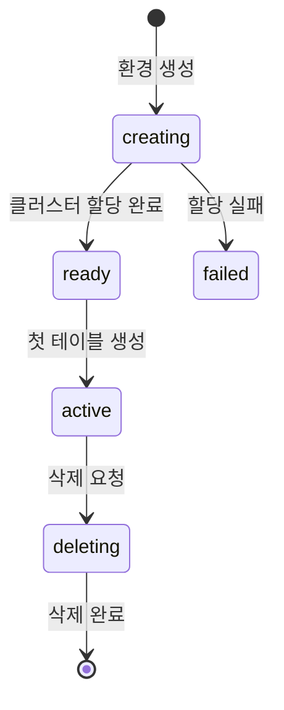

# 환경 개요

> bkend의 환경(Environment) 시스템과 Dev/Staging/Prod 환경의 차이를 안내합니다.

## 개요

bkend는 프로젝트별로 독립된 환경을 제공합니다. 각 환경은 별도의 데이터베이스와 설정을 가지며, 개발부터 프로덕션까지의 워크플로우를 지원합니다.

---

## 환경 타입

| 타입 | 용도 | 클러스터 | 특징 |
|------|------|---------|------|
| **dev** | 개발/테스트 | 공유 클러스터 | 빠른 프로비저닝, 비용 효율적 |
| **staging** | 배포 전 검증 | 전용 클러스터 | 프로덕션과 동일한 구성 |
| **prod** | 실제 서비스 운영 | 전용 클러스터 | 고가용성, 독립 리소스 |
| **custom** | 특수 목적 | 전용 클러스터 | Enterprise 플랜 전용 |

---

## 환경 상태

각 환경은 다음 상태를 거칩니다.

| 상태 | 설명 |
|------|------|
| `creating` | 환경 프로비저닝 진행 중 |
| `ready` | 클러스터 할당 완료, 사용 준비 |
| `active` | 테이블이 생성되어 활성 상태 |
| `failed` | 프로비저닝 실패 |
| `deleting` | 환경 삭제 진행 중 |

---

## 환경별 클러스터 차이

### Dev 환경

- **공유 클러스터**를 사용합니다 (여러 프로젝트가 하나의 클러스터를 공유).
- 프로비저닝이 빠릅니다 (약 1분).
- 개발과 테스트에 적합합니다.

### Staging / Prod 환경

- **전용 클러스터**를 사용합니다 (프로젝트 전용 리소스).
- 프로비저닝에 시간이 더 소요됩니다 (약 5~10분).
- 독립된 리소스로 안정적인 성능을 보장합니다.

---

## 플랜별 환경 제한

| 플랜 | 최대 환경 수 | 허용 타입 |
|------|------------|-----------|
| **Free** | 1 | dev만 |
| **Starter** | 3 | dev, staging, prod |
| **Growth** | 10 | dev, staging, prod, custom |
| **Enterprise** | 무제한 | 모두 |

> ⚠️ **주의** - Free 플랜은 dev 환경 1개만 사용할 수 있습니다. staging이나 prod 환경이 필요하면 Starter 이상 플랜으로 업그레이드하세요.

---

## 비활성화 정책

사용하지 않는 환경은 자동으로 비활성화됩니다.

| 환경 | 비활성 기간 | Shutdown 후 삭제 |
|------|-----------|----------------|
| **dev** | 30일 미사용 | 30일 후 |
| **staging** | 90일 미사용 | 90일 후 |
| **prod** | 90일 미사용 | 90일 후 |

- Shutdown 상태에서 다시 접속하면 자동으로 재활성화됩니다.
- 삭제가 예약된 환경은 콘솔에서 예약을 취소할 수 있습니다.

---

## 환경 구성 요소

각 환경은 독립적으로 다음 구성 요소를 가집니다.

| 구성 요소 | 설명 |
|----------|------|
| **데이터베이스** | 별도의 MongoDB 데이터베이스 |
| **테이블** | 환경별 독립된 테이블 스키마 |
| **User** | 환경별 독립된 User 풀 |
| **API Key** | 환경별 독립된 인증 키 |
| **파일 저장소** | 환경별 독립된 S3 경로 |

> 💡 **Tip** - dev 환경에서 기능을 개발하고, staging에서 검증한 후 prod에 반영하는 워크플로우를 권장합니다.

---

## 관련 문서

- [환경 전환하기](02-env-switching.md) — 콘솔에서 환경 전환
- [배포 가이드](04-deployment.md) — 환경 생성과 배포 프로세스
- [Organization & Project](../getting-started/06-org-and-project.md) — 조직과 프로젝트 구조
