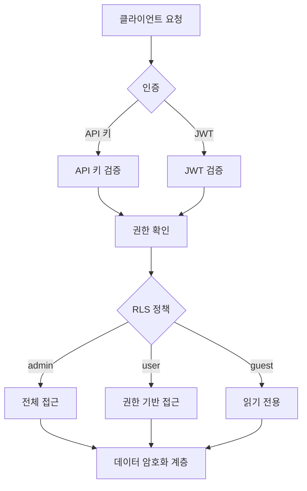

# 보안 개요


💡 bkend의 보안 아키텍처와 데이터 보호 방식을 이해합니다.


## 개요

게시판에서 다른 사용자의 글을 수정하거나 삭제할 수 없도록 하려면 데이터 접근 제어가 필요합니다. bkend의 보안 기능으로 Row/Column 수준의 세밀한 권한을 설정할 수 있습니다.

bkend는 다계층 보안 모델을 통해 데이터를 보호합니다. API 키 기반 인증, Row Level Security(RLS), 암호화 등 여러 보안 계층이 함께 동작합니다.

***

## 보안 계층

| 계층 | 보호 대상 | 메커니즘 |
|------|----------|---------|
| **인증 (Authentication)** | API 접근 | API 키, JWT 토큰 |
| **인가 (Authorization)** | 리소스 접근 | RLS 정책, 권한 그룹 |
| **전송 암호화** | 네트워크 통신 | TLS 1.2+ |
| **저장 암호화** | 저장 데이터 | AES-256-GCM, Encryption at Rest |
| **비밀번호 해싱** | 사용자 비밀번호 | Argon2id (OWASP 권장) |
| **토큰 보안** | API 키 | SHA-256 단방향 해시 |

***

## 인증 방식

### API 키

콘솔에서 생성하는 인증 키입니다. `X-API-Key` 헤더로 사용합니다. 키에 프로젝트 ID와 환경 정보가 포함되어 있어 별도의 컨텍스트 헤더가 필요 없습니다.

- **Publishable Key (`pk_`)**: 클라이언트 사이드에서 사용 (RLS 기반 제한된 권한)
- **Secret Key (`sk_`)**: 서버 사이드에서만 사용 (전체 admin 권한)

→ [API 키 이해](02-api-keys.md), [Publishable Key vs Secret Key](03-public-vs-secret.md)

### JWT 토큰

사용자 로그인 시 발급되는 인증 토큰입니다. 사용자 인증 후 자동으로 관리됩니다.

→ [인증 시스템 개요](../authentication/01-overview.md)

***

## 인가 (RLS)

Row Level Security는 테이블 데이터에 대한 접근 권한을 세밀하게 제어합니다.

| 사용자 그룹 | 설명 | 기본 권한 |
|------------|------|----------|
| `admin` | 관리자 | 모든 권한 |
| `user` | 인증된 사용자 | 생성, 읽기, 목록 조회 |
| `guest` | 미인증 사용자 | 읽기, 목록 조회 |
| `self` | 본인 데이터 | createdBy 기반 접근 |

→ [RLS 개요](04-rls-overview.md), [RLS 정책 작성](05-rls-policies.md)

***

## 암호화

### 전송 암호화

모든 API 통신은 TLS 1.2 이상으로 암호화됩니다.

### 저장 암호화

| 대상 | 방식 |
|------|------|
| 민감한 내부 설정 데이터 | AES-256-GCM (Application 레벨) |
| 데이터베이스 저장 데이터 | Encryption at Rest |
| API 키 | SHA-256 해시 (단방향) |
| 비밀번호 | Argon2id (OWASP 2025 권장) |

→ [데이터 암호화](06-data-encryption.md)

***


⚠️ Publishable Key는 클라이언트에 노출되어도 안전하지만, Secret Key는 반드시 서버 환경에서만 사용하세요. 자세한 내용은 [Publishable Key vs Secret Key](03-public-vs-secret.md)를 참고하세요.


***

## 다음 단계

- [API 키 이해](02-api-keys.md) — API 키 구조와 관리
- [RLS 개요](04-rls-overview.md) — 데이터 접근 제어
- [보안 모범 사례](07-best-practices.md) — 보안 권장 사항
