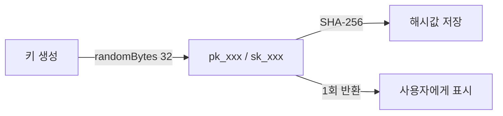
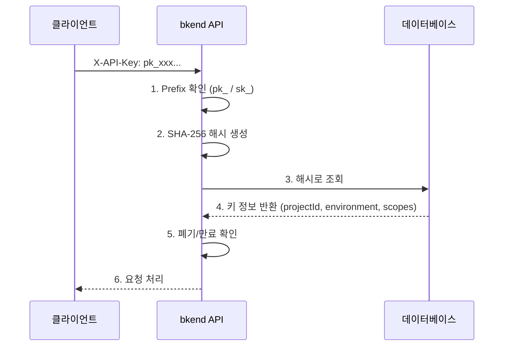

# API 키 이해


💡 bkend API 키의 구조, 생성 방식, 보안 특성을 이해합니다.


## 개요

API 키는 bkend 서비스 API에 접근하기 위한 인증 수단입니다. 콘솔에서 생성하며, `X-API-Key` 헤더로 사용합니다. API 키에는 프로젝트 ID와 환경 정보가 포함되어 있어 별도의 컨텍스트 헤더 없이 요청할 수 있습니다.

***

## API 키 종류

bkend는 두 가지 유형의 API 키를 제공합니다.

| 항목 | Publishable Key | Secret Key |
|------|----------------|------------|
| **Prefix** | `pk_` | `sk_` |
| **사용 환경** | 클라이언트 (브라우저, 모바일) | 서버 사이드만 |
| **권한** | RLS 기반 제한된 접근 | 전체 접근 (admin) |
| **노출 위험** | 낮음 (RLS로 보호) | 높음 (전체 권한) |

***

## API 키 구조

### 키 형식

```text
pk_a1b2c3d4e5f6...  (pk_ + 64자 hex)
sk_a1b2c3d4e5f6...  (sk_ + 64자 hex)
```

| 구성 요소 | 설명 |
|----------|------|
| `pk_` / `sk_` | 키 유형 prefix |
| 64자 hex | 32바이트 랜덤 값 (암호학적 난수) |

### 포함 정보

API 키는 생성 시 다음 정보를 포함합니다. API 요청 시 서버가 이 정보를 자동으로 추출하므로 별도 헤더가 불필요합니다.

| 정보 | 설명 |
|------|------|
| Project ID | 키가 속한 프로젝트 |
| Environment | 대상 환경 (`dev`, `staging`, `prod`) |
| Scopes | 테이블/작업별 접근 범위 |

### 보안 저장 방식

API 키는 생성 시 **SHA-256 해시**로 변환되어 저장됩니다. 원본 키는 저장되지 않습니다.




🚨 **위험** — API 키는 생성 시 **단 한 번만** 표시됩니다. 안전한 곳에 즉시 저장하세요.


***

## API 키 속성

| 속성 | 설명 |
|------|------|
| Organization | 키가 속한 조직 |
| 프로젝트 범위 | 접근 가능한 프로젝트 (전체 또는 특정) |
| 스코프 | 테이블 및 작업별 권한 범위 (아래 참조) |
| 만료 시간 | 선택 사항 (미설정 시 영구) |
| 생성자 | 키를 생성한 사용자 |

### API 키 스코프

스코프를 사용하면 API 키가 접근할 수 있는 테이블과 작업을 제한할 수 있습니다. 스코프가 설정되면 모든 API 요청에서 RLS 권한 검사 **이전에** 스코프를 먼저 확인합니다.

| 스코프 형식 | 설명 | 예시 |
|------------|------|------|
| `{tableName}:{operation}` | 특정 테이블의 특정 작업 허용 | `posts:read` |
| `{tableName}:*` | 특정 테이블의 모든 작업 허용 | `posts:*` |
| `*:{operation}` | 모든 테이블의 특정 작업 허용 | `*:read` |
| `*:*` | 모든 테이블의 모든 작업 허용 | `*:*` |


⚠️ 스코프 검사는 RLS 권한 검사 **이전에** 적용됩니다. `admin` 그룹이라도 스코프 제한을 우회할 수 없습니다. 요청한 작업이 스코프에 포함되지 않으면 `403 SCOPE_INSUFFICIENT` 에러가 반환됩니다.


***

## API 키 검증 흐름



### 검증 실패 사유

| 사유 | HTTP | 설명 |
|------|:----:|------|
| 잘못된 형식 | 401 | `pk_` / `sk_` prefix가 아닌 경우 |
| 키 없음 | 401 | 해시에 해당하는 키가 없는 경우 |
| 폐기됨 | 401 | 키가 폐기된 경우 |
| 만료됨 | 401 | 만료 시간이 지난 경우 |

***

## API 키 관리

### 콘솔에서 관리하기

콘솔의 **API 키** 메뉴에서 API 키를 관리할 수 있습니다. 토큰 생성, 권한 설정, 폐기 등의 상세 방법은 콘솔 가이드를 참고하세요.

→ [API 키 관리 (콘솔)](../console/11-api-keys.md)

### 5분 만에 API Key 발급하고 테스트하기

1. 콘솔 → **API 키** → **새 토큰 생성**을 클릭하세요.
2. 토큰 이름: `test-key`, 타입: Publishable Key, 권한: `Table Data (read, create)`.
3. **생성** 후 표시된 토큰을 복사하세요.
4. curl로 테스트하세요:

```bash
curl -X GET https://api-client.bkend.ai/v1/data/posts \
  -H "X-API-Key: {pk_publishable_key}"
```


✅ 200 응답이 돌아오면 API Key가 정상 동작하는 것입니다.


### API 키 사용 예시 (JavaScript)

```javascript
// Publishable Key를 X-API-Key 헤더에 포함
const response = await fetch('https://api-client.bkend.ai/v1/data/posts', {
  headers: {
    'X-API-Key': '{pk_publishable_key}',
  },
});

const data = await response.json();
```

앱에서 bkend API를 연동하는 상세 방법은 [앱에서 bkend 연동하기](../getting-started/03-app-integration.md)를 참고하세요.

***

## 다음 단계

- [Publishable Key vs Secret Key](03-public-vs-secret.md) — 키 종류별 사용법
- [API 키 관리 (콘솔)](../console/11-api-keys.md) — 콘솔에서 토큰 생성/관리
- [앱에서 bkend 연동하기](../getting-started/03-app-integration.md) — 앱에 API Key 설정하기
- [보안 모범 사례](07-best-practices.md) — API 키 보안 권장 사항
