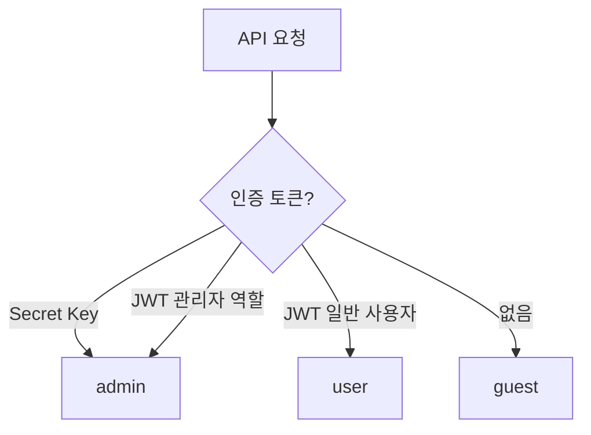

# Row Level Security 개요


💡 Row Level Security(RLS)를 통해 테이블 데이터에 대한 접근 권한을 세밀하게 제어합니다.


## 개요

RLS(Row Level Security)는 테이블 단위로 데이터 접근 권한을 제어하는 보안 메커니즘입니다. 사용자 그룹별로 생성, 읽기, 수정, 삭제, 목록 조회 권한을 설정할 수 있습니다.

***

## 사용자 그룹

bkend는 4가지 사용자 그룹으로 권한을 구분합니다.

| 그룹 | 설명 | 결정 기준 |
|------|------|----------|
| `admin` | 관리자 | API 키 인증 (Secret Key) 또는 관리자 역할 |
| `user` | 인증된 사용자 | JWT 토큰 인증 |
| `guest` | 미인증 사용자 | 인증 없음 |
| `self` | 본인 데이터 | `createdBy`가 본인인 데이터 |

### 그룹 결정 흐름



***

## 권한 모델

각 테이블에는 사용자 그룹별 CRUD + List 권한을 설정할 수 있습니다.

### 권한 종류

| 권한 | 설명 | API |
|------|------|-----|
| `create` | 데이터 생성 | `POST /v1/data/:tableName` |
| `read` | 단건 조회 | `GET /v1/data/:tableName/:id` |
| `update` | 데이터 수정 | `PATCH /v1/data/:tableName/:id` |
| `delete` | 데이터 삭제 | `DELETE /v1/data/:tableName/:id` |
| `list` | 목록 조회 | `GET /v1/data/:tableName` |

### 기본 권한 (미설정 시)

| 그룹 | create | read | update | delete | list |
|------|:------:|:----:|:------:|:------:|:----:|
| `admin` | ✅ | ✅ | ✅ | ✅ | ✅ |
| `user` | ✅ | ✅ | ❌ | ❌ | ✅ |
| `guest` | ❌ | ✅ | ❌ | ❌ | ✅ |


⚠️ `admin` 그룹은 항상 모든 권한을 가집니다. 별도 설정과 관계없이 제한할 수 없습니다.


***

## self 권한

`self` 권한은 **본인이 생성한 데이터**에만 적용되는 특수 권한입니다.

### 동작 방식

- 데이터의 `createdBy` 필드가 요청자의 사용자 ID와 일치하면 허용
- 목록 조회 시 `self` 권한만 있으면 **자동으로 본인 데이터만 필터링**

### 예시

`user` 그룹에 `update: false`, `self.update: true`로 설정하면:

- 다른 사용자의 데이터: 수정 **불가**
- 본인이 생성한 데이터: 수정 **가능**

***

## 권한 모드

bkend는 두 가지 권한 모드를 지원합니다. 콘솔 또는 MCP 도구에서 설정할 수 있습니다.

| 모드 | 설명 | 용도 |
|------|------|------|
| **Boolean** | 그룹별 CRUD 작업에 대한 허용/차단 스위치 | 단순한 접근 제어 |
| **Expression** | 그룹과 조건을 조합하는 규칙 기반 표현식 | 세밀한 접근 제어 |


두 모드는 완전히 호환됩니다. 표현식 기반 권한이 설정되면 우선 적용되고, 미설정 시 Boolean 권한이 폴백으로 사용됩니다.


### 표현식 기반 권한

표현식 기반 권한은 여러 조건을 조합하는 규칙을 작성할 수 있습니다. 예를 들어, `user` 그룹 **또는** 데이터 소유자에게 접근을 허용하는 표현식을 하나로 작성할 수 있습니다.

```text
user | self
```

주요 표현식:

| 표현식 | 의미 |
|--------|------|
| `user` | 인증된 사용자 허용 |
| `guest` | 미인증 사용자 허용 |
| `self` | 데이터 소유자 허용 (`createdBy`가 요청자와 일치) |
| `public` | 모든 사용자 허용 (인증 불필요) |
| `user \| self` | 인증된 사용자 또는 데이터 소유자 허용 |
| `role:moderator` | `moderator` 커스텀 역할 사용자 허용 |

→ [RLS 정책 작성](05-rls-policies.md) — 표현식 예시 및 설정 방법

***

## 컬럼 수준 권한

테이블 수준 CRUD 권한 외에도, 필드별 읽기/쓰기 권한을 설정할 수 있습니다. 특정 사용자 그룹에게 민감한 필드를 숨기거나 특정 필드의 수정 권한을 제한할 수 있습니다.

→ [컬럼 수준 권한](05-rls-policies.md#컬럼-수준-권한)

## 행 필터

행 필터는 조건에 따라 사용자가 접근할 수 있는 행을 자동으로 제한합니다. `self` 권한(`createdBy`로 필터링)과 달리, 행 필터는 임의의 필드 조건을 지원합니다.

→ [행 필터](05-rls-policies.md#행-필터)

***

## 시스템 테이블

이름이 `_`로 시작하는 테이블은 시스템 테이블입니다.


⚠️ 시스템 테이블은 기본적으로 `admin` 그룹만 접근할 수 있습니다. 권한이 설정되지 않은 경우 `user`와 `guest`는 접근이 차단됩니다.


***

## 다음 단계

- [RLS 정책 작성](05-rls-policies.md) — 테이블별 권한 설정 방법
- [Publishable Key vs Secret Key](03-public-vs-secret.md) — 키 종류별 권한 차이
- [보안 모범 사례](07-best-practices.md) — RLS 설정 권장 사항
