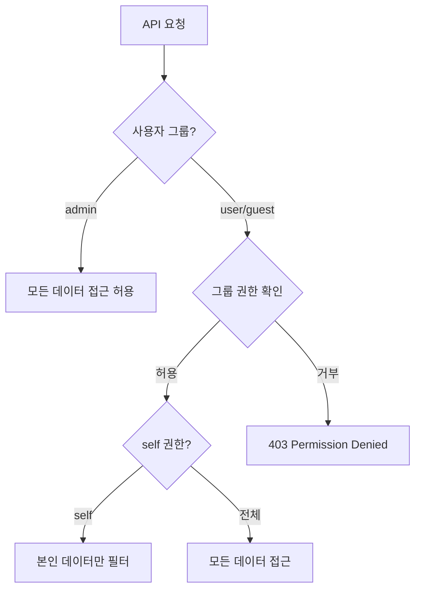

# Row Level Security 개요

> 테이블 데이터의 행 수준 접근 제어를 안내합니다.

## 개요

Row Level Security(RLS)는 테이블의 각 행에 대한 접근 권한을 제어합니다. bkend는 사용자 그룹(admin, user, guest)과 self 권한을 통해 데이터 접근을 세밀하게 관리합니다.

---

## 사용자 그룹

| 그룹 | 설명 |
|------|------|
| **admin** | 모든 데이터에 대한 전체 CRUD 권한 |
| **user** | 인증된 User (JWT 토큰 보유) |
| **guest** | 인증되지 않은 접근자 |
| **self** | 본인이 생성한 데이터만 접근 |

---

## 기본 권한 정책

| 작업 | admin | user | guest |
|------|:-----:|:----:|:-----:|
| Create | ✅ | ✅ | - |
| Read | ✅ | ✅ | ✅ |
| Update | ✅ | - | - |
| Delete | ✅ | - | - |
| List | ✅ | ✅ | ✅ |

---

## 권한 검사 흐름



---

## self 권한

self 권한이 설정된 경우, User는 자신이 생성한 데이터(`createdBy` = 본인 ID)에만 접근할 수 있습니다.

| 작업 | self 권한 동작 |
|------|-------------|
| **Read** | `createdBy`가 본인인 데이터만 반환 |
| **Update** | `createdBy`가 본인인 데이터만 수정 가능 |
| **Delete** | `createdBy`가 본인인 데이터만 삭제 가능 |
| **List** | `createdBy`가 본인인 데이터만 목록에 표시 |

---

## 테이블별 권한 설정하기

테이블 생성 또는 수정 시 `permissions` 필드로 권한을 설정합니다.

```json
{
  "permissions": {
    "admin": {
      "create": true,
      "read": true,
      "update": true,
      "delete": true
    },
    "user": {
      "create": true,
      "read": true,
      "update": false,
      "delete": false
    },
    "self": {
      "read": true,
      "update": true,
      "delete": true
    },
    "guest": {
      "read": true
    }
  }
}
```

---

## 관련 문서

- [RLS 정책 작성](06-rls-policies.md) — 정책 작성 가이드
- [보안 개요](01-overview.md) — 보안 모델 소개
- [데이터 조회](../database/07-select.md) — 데이터 조회와 권한
