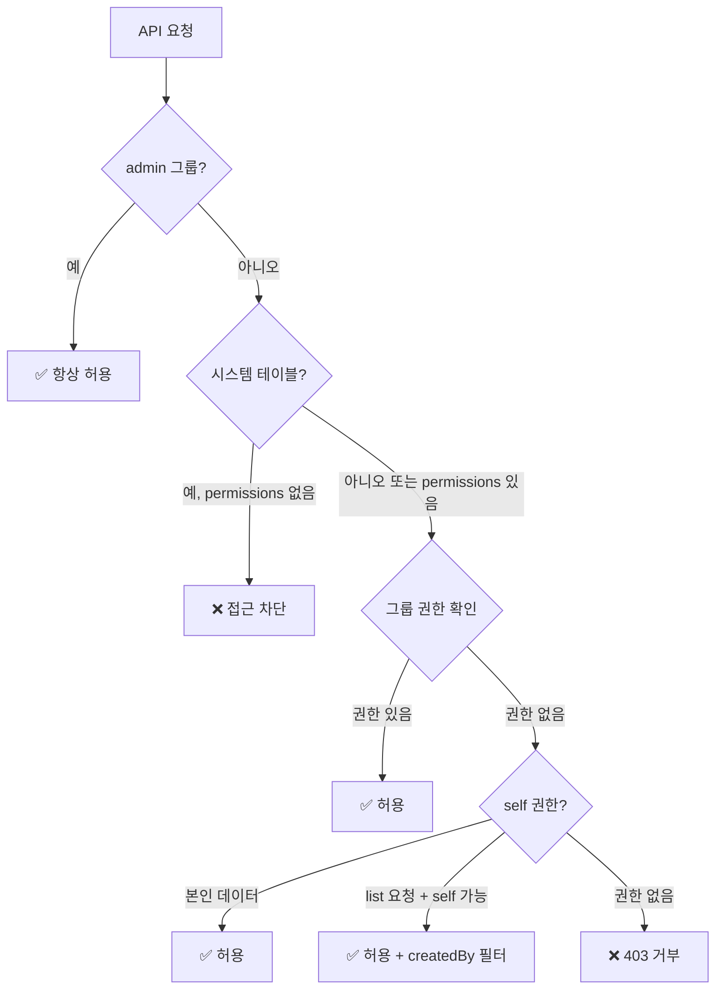
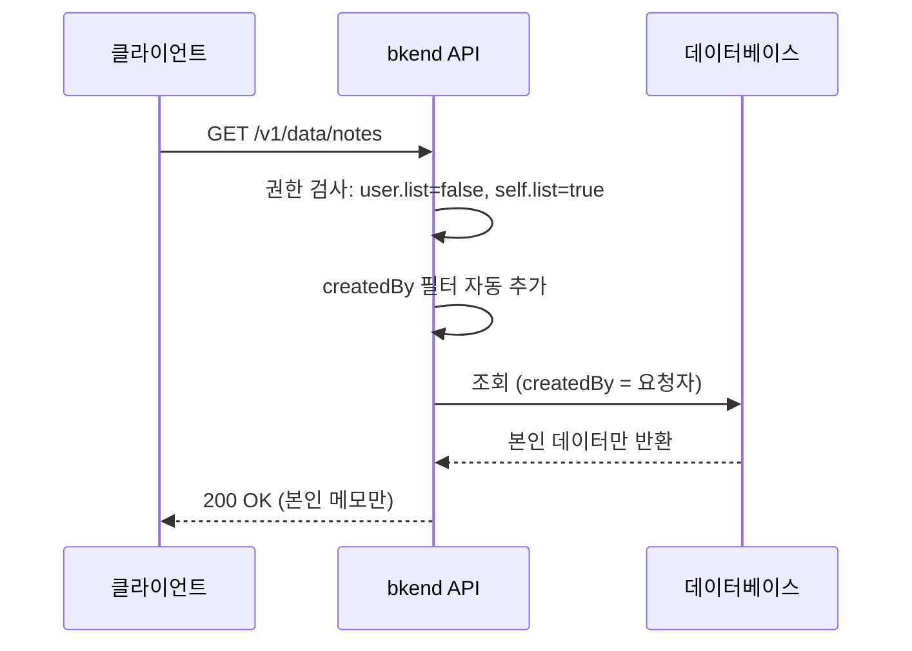

# RLS 정책 작성


💡 테이블별 Row Level Security 정책을 설정하여 데이터 접근 권한을 제어합니다.


## 개요

RLS 정책은 테이블의 `permissions` 설정을 통해 정의합니다. 각 사용자 그룹(admin, user, guest)별로 create, read, update, delete, list 권한을 개별 지정할 수 있으며, `self` 권한으로 본인 데이터에 대한 추가 접근을 허용할 수 있습니다.

***

## 정책 구조

### permissions JSON 형식

```json
{
  "permissions": {
    "admin": {
      "create": true, "read": true, "update": true, "delete": true, "list": true
    },
    "user": {
      "create": true, "read": true, "update": false, "delete": false, "list": true
    },
    "guest": {
      "create": false, "read": true, "update": false, "delete": false, "list": true
    },
    "self": {
      "read": true, "update": true, "delete": true, "list": true
    }
  }
}
```

### 권한 필드

| 필드 | 설명 | 기본값 (미설정 시) |
|------|------|:---:|
| `create` | 데이터 생성 | 그룹별 상이 |
| `read` | 단건 조회 | 그룹별 상이 |
| `update` | 데이터 수정 | 그룹별 상이 |
| `delete` | 데이터 삭제 | 그룹별 상이 |
| `list` | 목록 조회 | `read` 값으로 대체 |


💡 `list` 권한이 명시적으로 설정되지 않으면 `read` 권한 값으로 대체됩니다. 별도 제어가 필요하면 `list`를 명시하세요.


***

## 권한 검사 흐름



### 검사 우선순위

1. **admin 그룹** — 항상 모든 작업 허용 (시스템 테이블 포함)
2. **시스템 테이블 확인** — `_` 접두사 테이블에 permissions 미설정 시 차단
3. **그룹 권한 확인** — 해당 그룹(user/guest)의 권한 확인
4. **self 권한 확인** — 요청자 ID와 데이터의 `createdBy`가 일치하면 허용
5. **list + self 권한** — 목록 조회 시 self 권한이 있으면 허용 (자동 필터 적용)

***

## 정책 예시

### 게시판 (공개 읽기, 작성자만 수정/삭제)

모든 사용자가 읽을 수 있지만, 수정과 삭제는 본인 게시글만 가능합니다.

```json
{
  "permissions": {
    "user": {
      "create": true, "read": true, "update": false, "delete": false, "list": true
    },
    "self": {
      "update": true, "delete": true
    },
    "guest": {
      "read": true, "list": true
    }
  }
}
```

**동작:**
- 인증된 사용자: 게시글 생성 가능, 전체 목록 조회 가능, 본인 게시글만 수정/삭제
- 미인증 사용자: 읽기와 목록 조회만 가능

### 비공개 메모 (본인만 접근)

생성은 모든 인증 사용자가 가능하지만, 조회/수정/삭제는 본인 데이터만 가능합니다.

```json
{
  "permissions": {
    "user": {
      "create": true, "read": false, "update": false, "delete": false, "list": false
    },
    "self": {
      "read": true, "update": true, "delete": true, "list": true
    },
    "guest": {}
  }
}
```

**동작:**
- 인증된 사용자: 메모 생성 가능, **본인 메모만** 조회/수정/삭제
- 목록 조회 시 `createdBy` 필터가 자동 적용되어 본인 메모만 반환
- 미인증 사용자: 모든 접근 차단

### 공지사항 (관리자만 작성, 전체 공개)

관리자만 공지를 작성하고, 모든 사용자가 읽을 수 있습니다.

```json
{
  "permissions": {
    "user": {
      "create": false, "read": true, "list": true
    },
    "guest": {
      "read": true, "list": true
    }
  }
}
```

**동작:**
- 관리자(admin): 모든 권한 (별도 설정 불필요)
- 인증된 사용자: 읽기와 목록 조회만
- 미인증 사용자: 읽기와 목록 조회만

### 주문 내역 (본인 주문만 조회, 생성 불가)

서버에서 주문을 생성하고, 사용자는 본인 주문만 조회합니다.

```json
{
  "permissions": {
    "user": {
      "create": false, "read": false, "update": false, "delete": false, "list": false
    },
    "self": {
      "read": true, "list": true
    },
    "guest": {}
  }
}
```

**동작:**
- 관리자(Secret Key): 주문 생성/관리
- 인증된 사용자: 본인 주문만 조회 (자동 필터)
- 생성/수정/삭제는 서버 사이드(Secret Key)에서만 수행

***

## self 권한 상세

### 자동 필터 동작

`self` 권한만 있는 사용자가 **목록 조회**(`list`)를 요청하면, 시스템이 자동으로 `createdBy = {요청자 ID}` 필터를 추가합니다.



### self 권한 판단 기준

| 조건 | 적용 |
|------|------|
| 그룹 권한이 `true` | 그룹 권한 우선 (전체 데이터 접근) |
| 그룹 권한이 `false` + self 권한 `true` | self 권한 적용 (본인 데이터만) |
| 그룹 권한과 self 권한 모두 `false` 또는 미설정 | 접근 거부 |


⚠️ 그룹 권한이 `true`이면 self 필터가 적용되지 않습니다. 본인 데이터만 접근하게 하려면 반드시 그룹 권한을 `false`로 설정하세요.


***

## 정책 설정 방법

RLS 정책은 **콘솔** 또는 **MCP 도구**를 통해 설정합니다.



1. 콘솔에서 **프로젝트** > **테이블**로 이동하세요
2. 대상 테이블의 **스키마** 편집기를 여세요
3. **권한 설정** 섹션에서 그룹별 CRUD 권한을 설정하세요
4. 변경 사항을 **저장**하세요

→ [테이블 관리 (콘솔)](../console/07-table-management.md)


AI 도구에서 자연어로 요청하세요:

```text
"posts 테이블의 user 권한을 create, read, list만 허용하고
self에는 update, delete도 허용해줘"
```

→ [테이블 관리 도구](../mcp/04-table-tools.md)



***

## 에러 코드

| 에러 | HTTP | 설명 |
|------|:----:|------|
| `PERMISSION_DENIED` | 403 | 해당 그룹에 요청한 작업 권한이 없는 경우 |
| `SYSTEM_TABLE_ACCESS` | 403 | 시스템 테이블에 비관리자가 접근한 경우 |

***

## 다음 단계

- [RLS 개요](04-rls-overview.md) — 사용자 그룹과 기본 권한
- [데이터 암호화](06-data-encryption.md) — 저장 데이터 보호
- [보안 모범 사례](07-best-practices.md) — RLS 설정 권장 사항
