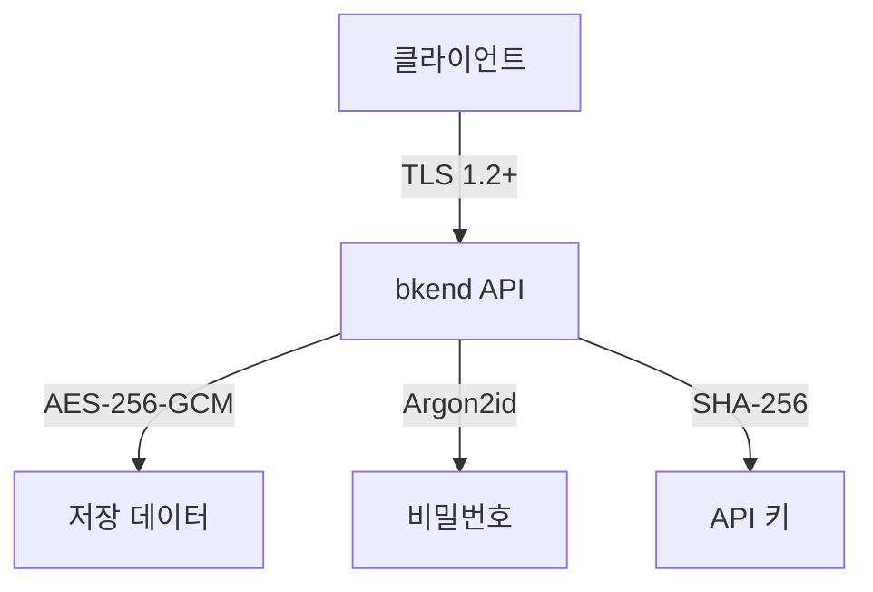

# 데이터 암호화


💡 bkend가 데이터를 보호하는 다계층 암호화 방식을 이해합니다.


## 개요

bkend는 전송 중(In Transit)과 저장 시(At Rest) 모두 암호화를 적용하여 데이터를 보호합니다. 추가로 민감 데이터에는 애플리케이션 레벨 암호화를 적용합니다.

***

## 전송 암호화 (In Transit)

모든 API 통신은 TLS(Transport Layer Security)로 암호화됩니다.

| 항목 | 값 |
|------|-----|
| **프로토콜** | TLS 1.2 이상 |
| **대상** | 모든 API 요청/응답 |
| **강제** | HTTP 요청은 HTTPS로 리다이렉트 |
| **인증서** | 자동 갱신 |


⚠️ HTTP(`http://`)로 요청하면 자동으로 HTTPS(`https://`)로 리다이렉트됩니다. 항상 `https://api-client.bkend.ai`를 사용하세요.


***

## 저장 암호화 (At Rest)

### 데이터베이스

| 계층 | 방식 | 대상 |
|------|------|------|
| **인프라 암호화** | Encryption at Rest | 모든 저장 데이터 |
| **애플리케이션 암호화** | AES-256-GCM | 민감한 내부 설정 데이터 |

데이터베이스 인프라는 모든 저장 데이터를 자동으로 암호화합니다. 추가로 민감한 내부 설정 데이터는 애플리케이션 레벨에서 AES-256-GCM으로 이중 암호화됩니다.

### 파일 스토리지

| 항목 | 값 |
|------|-----|
| **방식** | 서버 측 암호화 (AES-256) |
| **대상** | 업로드된 모든 파일 |

***

## 민감 데이터 처리

### 비밀번호 해싱

사용자 비밀번호는 **Argon2id** 알고리즘으로 해싱됩니다. 원본 비밀번호는 저장되지 않습니다.

| 항목 | 값 |
|------|-----|
| **알고리즘** | Argon2id (OWASP 권장 1순위) |
| **강도** | OWASP 권장 최소 기준 이상 |


💡 Argon2id는 OWASP Password Storage Cheat Sheet 권장 알고리즘 1순위입니다. GPU 브루트포스 공격에 강한 메모리 기반 해싱을 사용하며, OWASP 권장 최소 기준을 상회하는 파라미터로 구성되어 있습니다.


### API 키 해싱

API 키는 **SHA-256** 단방향 해시로 저장됩니다.

- 키는 **암호학적 난수 생성기(CSPRNG)**로 생성됩니다
- `pk_` 또는 `sk_` prefix로 키 유형을 구분합니다
- 원본 키는 **생성 시 1회만** 표시됩니다
- 서버에는 SHA-256 해시만 저장됩니다
- 요청 시 전송된 키를 해시하여 저장된 해시와 비교합니다

### Refresh Token

| 항목 | 값 |
|------|-----|
| **저장** | 세션별 저장 |
| **갱신** | 토큰 갱신 시 이전 토큰 즉시 무효화 |
| **재사용 감지** | 이미 사용된 Refresh Token 재사용 시 전체 세션 무효화 |

***

## 암호화 계층 요약

| 대상 | 암호화 방식 | 단방향 |
|------|-----------|:------:|
| 네트워크 통신 | TLS 1.2+ | — |
| 데이터베이스 | Encryption at Rest | — |
| 민감한 내부 설정 데이터 | AES-256-GCM (Application 레벨) | — |
| 파일 스토리지 | AES-256 서버 측 암호화 | — |
| 비밀번호 | Argon2id | ✅ |
| API 키 | SHA-256 | ✅ |

***

## 다음 단계

- [보안 모범 사례](07-best-practices.md) — 보안 권장 사항
- [API 키 이해](02-api-keys.md) — API 키 보안 상세
- [보안 개요](01-overview.md) — 전체 보안 아키텍처
