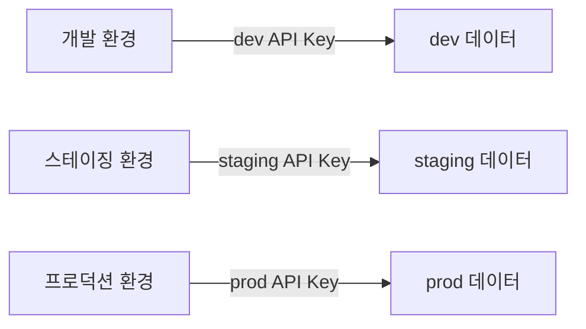

# 보안 모범 사례


💡 bkend를 안전하게 사용하기 위한 보안 권장 사항을 확인합니다.


## 개요

이 문서는 bkend 프로젝트를 운영할 때 지켜야 할 보안 모범 사례를 정리합니다. API 키 관리, 인증, 데이터 접근 제어, 파일 보안, 팀 관리, 환경 분리 6가지 영역을 다룹니다.

***

## API 키 관리

| 권장사항 | 설명 |
|---------|------|
| **환경 변수로 관리** | Secret Key는 소스 코드에 포함하지 말고 환경 변수로 관리하세요 |
| **Git에 커밋 금지** | `.env` 파일을 `.gitignore`에 추가하세요 |
| **최소 권한 원칙** | 필요한 프로젝트와 스코프만 부여하세요 |
| **만료 시간 설정** | 가능하면 만료 시간을 설정하여 키의 유효 기간을 제한하세요 |
| **미사용 키 폐기** | 사용하지 않는 API 키는 즉시 폐기하세요 |
| **키 노출 시 대응** | Secret Key가 노출되면 즉시 폐기하고 새로 생성하세요 |

### 키 사용 구분

| 환경 | 사용할 키 |
|------|----------|
| 프론트엔드 (브라우저, 모바일) | **Publishable Key** + 사용자 JWT |
| 서버 사이드 (API Routes, 배치) | **Secret Key** |


🚨 **위험** — Secret Key를 클라이언트 코드에 포함하면 브라우저 DevTools나 앱 디컴파일로 노출됩니다. 프론트엔드에서는 반드시 Publishable Key를 사용하세요.


***

## 인증 보안

| 권장사항 | 설명 |
|---------|------|
| **HTTPS 강제** | 모든 API 통신에 `https://`를 사용하세요 |
| **토큰 안전 저장** | 브라우저: HttpOnly Cookie, 모바일: Secure Storage 사용 |
| **토큰 노출 금지** | URL 파라미터, 로그, 소스 코드에 토큰을 포함하지 마세요 |
| **Refresh Token 관리** | 갱신 시 새 토큰을 즉시 저장하고 이전 토큰은 폐기하세요 |
| **로그아웃 처리** | 로그아웃 시 서버와 클라이언트 모두에서 토큰을 삭제하세요 |

### 토큰 저장 방법



```javascript
// ✅ 권장: HttpOnly Cookie
// 서버에서 Set-Cookie 헤더로 설정

// ❌ 비권장: localStorage (XSS 공격에 취약)
localStorage.setItem('token', jwt)  // 사용하지 마세요
```


```javascript
// ✅ 권장: 플랫폼 제공 Secure Storage
// iOS: Keychain, Android: Keystore

// ❌ 비권장: AsyncStorage 등 평문 저장소
```



***

## 데이터 접근 제어 (RLS)

| 권장사항 | 설명 |
|---------|------|
| **테이블별 권한 설정** | 모든 테이블에 적절한 CRUD 권한을 설정하세요 |
| **self 권한 활용** | 개인 데이터(메모, 프로필, 주문 등)는 `self` 권한으로 보호하세요 |
| **guest 권한 최소화** | `guest` 그룹에는 공개 데이터 읽기 권한만 부여하세요 |
| **생성 권한 주의** | `guest`에 `create` 권한을 부여하면 미인증 사용자가 데이터를 생성할 수 있습니다 |
| **기본 권한 검토** | permissions 미설정 시 기본 권한이 적용됩니다. 의도와 다른지 확인하세요 |

### 기본 권한 (미설정 시)

| 그룹 | create | read | update | delete | list |
|------|:------:|:----:|:------:|:------:|:----:|
| `admin` | ✅ | ✅ | ✅ | ✅ | ✅ |
| `user` | ✅ | ✅ | ❌ | ❌ | ✅ |
| `guest` | ❌ | ✅ | ❌ | ❌ | ✅ |


⚠️ 기본 권한에서 `guest`는 `read`와 `list`가 허용됩니다. 비공개 테이블이라면 반드시 `guest`의 권한을 명시적으로 제한하세요.


### 권장 정책 패턴

| 시나리오 | user | self | guest |
|---------|------|------|-------|
| 공개 게시판 | create, read, list | update, delete | read, list |
| 비공개 메모 | create | read, update, delete, list | (없음) |
| 공지사항 | read, list | (없음) | read, list |
| 주문 내역 | (없음) | read, list | (없음) |
| 공개 프로필 | create, read, list | update | read, list |

***

## 파일 보안

| 권장사항 | 설명 |
|---------|------|
| **기본 private 업로드** | 민감한 파일은 `private`으로 업로드하세요 |
| **Presigned URL 유효 기간** | 최소한의 유효 기간을 설정하세요 |
| **public 파일 검토** | CDN URL은 만료되지 않으므로 민감한 파일에 사용하지 마세요 |
| **파일 크기 제한** | 업로드 크기 제한을 설정하여 남용을 방지하세요 |

***

## 팀 관리

| 권장사항 | 설명 |
|---------|------|
| **최소 역할 부여** | 팀원에게 필요한 최소 역할만 부여하세요 |
| **정기 점검** | 팀 멤버 목록을 정기적으로 검토하세요 |
| **퇴사 처리** | 팀을 떠난 멤버는 즉시 제거하세요 |
| **API 키 분리** | 팀원별로 별도의 API 키를 사용하게 하세요 |

***

## 환경 분리

| 권장사항 | 설명 |
|---------|------|
| **dev/prod 분리** | 개발과 프로덕션 환경을 분리하세요 |
| **환경별 API 키** | 각 환경에 별도의 API 키를 사용하세요 |
| **프로덕션 주의** | 프로덕션 환경에서 테스트 데이터를 사용하지 마세요 |
| **환경별 RLS** | 환경별로 적절한 권한 정책을 설정하세요 |




⚠️ 환경 간 API 키를 혼용하지 마세요. 개발 환경의 키로 프로덕션 데이터에 접근하면 보안 사고가 발생할 수 있습니다.


***

## 보안 체크리스트

프로젝트 출시 전 다음 항목을 확인하세요.

- [ ] Secret Key가 클라이언트 코드에 포함되지 않았는지 확인
- [ ] `.env` 파일이 `.gitignore`에 포함되어 있는지 확인
- [ ] 모든 테이블에 적절한 RLS 권한이 설정되었는지 확인
- [ ] `guest` 그룹의 권한이 최소화되었는지 확인
- [ ] 민감한 파일이 `private`으로 업로드되는지 확인
- [ ] 팀 멤버 목록과 역할이 최신인지 확인
- [ ] 환경별 API 키가 분리되어 있는지 확인
- [ ] 프로덕션 환경에서 HTTPS만 사용하는지 확인

***

## 다음 단계

- [보안 API 레퍼런스](08-api-reference.md) — 보안 관련 API 상세
- [RLS 정책 작성](05-rls-policies.md) — 정책 설정 방법
- [Publishable Key vs Secret Key](03-public-vs-secret.md) — 키 종류별 가이드
