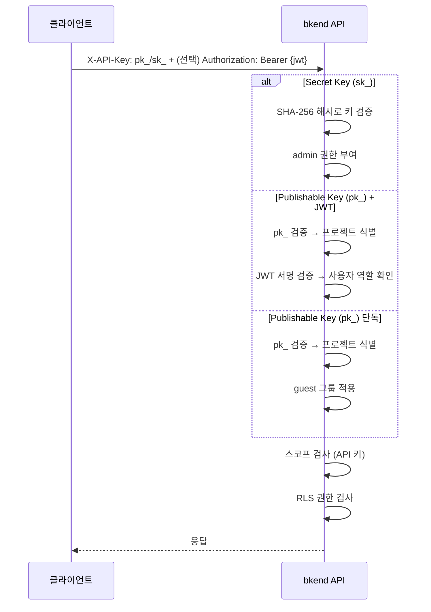
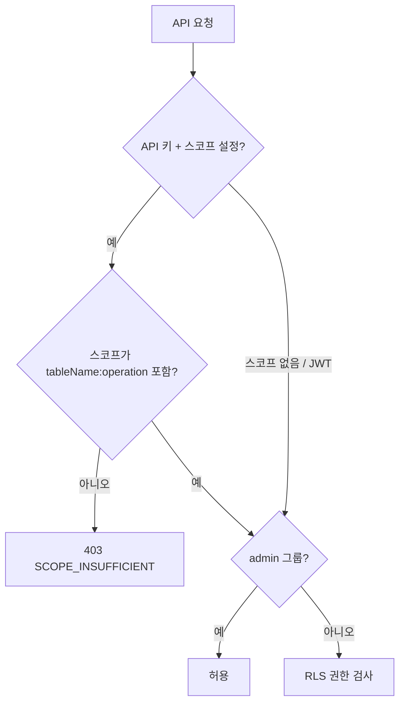

# Security REST API 레퍼런스


💡 보안 관련 API 인증 방식, 헤더, 에러 코드를 확인합니다.


## 개요

이 문서는 bkend REST API의 보안 관련 사항을 정리합니다. 모든 API 요청에 적용되는 인증 헤더, 권한 모델, 보안 관련 에러 코드를 다룹니다.

***

## 베이스 URL

```text
https://api-client.bkend.ai
```

***

## 인증 헤더

### 필수 헤더

| 헤더 | 필수 | 설명 |
|------|:----:|------|
| `X-API-Key` | ✅ | Publishable Key (`pk_`) 또는 Secret Key (`sk_`). 프로젝트 ID와 환경 정보 포함 |

### 인증 헤더 (선택)

| 헤더 | 값 | 결과 |
|------|-----|------|
| `Authorization: Bearer {jwt}` | JWT 토큰 | 사용자 인증 (user 그룹) |
| (없음) | — | 미인증 (pk_ 단독 → guest 그룹) |


💡 `pk_`/`sk_` 키에 프로젝트 ID와 환경 정보가 포함되어 있으므로, `X-Project-Id`와 `X-Environment` 헤더는 불필요합니다.


### Publishable Key 인증

```bash
# 공개 엔드포인트 (pk_ 단독)
curl -X GET https://api-client.bkend.ai/v1/data/{tableName} \
  -H "X-API-Key: {pk_publishable_key}"

# 인증 필요 엔드포인트 (pk_ + JWT)
curl -X GET https://api-client.bkend.ai/v1/data/{tableName} \
  -H "X-API-Key: {pk_publishable_key}" \
  -H "Authorization: Bearer {accessToken}"
```

### Secret Key 인증

```bash
# 서버 사이드 (sk_ 단독, admin 권한)
curl -X GET https://api-client.bkend.ai/v1/data/{tableName} \
  -H "X-API-Key: {sk_secret_key}"
```

***

## 인증 흐름



***

## 사용자 그룹 결정

| 인증 | 조건 | 사용자 그룹 |
|------|------|-----------|
| Secret Key (`sk_`) | — | `admin` |
| Publishable Key (`pk_`) + JWT | 조직 관리자 역할 | `admin` |
| Publishable Key (`pk_`) + JWT | 일반 사용자 | `user` |
| Publishable Key (`pk_`) 단독 | — | `guest` |

***

## API 키 형식

| 항목 | Publishable Key | Secret Key |
|------|----------------|------------|
| **Prefix** | `pk_` | `sk_` |
| **형식** | `pk_` + 64자 hex | `sk_` + 64자 hex |
| **정규식** | `^pk_[a-fA-F0-9]{64}$` | `^sk_[a-fA-F0-9]{64}$` |
| **저장 방식** | SHA-256 해시 (원본 미저장) | SHA-256 해시 (원본 미저장) |

### 키 생성

API 키는 **콘솔**에서 생성합니다.

→ [API 키 관리 (콘솔)](../console/11-api-keys.md)

***

## RLS 권한 검사

### 기본 권한

permissions 미설정 시 적용되는 기본 권한입니다.

| 그룹 | create | read | update | delete | list |
|------|:------:|:----:|:------:|:------:|:----:|
| `admin` | ✅ | ✅ | ✅ | ✅ | ✅ |
| `user` | ✅ | ✅ | ❌ | ❌ | ✅ |
| `guest` | ❌ | ✅ | ❌ | ❌ | ✅ |

### 권한별 API 매핑

| 권한 | HTTP 메서드 | 엔드포인트 |
|------|-----------|-----------|
| `create` | `POST` | `/v1/data/{tableName}` |
| `read` | `GET` | `/v1/data/{tableName}/{id}` |
| `update` | `PATCH` | `/v1/data/{tableName}/{id}` |
| `delete` | `DELETE` | `/v1/data/{tableName}/{id}` |
| `list` | `GET` | `/v1/data/{tableName}` |

### self 권한 자동 필터

`self` 권한만 있는 사용자가 목록 조회 시, 응답에 `createdBy = {requesterId}` 필터가 자동 적용됩니다.

***

## API 키 스코프 검사

API 키에 스코프가 설정되어 있으면, RLS 권한 검사 **이전에** 스코프를 먼저 확인합니다. `admin` 그룹이라도 스코프 제한을 우회할 수 없습니다.

### 검사 순서



### 스코프 에러 응답

```json
{
  "statusCode": 403,
  "error": "SCOPE_INSUFFICIENT",
  "message": "API Key scope does not include posts:delete"
}
```

***

## 보안 관련 에러 코드

### 인증 에러 (401)

| 에러 코드 | 설명 | 대응 |
|----------|------|------|
| `UNAUTHORIZED` | 인증 토큰 없음 | `X-API-Key` 헤더 추가 |
| `INVALID_TOKEN` | 잘못된 토큰 형식 | 토큰 형식 확인 (pk_/sk_ prefix 또는 유효한 JWT) |
| `TOKEN_EXPIRED` | 토큰 만료 | 새 토큰 발급 또는 Refresh Token으로 갱신 |
| `TOKEN_REVOKED` | 폐기된 API 키 | 새 API 키 생성 |

### 인증 에러 응답 예시

```json
{
  "statusCode": 401,
  "error": "UNAUTHORIZED",
  "message": "Authentication required"
}
```

### 인가 에러 (403)

| 에러 코드 | 설명 | 대응 |
|----------|------|------|
| `PERMISSION_DENIED` | 해당 그룹에 권한 없음 | RLS 정책 확인 또는 인증 방식 변경 |
| `SCOPE_INSUFFICIENT` | API 키 스코프에 요청한 작업 미포함 | API 키에 필요한 스코프 추가 |
| `SYSTEM_TABLE_ACCESS` | 시스템 테이블 접근 차단 | admin 인증(Secret Key) 사용 |

### 인가 에러 응답 예시

```json
{
  "statusCode": 403,
  "error": "PERMISSION_DENIED",
  "message": "user 그룹에 delete 권한이 없습니다"
}
```

### 프로젝트/환경 에러

| 에러 코드 | HTTP | 설명 | 대응 |
|----------|:----:|------|------|
| `PROJECT_NOT_FOUND` | 404 | API 키의 프로젝트가 잘못됨 | 올바른 API 키 사용 확인 |
| `ENVIRONMENT_NOT_FOUND` | 404 | API 키의 환경이 잘못됨 | 올바른 환경의 API 키 사용 확인 |

***


⚠️ Secret Key(`sk_`)는 서버 사이드에서만 사용하세요. 클라이언트 코드(JavaScript 번들, 모바일 앱 등)에 포함하면 노출 위험이 있습니다.


## Rate Limiting

| 항목 | 값 |
|------|-----|
| **제한** | 플랜별 상이 |
| **헤더** | `X-RateLimit-Limit`, `X-RateLimit-Remaining` |
| **초과 시** | `429 Too Many Requests` |

### 재시도 처리

```javascript
async function fetchWithRetry(url, options, maxRetries = 3) {
  for (let i = 0; i < maxRetries; i++) {
    const response = await fetch(url, options);

    if (response.status === 429) {
      const retryAfter = response.headers.get('Retry-After') || '1';
      await new Promise(resolve =>
        setTimeout(resolve, parseInt(retryAfter) * 1000)
      );
      continue;
    }

    return response;
  }
  throw new Error('Rate limit exceeded after retries');
}
```

***

## 다음 단계

- [보안 개요](01-overview.md) — 전체 보안 아키텍처
- [API 키 이해](02-api-keys.md) — API 키 상세
- [RLS 정책 작성](05-rls-policies.md) — 접근 권한 설정
- [공통 에러 코드](../troubleshooting/01-common-errors.md) — 전체 에러 코드 레퍼런스
