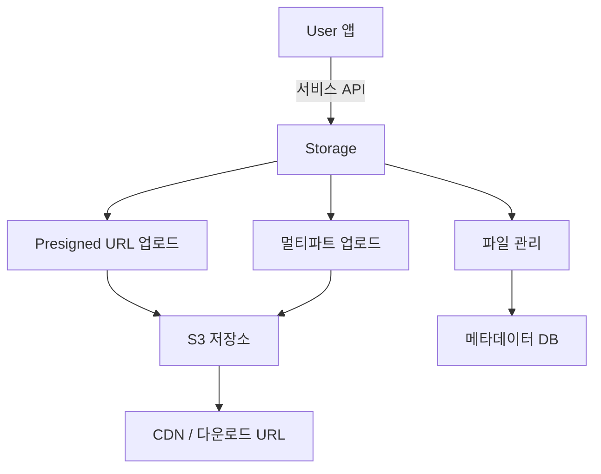
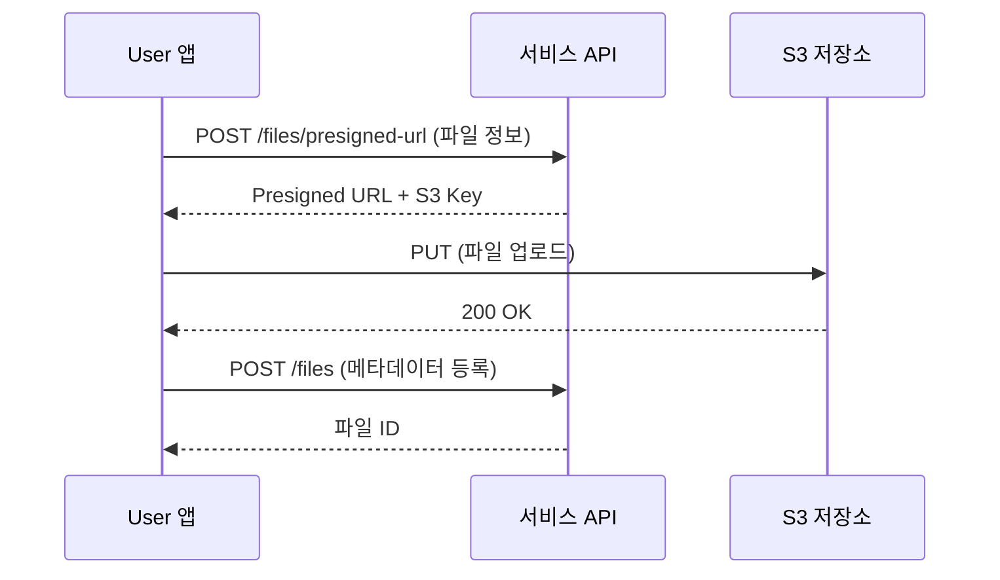

# Storage 개요

> bkend의 Storage 기능으로 파일을 업로드하고 관리하는 방법을 소개합니다.

## 개요

bkend Storage는 이미지, 문서, 미디어 파일을 안전하게 저장하고 관리하는 파일 호스팅 서비스입니다. Presigned URL 기반 업로드, 대용량 파일 멀티파트 업로드, CDN을 통한 다운로드를 지원합니다.

---

## 주요 기능

| 기능 | 설명 |
|------|------|
| **단일 파일 업로드** | Presigned URL로 직접 S3에 업로드 |
| **대용량 파일 업로드** | 멀티파트 업로드로 대용량 파일 분할 전송 |
| **파일 다운로드** | CDN URL (public) 또는 Presigned URL (private) |
| **파일 목록 조회** | 검색, 필터, 페이지네이션 |
| **파일 메타데이터** | 파일명, MIME 타입, 크기, 가시성 관리 |
| **접근 권한** | public, private, protected, shared |

---

## 파일 업로드 흐름

Storage는 Presigned URL 방식으로 파일을 업로드합니다. 서버를 거치지 않고 클라이언트에서 S3로 직접 업로드하여 빠르고 효율적입니다.

---

## 파일 가시성

| 가시성 | 설명 | 다운로드 방식 |
|--------|------|-------------|
| `public` | 누구나 접근 가능 | CDN URL (만료 없음) |
| `private` | 소유자만 접근 가능 (기본값) | Presigned URL (1시간 유효) |
| `protected` | 인증된 User만 접근 가능 | Presigned URL (1시간 유효) |
| `shared` | 공유 대상자만 접근 가능 | Presigned URL (1시간 유효) |

---

## 지원 파일 타입 및 크기 제한

| 분류 | MIME 타입 | 최대 크기 |
|------|----------|----------|
| **이미지** | JPEG, PNG, GIF, WebP, SVG | 10MB |
| **비디오** | MP4, WebM, OGG, AVI, MOV | 100MB |
| **오디오** | MP3, WAV, OGG, AAC | - |
| **문서** | PDF, Word, Excel, PowerPoint | 20MB |

---

## 버킷 (카테고리)

파일을 용도별로 분류하여 관리할 수 있습니다.

| 버킷 | 설명 |
|------|------|
| `images` | 이미지 파일 |
| `documents` | 문서 파일 |
| `media` | 미디어 파일 (비디오, 오디오) |
| `attachments` | 첨부 파일 (기본값) |
| `temp` | 임시 파일 |

---

## API 인증 헤더

서비스 API 호출 시 다음 헤더를 포함하세요:

| 헤더 | 필수 | 설명 |
|------|------|------|
| `x-project-id` | ✅ | 프로젝트 ID |
| `x-environment` | - | 환경 이름 (기본값: `development`) |
| `Authorization` | ✅ | `Bearer {accessToken}` |

---

## 관련 문서

- [콘솔에서 Storage 관리](02-console-ui.md) — 콘솔 UI 가이드
- [단일 파일 업로드](04-upload-single.md) — Presigned URL 업로드
- [대용량 파일 업로드](06-upload-large.md) — 멀티파트 업로드
- [파일 다운로드](07-download.md) — 다운로드 URL 생성
- [파일 접근 권한](10-permissions.md) — 파일 가시성과 접근 제어
