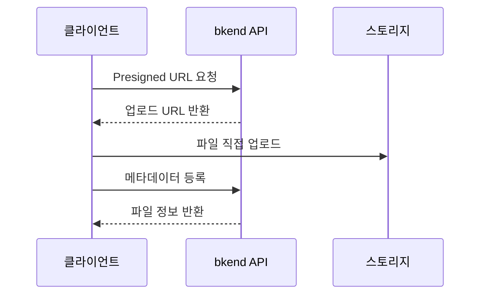
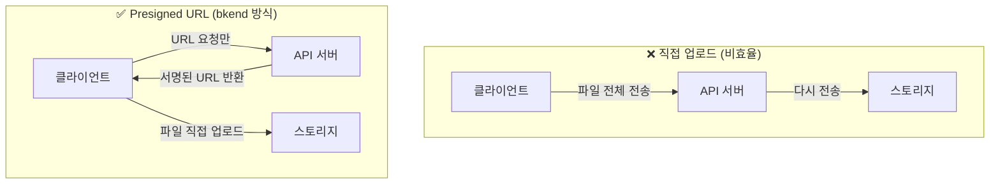
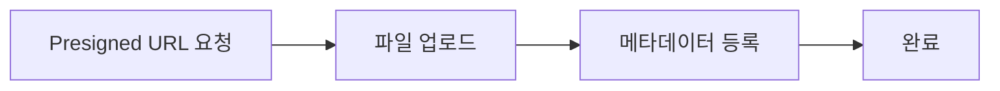

# 스토리지 개요


💡 bkend 스토리지로 파일을 업로드하고, 메타데이터를 관리하세요.


## 스토리지란?

앱에서 프로필 사진, 게시글 이미지, 문서 파일을 안전하게 업로드하고 다운로드하려면 bkend의 파일 스토리지를 사용하세요. Presigned URL 방식으로 파일이 서버를 거치지 않고 직접 스토리지에 저장됩니다.

bkend 스토리지는 파일 업로드, 다운로드, 메타데이터 관리를 위한 서비스입니다. Presigned URL은 일정 시간 동안만 유효한 서명된 URL로, 클라이언트가 서버를 거치지 않고 직접 스토리지에 파일을 업로드/다운로드할 수 있게 합니다. Presigned URL 기반으로 클라이언트에서 직접 파일을 업로드하며, 메타데이터 API로 파일 정보를 관리합니다.



***

## 핵심 특징

### Presigned URL 업로드

파일은 bkend 서버를 거치지 않고 스토리지에 직접 업로드됩니다. 서버 부하 없이 대용량 파일도 효율적으로 처리할 수 있습니다.

#### 왜 Presigned URL인가?

bkend는 파일을 API 서버로 직접 전송(Direct Upload)하지 않고, **3단계 Presigned URL 패턴**을 사용합니다. 이 방식을 채택한 이유는 다음과 같습니다.



| 이점 | 설명 |
|------|------|
| **보안** | 파일이 API 서버를 통과하지 않으므로, 서버 메모리에 파일 데이터가 노출되지 않습니다. Presigned URL은 제한된 시간 동안만 유효하여 무단 접근을 방지합니다. |
| **성능** | 클라이언트가 스토리지에 직접 업로드하므로, API 서버가 파일 데이터를 중계하는 병목이 발생하지 않습니다. 업로드 속도가 서버 대역폭에 제한되지 않습니다. |
| **확장성** | API 서버는 URL 발급만 처리하므로, 수천 명이 동시에 파일을 업로드해도 서버 리소스 사용이 최소화됩니다. 대용량 파일(수 GB)도 서버 부하 없이 처리됩니다. |


💡 Presigned URL은 발급 후 일정 시간이 지나면 만료됩니다. URL 발급 후 가능한 빨리 업로드를 시작하세요.


### 멀티파트 업로드

대용량 파일은 여러 조각으로 나누어 병렬 업로드할 수 있습니다. 업로드 실패 시 해당 파트만 재시도하면 됩니다.

### 메타데이터 관리

파일의 이름, 크기, MIME 타입, 카테고리, 태그 등 메타데이터를 별도로 관리할 수 있습니다.

### 접근 제어

파일마다 접근 범위(`visibility`)를 설정하여 공개/비공개를 제어합니다.

| Visibility | 설명 |
|-----------|------|
| `public` | 누구나 접근 가능 |
| `private` | 소유자만 접근 가능 |
| `protected` | 인증된 사용자만 접근 가능 |
| `shared` | 지정된 사용자만 접근 가능 |

### 이미지 최적화 CDN

`public` 이미지는 `img.bkend.ai` CDN을 통해 URL만으로 리사이즈, 포맷 변환, 품질 조절이 가능합니다. 별도 API 호출 없이 URL 패턴만 구성하면 최적화된 이미지가 제공됩니다.

```
https://img.bkend.ai/fit-in/300x200/filters:quality(80)/{filePath}
```

***

## 파일 카테고리

| 카테고리 | 설명 |
|---------|------|
| `images` | 이미지 파일 |
| `documents` | 문서 파일 |
| `media` | 미디어 (오디오/비디오) |
| `attachments` | 첨부 파일 |
| `exports` | 내보내기 파일 |
| `backups` | 백업 파일 |
| `temp` | 임시 파일 |

***

## 업로드 흐름

### 단일 파일 업로드



1. `POST /v1/files/presigned-url` — 업로드 URL 발급
2. 스토리지에 파일 직접 업로드 (PUT)
3. `POST /v1/files` — 메타데이터 등록

### 멀티파트 업로드 (대용량)


1. `POST /v1/files/multipart/init` — 업로드 초기화
2. `POST /v1/files/multipart/presigned-url` — 파트별 URL 발급
3. 스토리지에 각 파트 업로드 (PUT)
4. `POST /v1/files/multipart/complete` — 업로드 완료
5. `POST /v1/files` — 메타데이터 등록

***

## 필수 헤더

| 헤더 | 필수 | 설명 |
|------|:----:|------|
| `X-API-Key` | ✅ | `{pk_publishable_key}` |
| `Authorization` | ✅ | `Bearer {accessToken}` |
| `Content-Type` | 조건부 | `application/json` — POST, PATCH 요청 시 |

***

## 이 섹션 구성

| 문서 | 설명 |
|------|------|
| [단일 파일 업로드](02-upload-single.md) | Presigned URL로 파일 업로드 |
| [대용량 파일 업로드](03-upload-multipart.md) | 멀티파트 업로드 |
| [파일 메타데이터](04-file-metadata.md) | 메타데이터 등록/조회/수정 |
| [파일 목록 조회](05-file-list.md) | 필터링/정렬/페이지네이션 |
| [파일 다운로드](06-download.md) | Presigned URL로 다운로드 |
| [파일 삭제](07-file-delete.md) | 파일 삭제 |
| [파일 접근 권한](08-permissions.md) | Visibility와 소유자 제어 |
| [API 레퍼런스](09-api-reference.md) | 전체 엔드포인트 목록 |
| [파일 업로드 앱 패턴](10-upload-app-patterns.md) | 앱에서 파일 업로드 구현 |
| [이미지 최적화](11-image-optimization.md) | URL 기반 이미지 리사이즈/포맷 변환 |


💡 **실전으로 배우기**: 이미지 업로드를 실전 프로젝트에서 활용하는 방법은 [쿡북](../../cookbooks/README.md)을 참고하세요.

