# 스토리지 개요


💡 bkend 스토리지로 파일을 업로드하고, 메타데이터를 관리하세요.


## 스토리지란?

bkend 스토리지는 파일 업로드, 다운로드, 메타데이터 관리를 위한 서비스입니다. S3 Presigned URL 기반으로 클라이언트에서 직접 파일을 업로드하며, 메타데이터 API로 파일 정보를 관리합니다.

```mermaid
sequenceDiagram
    participant C as 클라이언트
    participant B as bkend API
    participant S as S3 스토리지

    C->>B: Presigned URL 요청
    B-->>C: 업로드 URL 반환
    C->>S: 파일 직접 업로드
    C->>B: 메타데이터 등록
    B-->>C: 파일 정보 반환
```

***

## 핵심 특징

### Presigned URL 업로드

파일은 bkend 서버를 거치지 않고 S3에 직접 업로드됩니다. 서버 부하 없이 대용량 파일도 효율적으로 처리할 수 있습니다.

### 멀티파트 업로드

대용량 파일은 여러 조각으로 나누어 병렬 업로드할 수 있습니다. 업로드 실패 시 해당 파트만 재시도하면 됩니다.

### 메타데이터 관리

파일의 이름, 크기, MIME 타입, 카테고리, 태그 등 메타데이터를 별도로 관리할 수 있습니다.

### 접근 제어

파일마다 접근 범위(`visibility`)를 설정하여 공개/비공개를 제어합니다.

| Visibility | 설명 |
|-----------|------|
| `public` | 누구나 접근 가능 |
| `private` | 소유자만 접근 가능 |
| `protected` | 인증된 사용자만 접근 가능 |
| `shared` | 지정된 사용자만 접근 가능 |

***

## 파일 카테고리

| 카테고리 | 설명 |
|---------|------|
| `images` | 이미지 파일 |
| `documents` | 문서 파일 |
| `media` | 미디어 (오디오/비디오) |
| `attachments` | 첨부 파일 |
| `exports` | 내보내기 파일 |
| `backups` | 백업 파일 |
| `temp` | 임시 파일 |

***

## 업로드 흐름

### 단일 파일 업로드

```mermaid
flowchart LR
    A[Presigned URL 요청] --> B[S3 업로드]
    B --> C[메타데이터 등록]
    C --> D[완료]
```

1. `POST /v1/files/presigned-url` — 업로드 URL 발급
2. S3에 파일 직접 업로드 (PUT)
3. `POST /v1/files` — 메타데이터 등록

### 멀티파트 업로드 (대용량)

```mermaid
flowchart LR
    A[초기화] --> B[파트별 URL 발급]
    B --> C[파트 업로드]
    C --> D[완료 요청]
    D --> E[메타데이터 등록]
```

1. `POST /v1/files/multipart/init` — 업로드 초기화
2. `POST /v1/files/multipart/presigned-url` — 파트별 URL 발급
3. S3에 각 파트 업로드 (PUT)
4. `POST /v1/files/multipart/complete` — 업로드 완료
5. `POST /v1/files` — 메타데이터 등록

***

## 필수 헤더

| 헤더 | 필수 | 설명 |
|------|:----:|------|
| `X-Project-Id` | ✅ | 프로젝트 ID |
| `X-Environment` | ✅ | `dev` / `staging` / `prod` |
| `Authorization` | ✅ | `Bearer {accessToken}` |
| `Content-Type` | 조건부 | `application/json` — POST, PATCH 요청 시 |

***

## 이 섹션 구성

| 문서 | 설명 |
|------|------|
| [단일 파일 업로드](02-upload-single.md) | Presigned URL로 파일 업로드 |
| [대용량 파일 업로드](03-upload-multipart.md) | 멀티파트 업로드 |
| [파일 메타데이터](04-file-metadata.md) | 메타데이터 등록/조회/수정 |
| [파일 목록 조회](05-file-list.md) | 필터링/정렬/페이지네이션 |
| [파일 다운로드](06-download.md) | Presigned URL로 다운로드 |
| [파일 삭제](07-file-delete.md) | 파일 삭제 |
| [파일 접근 권한](08-permissions.md) | Visibility와 소유자 제어 |
| [API 레퍼런스](09-api-reference.md) | 전체 엔드포인트 목록 |
