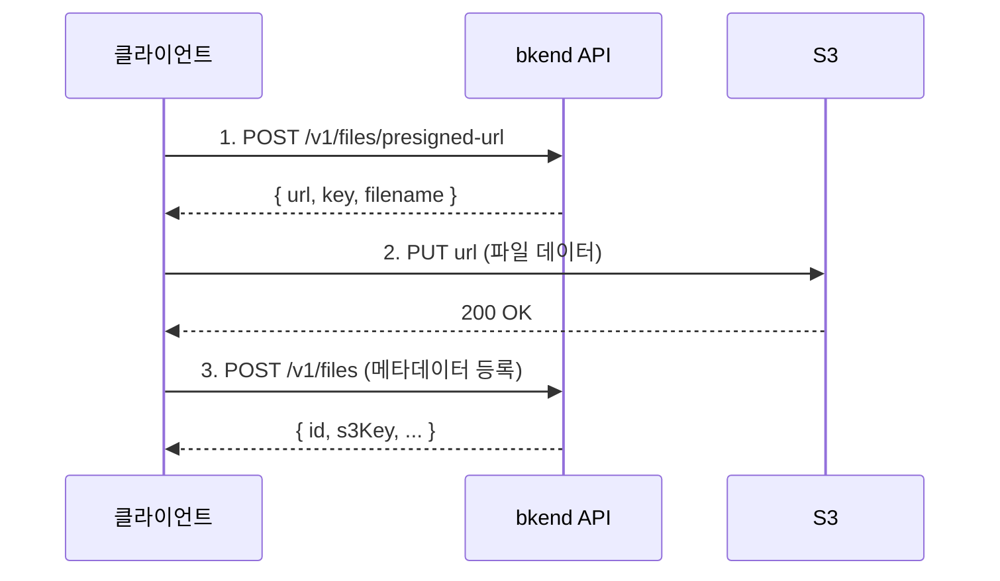

# 단일 파일 업로드


💡 Presigned URL을 발급받아 S3에 직접 파일을 업로드하세요.


## 개요

단일 파일 업로드는 2단계로 진행됩니다:

1. bkend API에서 **Presigned URL**을 발급받습니다.
2. 발급받은 URL로 S3에 **파일을 직접 업로드**합니다.



***

## 1단계: Presigned URL 발급

### POST /v1/files/presigned-url



```bash
curl -X POST https://api-client.bkend.ai/v1/files/presigned-url \
  -H "Content-Type: application/json" \
  -H "Authorization: Bearer {accessToken}" \
  -H "X-Project-Id: {project_id}" \
  -H "X-Environment: dev" \
  -d '{
    "filename": "profile.jpg",
    "contentType": "image/jpeg",
    "fileSize": 1048576,
    "visibility": "private",
    "category": "images",
    "namespace": "{namespace}"
  }'
```


```javascript
const response = await fetch('https://api-client.bkend.ai/v1/files/presigned-url', {
  method: 'POST',
  headers: {
    'Content-Type': 'application/json',
    'Authorization': `Bearer ${accessToken}`,
    'X-Project-Id': '{project_id}',
    'X-Environment': 'dev',
  },
  body: JSON.stringify({
    filename: 'profile.jpg',
    contentType: 'image/jpeg',
    fileSize: 1048576,
    visibility: 'private',
    category: 'images',
    namespace: '{namespace}',
  }),
});

const { url, key, filename } = await response.json();
```



### 요청 파라미터

| 파라미터 | 타입 | 필수 | 설명 |
|---------|------|:----:|------|
| `filename` | `string` | ✅ | 원본 파일명 |
| `contentType` | `string` | ✅ | MIME 타입 (예: `image/jpeg`, `application/pdf`) |
| `fileSize` | `number` | - | 파일 크기 (바이트) |
| `visibility` | `string` | - | `public`, `private`(기본값), `protected`, `shared` |
| `category` | `string` | - | `images`, `documents`, `media`, `attachments`, `exports`, `backups`, `temp` |
| `namespace` | `string` | ✅ | 조직 식별자 (예: `org_xxx`) |

### 응답 (200 OK)

```json
{
  "url": "https://s3.amazonaws.com/bucket/...",
  "key": "org_xxx/private/images/a1b2c3d4-e5f6-7890-abcd-ef1234567890/profile.jpg",
  "filename": "profile.jpg",
  "contentType": "image/jpeg"
}
```

| 필드 | 타입 | 설명 |
|------|------|------|
| `url` | `string` | S3 Presigned URL (15분 유효) |
| `key` | `string` | S3 오브젝트 키 |
| `filename` | `string` | 원본 파일명 |
| `contentType` | `string` | MIME 타입 |


⚠️ Presigned URL은 **15분** 동안만 유효합니다. 만료 전에 업로드를 완료하세요.


***

## 2단계: S3 업로드

발급받은 `url`로 파일을 직접 업로드합니다.

```javascript
// Presigned URL로 파일 업로드
const uploadResponse = await fetch(url, {
  method: 'PUT',
  headers: {
    'Content-Type': contentType,
  },
  body: file, // File 또는 Blob 객체
});

if (uploadResponse.ok) {
  console.log('업로드 완료');
}
```

### HTML 파일 입력과 함께 사용

```javascript
const fileInput = document.querySelector('input[type="file"]');
const file = fileInput.files[0];

// 1. Presigned URL 발급
const presigned = await fetch('https://api-client.bkend.ai/v1/files/presigned-url', {
  method: 'POST',
  headers: {
    'Content-Type': 'application/json',
    'Authorization': `Bearer ${accessToken}`,
    'X-Project-Id': '{project_id}',
    'X-Environment': 'dev',
  },
  body: JSON.stringify({
    filename: file.name,
    contentType: file.type,
    fileSize: file.size,
    visibility: 'private',
    category: 'images',
    namespace: '{namespace}',
  }),
}).then(res => res.json());

// 2. S3에 파일 업로드
await fetch(presigned.url, {
  method: 'PUT',
  headers: { 'Content-Type': file.type },
  body: file,
});

// 3. 메타데이터 등록
const metadata = await fetch('https://api-client.bkend.ai/v1/files', {
  method: 'POST',
  headers: {
    'Content-Type': 'application/json',
    'Authorization': `Bearer ${accessToken}`,
    'X-Project-Id': '{project_id}',
    'X-Environment': 'dev',
  },
  body: JSON.stringify({
    s3Key: presigned.key,
    originalName: file.name,
    mimeType: file.type,
    size: file.size,
    visibility: 'private',
  }),
}).then(res => res.json());

console.log('파일 ID:', metadata.id);
```

***

## S3 키 구조

업로드된 파일의 S3 키는 다음 구조를 따릅니다.

```
{namespace}/{visibility}/{category}/{fileId}/{filename}
```

| 세그먼트 | 설명 | 예시 |
|---------|------|------|
| `namespace` | 조직 식별자 | `org_xxx` |
| `visibility` | 접근 범위 (기본: `private`) | `private` |
| `category` | 파일 카테고리 (기본: `attachments`) | `images` |
| `fileId` | UUID v4 (자동 생성) | `a1b2c3d4-e5f6-7890-abcd-ef1234567890` |
| `filename` | sanitized 파일명 (소문자, 특수문자 제거) | `profile.jpg` |

**예시:** `org_xxx/private/images/a1b2c3d4-e5f6-7890-abcd-ef1234567890/profile.jpg`

***

## 에러 응답

| 에러 코드 | HTTP | 설명 |
|----------|:----:|------|
| `file/namespace-required` | 400 | namespace 누락 |
| `file/invalid-name` | 400 | 유효하지 않은 파일명 |
| `file/file-too-large` | 400 | 파일 크기 초과 |
| `file/invalid-format` | 400 | 지원하지 않는 파일 형식 |
| `file/bucket-not-configured` | 500 | S3 버킷 미설정 |
| `common/authentication-required` | 401 | 인증 필요 |

***

## 다음 단계

- [대용량 파일 업로드](03-upload-multipart.md) — 멀티파트 업로드
- [파일 메타데이터](04-file-metadata.md) — 메타데이터 등록/관리
- [파일 접근 권한](08-permissions.md) — Visibility 설정
