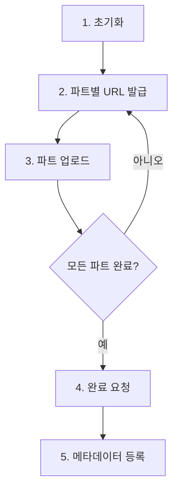

# 대용량 파일 업로드 (멀티파트)


💡 대용량 파일을 여러 파트로 나누어 병렬 업로드하세요.



💡 **시작하기 전에** — 이 작업을 진행하려면 다음이 필요합니다:
- [프로젝트 생성](../getting-started/02-quickstart.md) 완료
- 사용자 인증 완료 (JWT 토큰 필요 — 모든 파일 API는 인증 필수)


**이 문서에서 사용하는 API:**

| 엔드포인트 | 메서드 | 인증 | 설명 |
|-----------|:------:|:----:|------|
| `/v1/files/multipart/init` | POST | JWT | 멀티파트 초기화 |
| `/v1/files/multipart/presigned-url` | POST | JWT | 파트 URL 발급 |
| `/v1/files/multipart/complete` | POST | JWT | 멀티파트 완료 |
| `/v1/files/multipart/abort` | POST | JWT | 멀티파트 취소 |

## 개요

멀티파트 업로드는 대용량 파일을 여러 조각(파트)으로 나누어 업로드하는 방식입니다. 파트별 병렬 업로드가 가능하며, 실패한 파트만 재시도할 수 있습니다.



***

## 1단계: 업로드 초기화

### POST /v1/files/multipart/init

```bash
curl -X POST https://api-client.bkend.ai/v1/files/multipart/init \
  -H "Content-Type: application/json" \
  -H "X-API-Key: {pk_publishable_key}" \
  -H "Authorization: Bearer {accessToken}" \
  -d '{
    "filename": "video.mp4",
    "contentType": "video/mp4",
    "fileSize": 104857600,
    "visibility": "private",
    "category": "media"
  }'
```

### 요청 파라미터

| 파라미터 | 타입 | 필수 | 설명 |
|---------|------|:----:|------|
| `filename` | `string` | ✅ | 원본 파일명 |
| `contentType` | `string` | ✅ | MIME 타입 |
| `fileSize` | `number` | ✅ | 전체 파일 크기 (바이트) |
| `visibility` | `string` | - | `public`, `private`(기본값), `protected`, `shared` |
| `category` | `string` | - | 파일 카테고리 |

### 응답 (200 OK)

```json
{
  "uploadId": "multipart-upload-id",
  "key": "files/a1b2c3d4/video.mp4",
  "filename": "video.mp4"
}
```

***

## 2단계: 파트별 URL 발급

### POST /v1/files/multipart/presigned-url

각 파트의 업로드 URL을 발급받습니다.

```bash
curl -X POST https://api-client.bkend.ai/v1/files/multipart/presigned-url \
  -H "Content-Type: application/json" \
  -H "X-API-Key: {pk_publishable_key}" \
  -H "Authorization: Bearer {accessToken}" \
  -d '{
    "key": "{init 응답의 key}",
    "uploadId": "multipart-upload-id",
    "partNumber": 1
  }'
```

### 요청 파라미터

| 파라미터 | 타입 | 필수 | 설명 |
|---------|------|:----:|------|
| `key` | `string` | ✅ | init 응답의 파일 키 |
| `uploadId` | `string` | ✅ | init 응답의 업로드 ID |
| `partNumber` | `number` | ✅ | 파트 번호 (1~10000) |

### 응답 (200 OK)

```json
{
  "url": "https://s3.amazonaws.com/bucket/...?partNumber=1&uploadId=...",
  "partNumber": 1
}
```

***

## 3단계: 파트 업로드

발급받은 URL로 파일 조각을 스토리지에 업로드합니다. 응답의 `ETag` 헤더를 저장해두세요.

```javascript
const response = await fetch(partUrl, {
  method: 'PUT',
  body: partData,
});

const etag = response.headers.get('ETag');
// etag: "\"abc123def456\"" — 완료 단계에서 필요
```

***

## 4단계: 업로드 완료

### POST /v1/files/multipart/complete

모든 파트 업로드가 끝나면 완료 요청을 보냅니다.

```bash
curl -X POST https://api-client.bkend.ai/v1/files/multipart/complete \
  -H "Content-Type: application/json" \
  -H "X-API-Key: {pk_publishable_key}" \
  -H "Authorization: Bearer {accessToken}" \
  -d '{
    "key": "{init 응답의 key}",
    "uploadId": "multipart-upload-id",
    "parts": [
      { "partNumber": 1, "etag": "\"abc123\"" },
      { "partNumber": 2, "etag": "\"def456\"" },
      { "partNumber": 3, "etag": "\"ghi789\"" }
    ]
  }'
```

### 요청 파라미터

| 파라미터 | 타입 | 필수 | 설명 |
|---------|------|:----:|------|
| `key` | `string` | ✅ | 파일 키 |
| `uploadId` | `string` | ✅ | 업로드 ID |
| `parts` | `array` | ✅ | 업로드된 파트 목록 |
| `parts[].partNumber` | `number` | ✅ | 파트 번호 |
| `parts[].etag` | `string` | ✅ | 스토리지 응답의 ETag |

### 응답 (200 OK)

```json
{
  "key": "files/a1b2c3d4/video.mp4",
  "location": "https://s3.amazonaws.com/bucket/..."
}
```

***

## 업로드 취소

업로드를 중단해야 하는 경우 abort 요청을 보냅니다.

### POST /v1/files/multipart/abort

```bash
curl -X POST https://api-client.bkend.ai/v1/files/multipart/abort \
  -H "Content-Type: application/json" \
  -H "X-API-Key: {pk_publishable_key}" \
  -H "Authorization: Bearer {accessToken}" \
  -d '{
    "key": "{init 응답의 key}",
    "uploadId": "multipart-upload-id"
  }'
```

### 응답 (200 OK)

```json
{
  "success": true,
  "key": "files/a1b2c3d4/video.mp4"
}
```

***

## 전체 구현 예시

```javascript
const PART_SIZE = 10 * 1024 * 1024; // 10MB

async function multipartUpload(file, accessToken) {
  // 1. 초기화
  const initRes = await fetch('https://api-client.bkend.ai/v1/files/multipart/init', {
    method: 'POST',
    headers: {
      'Content-Type': 'application/json',
      'X-API-Key': '{pk_publishable_key}',
      'Authorization': `Bearer ${accessToken}`,
    },
    body: JSON.stringify({
      filename: file.name,
      contentType: file.type,
      fileSize: file.size,
    }),
  }).then(res => res.json());

  const { uploadId, key } = initRes;
  const totalParts = Math.ceil(file.size / PART_SIZE);
  const parts = [];

  // 2-3. 파트별 URL 발급 + 업로드
  for (let i = 0; i < totalParts; i++) {
    const start = i * PART_SIZE;
    const end = Math.min(start + PART_SIZE, file.size);
    const partNumber = i + 1;

    // URL 발급
    const urlRes = await fetch('https://api-client.bkend.ai/v1/files/multipart/presigned-url', {
      method: 'POST',
      headers: {
        'Content-Type': 'application/json',
        'X-API-Key': '{pk_publishable_key}',
        'Authorization': `Bearer ${accessToken}`,
      },
      body: JSON.stringify({ key, uploadId, partNumber }),
    }).then(res => res.json());

    // 파트 업로드
    const partData = file.slice(start, end);
    const uploadRes = await fetch(urlRes.url, {
      method: 'PUT',
      body: partData,
    });

    parts.push({
      partNumber,
      etag: uploadRes.headers.get('ETag'),
    });
  }

  // 4. 완료
  const completeRes = await fetch('https://api-client.bkend.ai/v1/files/multipart/complete', {
    method: 'POST',
    headers: {
      'Content-Type': 'application/json',
      'X-API-Key': '{pk_publishable_key}',
      'Authorization': `Bearer ${accessToken}`,
    },
    body: JSON.stringify({ key, uploadId, parts }),
  }).then(res => res.json());

  return { key: completeRes.key };
}
```

***

## 에러 응답

| 에러 코드 | HTTP | 설명 |
|----------|:----:|------|
| `file/upload-init-failed` | 500 | 초기화 실패 |
| `file/invalid-part-number-range` | 400 | 파트 번호가 1~10000 범위 밖 |
| `file/invalid-parts-array` | 400 | 파트 배열이 유효하지 않음 |
| `file/file-too-large` | 400 | 파일 크기 초과 |
| `common/authentication-required` | 401 | 인증 필요 |

***

## 앱에서 사용하기

`bkendFetch` 헬퍼를 사용하면 필수 헤더가 자동으로 포함됩니다.

```javascript
import { bkendFetch } from './bkend.js';

const PART_SIZE = 10 * 1024 * 1024; // 10MB

async function multipartUpload(file) {
  // 1. 초기화
  const { uploadId, key } = await bkendFetch('/v1/files/multipart/init', {
    method: 'POST',
    body: {
      filename: file.name,
      contentType: file.type,
      fileSize: file.size,
      visibility: 'private',
      category: 'media',
    },
  });

  const totalParts = Math.ceil(file.size / PART_SIZE);
  const parts = [];

  // 2-3. 파트별 URL 발급 + 업로드
  for (let i = 0; i < totalParts; i++) {
    const start = i * PART_SIZE;
    const end = Math.min(start + PART_SIZE, file.size);
    const partNumber = i + 1;

    // URL 발급
    const { url } = await bkendFetch('/v1/files/multipart/presigned-url', {
      method: 'POST',
      body: { key, uploadId, partNumber },
    });

    // 파트 업로드 (bkendFetch 사용 금지 — Authorization 헤더 불필요)
    const partData = file.slice(start, end);
    const uploadRes = await fetch(url, {
      method: 'PUT',
      body: partData,
    });

    parts.push({
      partNumber,
      etag: uploadRes.headers.get('ETag'),
    });
  }

  // 4. 완료
  const result = await bkendFetch('/v1/files/multipart/complete', {
    method: 'POST',
    body: { key, uploadId, parts },
  });

  return result; // { key, location }
}

// HTML 파일 입력과 함께 사용
const fileInput = document.querySelector('input[type="file"]');
fileInput.addEventListener('change', async (e) => {
  const file = e.target.files[0];

  if (file.size > 10 * 1024 * 1024) {
    // 10MB 이상이면 멀티파트 업로드
    const result = await multipartUpload(file);
    console.log('멀티파트 업로드 완료:', result.key);
  }
});
```


💡 `bkendFetch` 설정은 [앱에서 bkend 연동하기](../getting-started/03-app-integration.md)를 참고하세요.


***

## 다음 단계

- [파일 메타데이터](04-file-metadata.md) — 업로드 후 메타데이터 등록
- [단일 파일 업로드](02-upload-single.md) — 소용량 파일 업로드
- [파일 접근 권한](08-permissions.md) — Visibility 설정
