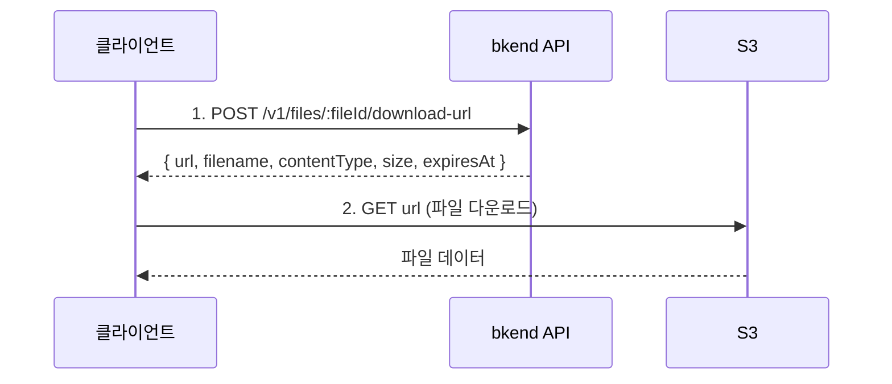

# 파일 다운로드


💡 Presigned URL을 발급받아 파일을 다운로드하세요.


## 개요

파일 다운로드도 업로드와 마찬가지로 Presigned URL 방식을 사용합니다. bkend API에서 시간 제한이 있는 다운로드 URL을 발급받아 S3에서 직접 파일을 다운로드합니다.



***

## 다운로드 URL 발급

### POST /v1/files/:fileId/download-url



```bash
curl -X POST https://api-client.bkend.ai/v1/files/{fileId}/download-url \
  -H "Authorization: Bearer {accessToken}" \
  -H "X-Project-Id: {project_id}" \
  -H "X-Environment: dev"
```


```javascript
const response = await fetch(`https://api-client.bkend.ai/v1/files/${fileId}/download-url`, {
  method: 'POST',
  headers: {
    'Authorization': `Bearer ${accessToken}`,
    'X-Project-Id': '{project_id}',
    'X-Environment': 'dev',
  },
});

const { url, filename, contentType, size, expiresAt } = await response.json();
```



### 경로 파라미터

| 파라미터 | 타입 | 필수 | 설명 |
|---------|------|:----:|------|
| `fileId` | `string` | ✅ | 파일 ID |

### 응답 (200 OK)

```json
{
  "url": "https://s3.amazonaws.com/bucket/...",
  "filename": "profile.jpg",
  "contentType": "image/jpeg",
  "size": 1048576,
  "expiresAt": "2025-01-15T11:30:00.000Z"
}
```

| 필드 | 타입 | 설명 |
|------|------|------|
| `url` | `string` | S3 Presigned URL |
| `filename` | `string` | 원본 파일명 |
| `contentType` | `string` | MIME 타입 |
| `size` | `number` | 파일 크기 (바이트) |
| `expiresAt` | `string` | URL 만료 시간 (ISO 8601) |


⚠️ 다운로드 URL에는 만료 시간이 있습니다. `expiresAt` 이전에 다운로드를 시작하세요.


***

## 다운로드 구현

### 브라우저에서 다운로드

```javascript
async function downloadFile(fileId, accessToken) {
  // 1. 다운로드 URL 발급
  const res = await fetch(`https://api-client.bkend.ai/v1/files/${fileId}/download-url`, {
    method: 'POST',
    headers: {
      'Authorization': `Bearer ${accessToken}`,
      'X-Project-Id': '{project_id}',
      'X-Environment': 'dev',
    },
  });

  const { url, filename } = await res.json();

  // 2. 다운로드 트리거
  const link = document.createElement('a');
  link.href = url;
  link.download = filename;
  link.click();
}
```

### 프로그래밍 방식 다운로드

```javascript
async function downloadToBlob(fileId, accessToken) {
  const res = await fetch(`https://api-client.bkend.ai/v1/files/${fileId}/download-url`, {
    method: 'POST',
    headers: {
      'Authorization': `Bearer ${accessToken}`,
      'X-Project-Id': '{project_id}',
      'X-Environment': 'dev',
    },
  });

  const { url, contentType } = await res.json();

  // S3에서 파일 데이터 가져오기
  const fileRes = await fetch(url);
  const blob = await fileRes.blob();

  return blob;
}
```

***

## 에러 응답

| 에러 코드 | HTTP | 설명 |
|----------|:----:|------|
| `file/not-found` | 404 | 파일을 찾을 수 없음 |
| `file/access-denied` | 403 | 접근 권한 없음 |
| `common/authentication-required` | 401 | 인증 필요 |

***

## 앱에서 사용하기

`bkendFetch` 헬퍼를 사용하면 필수 헤더가 자동으로 포함됩니다.

```javascript
import { bkendFetch } from './bkend.js';

// 브라우저에서 다운로드
async function downloadFile(fileId) {
  // 1. 다운로드 URL 발급
  const { url, filename } = await bkendFetch(`/v1/files/${fileId}/download-url`, {
    method: 'POST',
  });

  // 2. 다운로드 트리거
  const link = document.createElement('a');
  link.href = url;
  link.download = filename;
  link.click();
}

// 프로그래밍 방식 다운로드 (Blob으로 가져오기)
async function downloadToBlob(fileId) {
  // 1. 다운로드 URL 발급
  const { url, contentType } = await bkendFetch(`/v1/files/${fileId}/download-url`, {
    method: 'POST',
  });

  // 2. S3에서 파일 데이터 가져오기 (bkendFetch 사용 금지 — Authorization 헤더 불필요)
  const fileRes = await fetch(url);
  const blob = await fileRes.blob();

  return blob;
}

// 이미지 미리보기
async function previewImage(fileId, imgElement) {
  const blob = await downloadToBlob(fileId);
  const objectUrl = URL.createObjectURL(blob);

  imgElement.src = objectUrl;

  // 메모리 정리
  imgElement.onload = () => URL.revokeObjectURL(objectUrl);
}

// 사용 예시
const fileId = 'file-uuid-1234';
await downloadFile(fileId); // 브라우저 다운로드

// 또는 이미지 미리보기
const img = document.querySelector('#preview');
await previewImage(fileId, img);
```


💡 `bkendFetch` 설정은 [앱에서 bkend 연동하기](../getting-started/06-app-integration.md)를 참고하세요.


***

## 다음 단계

- [파일 목록 조회](05-file-list.md) — 다운로드할 파일 검색
- [파일 접근 권한](08-permissions.md) — 다운로드 권한 설정
- [단일 파일 업로드](02-upload-single.md) — 파일 업로드
