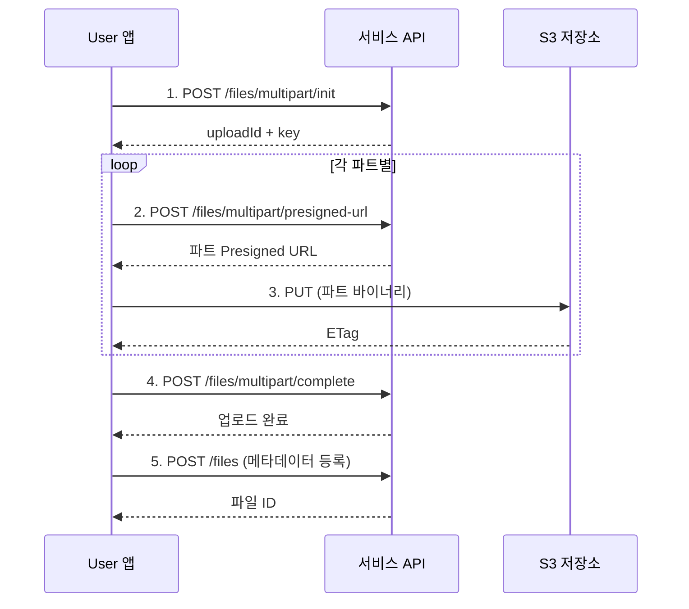

# 대용량 파일 업로드

> 멀티파트 업로드를 사용하여 대용량 파일을 분할 전송하는 방법을 안내합니다.

## 개요

대용량 파일(비디오, 대형 문서 등)은 멀티파트 업로드를 사용합니다. 파일을 여러 파트로 분할하여 병렬로 업로드하므로 안정적이고 빠릅니다. 업로드 중 네트워크 오류가 발생해도 실패한 파트만 재전송하면 됩니다.

---

## 멀티파트 업로드 흐름



---

## 1단계: 멀티파트 업로드 초기화하기

### 요청

```bash
curl -X POST "https://api.bkend.ai/v1/files/multipart/init" \
  -H "x-project-id: {project_id}" \
  -H "x-environment: dev" \
  -H "Authorization: Bearer {accessToken}" \
  -H "Content-Type: application/json" \
  -d '{
    "filename": "video.mp4",
    "contentType": "video/mp4",
    "fileSize": 104857600,
    "visibility": "private",
    "category": "media"
  }'
```

### 파라미터

| 파라미터 | 타입 | 필수 | 설명 |
|---------|------|------|------|
| `filename` | string | ✅ | 원본 파일명 |
| `contentType` | string | ✅ | MIME 타입 |
| `fileSize` | number | ✅ | 전체 파일 크기 (바이트) |
| `visibility` | string | - | 파일 가시성 (기본값: `private`) |
| `category` | string | - | 버킷 카테고리 |

### 응답 (200 OK)

```json
{
  "uploadId": "upload_abc123",
  "key": "my-project/private/media/a1b2c3d4/video.mp4",
  "filename": "video.mp4"
}
```

---

## 2단계: 파트별 Presigned URL 요청하기

### 요청

```bash
curl -X POST "https://api.bkend.ai/v1/files/multipart/presigned-url" \
  -H "x-project-id: {project_id}" \
  -H "x-environment: dev" \
  -H "Authorization: Bearer {accessToken}" \
  -H "Content-Type: application/json" \
  -d '{
    "key": "my-project/private/media/a1b2c3d4/video.mp4",
    "uploadId": "upload_abc123",
    "partNumber": 1
  }'
```

### 파라미터

| 파라미터 | 타입 | 필수 | 설명 |
|---------|------|------|------|
| `key` | string | ✅ | 1단계 응답의 `key` |
| `uploadId` | string | ✅ | 1단계 응답의 `uploadId` |
| `partNumber` | number | ✅ | 파트 번호 (1~10000) |

### 응답 (200 OK)

```json
{
  "url": "https://s3.amazonaws.com/...",
  "partNumber": 1
}
```

---

## 3단계: 파트 업로드하기

Presigned URL로 파트 바이너리를 업로드합니다.

```bash
curl -X PUT "{presigned_url}" \
  -H "Content-Type: video/mp4" \
  --data-binary @part1.bin
```

> 💡 **Tip** - S3 응답 헤더의 `ETag` 값을 저장하세요. 4단계에서 필요합니다.

---

## 4단계: 업로드 완료하기

모든 파트 업로드 후 완료를 요청합니다.

### 요청

```bash
curl -X POST "https://api.bkend.ai/v1/files/multipart/complete" \
  -H "x-project-id: {project_id}" \
  -H "x-environment: dev" \
  -H "Authorization: Bearer {accessToken}" \
  -H "Content-Type: application/json" \
  -d '{
    "key": "my-project/private/media/a1b2c3d4/video.mp4",
    "uploadId": "upload_abc123",
    "parts": [
      { "partNumber": 1, "etag": "\"abc123...\"" },
      { "partNumber": 2, "etag": "\"def456...\"" },
      { "partNumber": 3, "etag": "\"ghi789...\"" }
    ]
  }'
```

### 파라미터

| 파라미터 | 타입 | 필수 | 설명 |
|---------|------|------|------|
| `key` | string | ✅ | S3 객체 키 |
| `uploadId` | string | ✅ | 업로드 ID |
| `parts` | array | ✅ | 파트 정보 배열 (최소 1개) |
| `parts[].partNumber` | number | ✅ | 파트 번호 |
| `parts[].etag` | string | ✅ | S3 응답의 ETag |

### 응답 (200 OK)

```json
{
  "key": "my-project/private/media/a1b2c3d4/video.mp4",
  "location": "https://s3.amazonaws.com/..."
}
```

---

## 5단계: 메타데이터 등록하기

[단일 파일 업로드](04-upload-single.md)의 3단계와 동일하게 메타데이터를 등록합니다.

```bash
curl -X POST "https://api.bkend.ai/v1/files" \
  -H "x-project-id: {project_id}" \
  -H "x-environment: dev" \
  -H "Authorization: Bearer {accessToken}" \
  -H "Content-Type: application/json" \
  -d '{
    "s3Key": "my-project/private/media/a1b2c3d4/video.mp4",
    "originalName": "video.mp4",
    "mimeType": "video/mp4",
    "size": 104857600,
    "visibility": "private",
    "bucket": "media"
  }'
```

---

## 업로드 취소하기

업로드를 중단하려면 abort API를 호출하세요.

```bash
curl -X POST "https://api.bkend.ai/v1/files/multipart/abort" \
  -H "x-project-id: {project_id}" \
  -H "x-environment: dev" \
  -H "Authorization: Bearer {accessToken}" \
  -H "Content-Type: application/json" \
  -d '{
    "key": "my-project/private/media/a1b2c3d4/video.mp4",
    "uploadId": "upload_abc123"
  }'
```

### 응답 (200 OK)

```json
{
  "success": true,
  "key": "my-project/private/media/a1b2c3d4/video.mp4"
}
```

> 💡 **Tip** - 완료하지 않은 멀티파트 업로드는 24시간 후 S3 Lifecycle Rule에 의해 자동 정리됩니다.

---

## 에러 응답

| 에러 코드 | HTTP 상태 | 설명 |
|----------|----------|------|
| `file/upload-init-failed` | 400 | 멀티파트 업로드 초기화 실패 |
| `file/invalid-part-number-range` | 400 | 파트 번호가 1~10000 범위를 벗어남 |
| `file/invalid-parts-array` | 400 | 파트 배열이 유효하지 않음 |
| `file/file-too-large` | 400 | 파일 크기 초과 |
| `file/invalid-format` | 400 | 지원하지 않는 파일 형식 |

---

## 관련 문서

- [단일 파일 업로드](04-upload-single.md) — 일반 파일 업로드
- [다중 파일 업로드](05-upload-multiple.md) — 여러 파일 동시 업로드
- [파일 다운로드](07-download.md) — 다운로드 URL 생성
