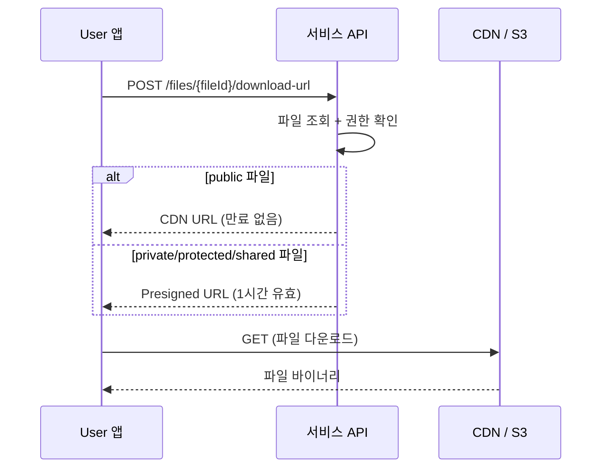

# 파일 다운로드

> 업로드된 파일의 다운로드 URL을 생성하는 방법을 안내합니다.

## 개요

bkend Storage에서 파일을 다운로드하려면 다운로드 URL을 생성합니다. public 파일은 CDN URL로 빠르게 접근하고, private 파일은 임시 Presigned URL로 안전하게 다운로드합니다.

---

## 다운로드 URL 생성하기

### 요청

```bash
curl -X POST "https://api.bkend.ai/v1/files/{fileId}/download-url" \
  -H "x-project-id: {project_id}" \
  -H "x-environment: dev" \
  -H "Authorization: Bearer {accessToken}"
```

### 응답 (200 OK)

**public 파일:**

```json
{
  "url": "https://cdn.bkend.ai/my-project/public/images/a1b2c3d4/photo.jpg",
  "filename": "photo.jpg",
  "content_type": "image/jpeg",
  "size": 1048576,
  "expires_at": null
}
```

**private 파일:**

```json
{
  "url": "https://s3.amazonaws.com/bucket/...?X-Amz-Signature=...",
  "filename": "contract.pdf",
  "content_type": "application/pdf",
  "size": 2097152,
  "expires_at": "2024-01-15T11:30:00Z"
}
```

### 응답 필드

| 필드 | 타입 | 설명 |
|------|------|------|
| `url` | string | 다운로드 URL |
| `filename` | string | 원본 파일명 |
| `content_type` | string | MIME 타입 |
| `size` | number | 파일 크기 (바이트) |
| `expires_at` | string | URL 만료 시점 (public은 `null`) |

---

## 가시성별 다운로드 방식

| 가시성 | URL 타입 | 유효 기간 | 설명 |
|--------|---------|----------|------|
| `public` | CDN URL | 만료 없음 | 누구나 URL로 접근 가능 |
| `private` | Presigned URL | 1시간 | 소유자만 URL 생성 가능 |
| `protected` | Presigned URL | 1시간 | 인증된 User만 URL 생성 가능 |
| `shared` | Presigned URL | 1시간 | 공유 대상자만 URL 생성 가능 |

---

## 다운로드 흐름



---

## JavaScript 구현 예시

```typescript
async function downloadFile(fileId: string, accessToken: string) {
  // 다운로드 URL 생성
  const res = await fetch(
    `https://api.bkend.ai/v1/files/${fileId}/download-url`,
    {
      method: 'POST',
      headers: {
        'x-project-id': PROJECT_ID,
        'Authorization': `Bearer ${accessToken}`,
      },
    }
  );
  const { url, filename } = await res.json();

  // 브라우저에서 다운로드
  const link = document.createElement('a');
  link.href = url;
  link.download = filename;
  link.click();
}
```

---

## 에러 응답

| 에러 코드 | HTTP 상태 | 설명 |
|----------|----------|------|
| `file/not-found` | 404 | 파일을 찾을 수 없음 |
| `file/access-denied` | 403 | 파일에 대한 접근 권한 없음 |

---

## 관련 문서

- [단일 파일 업로드](04-upload-single.md) — 파일 업로드 가이드
- [파일 목록 조회](08-file-list.md) — 파일 목록 API
- [파일 접근 권한](10-permissions.md) — 가시성과 접근 제어
