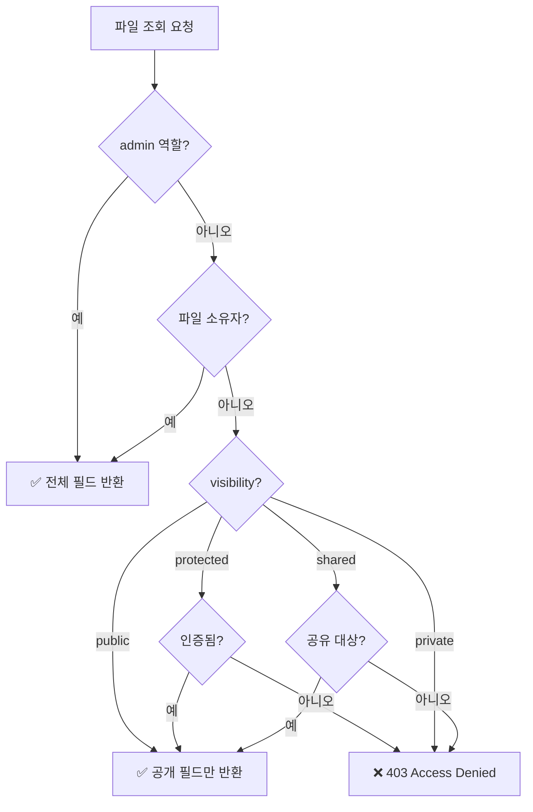

# 파일 접근 권한


💡 파일의 Visibility와 소유자 기반 접근 제어를 이해하세요.


## 개요

bkend 스토리지는 **Visibility**(공개 범위)와 **소유자**(Owner) 기반의 접근 제어를 제공합니다. 파일 업로드 시 Visibility를 설정하고, 소유자만 비공개 파일에 접근할 수 있습니다.

***

## Visibility

파일의 접근 범위를 결정합니다.

| Visibility | 설명 | 접근 가능 |
|-----------|------|----------|
| `public` | 공개 | 모든 사용자 |
| `private` | 비공개 (기본값) | 소유자, 관리자 |
| `protected` | 보호됨 | 인증된 사용자 |
| `shared` | 공유 | 지정된 사용자 |

### Visibility 설정

파일 업로드 시 또는 메타데이터 수정으로 Visibility를 설정합니다.

```javascript
// 업로드 시 설정
const presigned = await fetch('https://api-client.bkend.ai/v1/files/presigned-url', {
  method: 'POST',
  headers: {
    'Content-Type': 'application/json',
    'X-API-Key': '{pk_publishable_key}',
    'Authorization': `Bearer ${accessToken}`,
  },
  body: JSON.stringify({
    filename: 'document.pdf',
    contentType: 'application/pdf',
    visibility: 'protected', // 인증된 사용자만 접근
  }),
}).then(res => res.json());
```

### Visibility 변경

```bash
curl -X PATCH https://api-client.bkend.ai/v1/files/{fileId} \
  -H "Content-Type: application/json" \
  -H "X-API-Key: {pk_publishable_key}" \
  -H "Authorization: Bearer {accessToken}" \
  -d '{
    "visibility": "public"
  }'
```

***

## 소유자 (Owner)

파일 메타데이터 등록 시 소유자 정보가 자동으로 설정됩니다.

### 소유자 타입

| 타입 | 설명 |
|------|------|
| `user` | 인증된 사용자 (기본값) |
| `session` | 세션 기반 |
| `service` | 서비스 계정 |
| `public` | 공개 (소유자 없음) |

***

## 접근 제어 규칙

### 파일 조회



### 파일 수정/삭제

| 작업 | admin | 소유자 | 비소유자 |
|------|:-----:|:------:|:-------:|
| 조회 | ✅ 전체 | ✅ 전체 | Visibility에 따라 |
| 수정 | ✅ | ✅ | ❌ |
| 삭제 | ✅ | ✅ | ❌ |

***

## 목록 조회 시 RLS

파일 목록 조회(`GET /v1/files`) 시 RLS(Row Level Security)가 자동으로 적용됩니다.

| 사용자 | 조회 범위 |
|--------|----------|
| `admin` | 모든 파일 조회 |
| 인증된 사용자 | 본인 파일 + public/protected 파일 |
| 비인증 사용자 | public 파일만 |

***

## 활용 패턴

### 프로필 이미지 (공개)

```javascript
// 프로필 이미지는 누구나 볼 수 있도록 public 설정
await uploadFile({
  filename: 'avatar.jpg',
  contentType: 'image/jpeg',
  visibility: 'public',
  category: 'images',
});
```

### 개인 문서 (비공개)

```javascript
// 개인 문서는 본인만 접근 가능하도록 private 설정
await uploadFile({
  filename: 'report.pdf',
  contentType: 'application/pdf',
  visibility: 'private',
  category: 'documents',
});
```

### 팀 공유 파일 (인증 사용자)

```javascript
// 팀 내 공유 파일은 인증된 사용자만 접근 가능하도록 protected 설정
await uploadFile({
  filename: 'meeting-notes.docx',
  contentType: 'application/vnd.openxmlformats-officedocument.wordprocessingml.document',
  visibility: 'protected',
  category: 'documents',
});
```

***


⚠️ `public` Visibility로 업로드된 파일은 URL을 알면 누구나 접근할 수 있습니다. 민감한 파일은 반드시 `private`으로 설정하세요.


## 다음 단계

- [파일 메타데이터](04-file-metadata.md) — Visibility 설정 변경
- [파일 목록 조회](05-file-list.md) — Visibility별 필터링
- [보안 모범 사례](../security/07-best-practices.md) — 파일 보안 권장 사항
