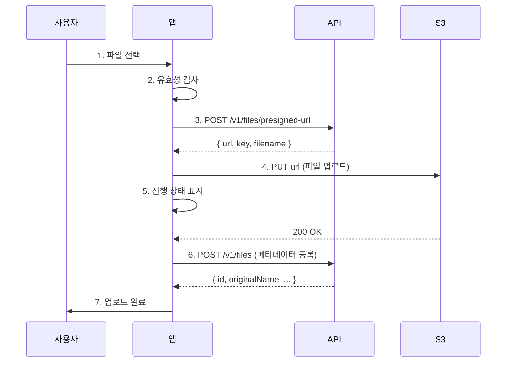

# 파일 업로드 앱 패턴


💡 파일 선택부터 업로드, 진행 상태 표시, 미리보기까지 앱에 파일 업로드 기능을 구현하는 패턴을 안내합니다.


## 개요

bkend 스토리지 API를 활용하여 앱에 파일 업로드 기능을 구현하는 방법을 설명합니다. Presigned URL 방식으로 S3에 직접 업로드하므로 대용량 파일도 안정적으로 처리할 수 있습니다.




⚠️ `bkendFetch` 설정이 완료되지 않았다면 [앱에서 bkend 연동하기](../getting-started/03-app-integration.md)를 먼저 참고하세요.


***

## 전체 흐름

파일 업로드는 3단계 API 호출로 구성됩니다.

| 단계 | 메서드 | 엔드포인트 | 설명 |
|:----:|:------:|-----------|------|
| 1 | `POST` | `/v1/files/presigned-url` | Presigned URL 발급 |
| 2 | `PUT` | 발급받은 S3 URL | S3에 파일 직접 업로드 |
| 3 | `POST` | `/v1/files` | bkend에 메타데이터 등록 |


💡 Presigned URL은 **15분** 동안만 유효합니다. 만료 전에 업로드를 완료하세요.


***

## 1. 파일 선택 UI

### 기본 파일 입력

```html
<div id="uploadArea">
  <input type="file" id="fileInput" accept="image/*,.pdf,.doc,.docx" />
  <div id="preview" style="display:none">
    
    <p id="fileInfo"></p>
  </div>
  <button id="uploadBtn" disabled>업로드</button>
  <div id="progress" style="display:none">
    <progress id="progressBar" max="100" value="0"></progress>
    <span id="progressText">0%</span>
  </div>
</div>
```

### 파일 선택 이벤트

```javascript
const fileInput = document.getElementById('fileInput');
const uploadBtn = document.getElementById('uploadBtn');

fileInput.addEventListener('change', (e) => {
  const file = e.target.files[0];
  if (!file) return;

  // 유효성 검사
  if (!validateFile(file)) return;

  // 이미지 미리보기
  if (file.type.startsWith('image/')) {
    showPreview(file);
  }

  // 파일 정보 표시
  document.getElementById('fileInfo').textContent =
    `${file.name} (${formatFileSize(file.size)})`;
  document.getElementById('preview').style.display = 'block';
  uploadBtn.disabled = false;
});
```

***

## 2. 파일 유효성 검사

업로드 전에 파일 크기와 형식을 클라이언트에서 먼저 검증하세요.

```javascript
const MAX_FILE_SIZE = 50 * 1024 * 1024; // 50MB
const ALLOWED_TYPES = [
  'image/jpeg',
  'image/png',
  'image/gif',
  'image/webp',
  'application/pdf',
  'application/msword',
  'application/vnd.openxmlformats-officedocument.wordprocessingml.document',
];

function validateFile(file) {
  if (file.size > MAX_FILE_SIZE) {
    alert(`파일 크기가 ${formatFileSize(MAX_FILE_SIZE)}를 초과합니다.`);
    return false;
  }

  if (!ALLOWED_TYPES.includes(file.type)) {
    alert('지원하지 않는 파일 형식입니다.');
    return false;
  }

  return true;
}

function formatFileSize(bytes) {
  if (bytes < 1024) return `${bytes}B`;
  if (bytes < 1024 * 1024) return `${(bytes / 1024).toFixed(1)}KB`;
  return `${(bytes / (1024 * 1024)).toFixed(1)}MB`;
}
```

***

## 3. 업로드 구현

### 3단계 업로드 함수

```javascript
async function uploadFile(file) {
  const progressBar = document.getElementById('progressBar');
  const progressText = document.getElementById('progressText');
  document.getElementById('progress').style.display = 'block';
  uploadBtn.disabled = true;

  try {
    // 1단계: Presigned URL 발급
    updateProgress(10, 'URL 발급 중...');
    const presigned = await bkendFetch('/v1/files/presigned-url', {
      method: 'POST',
      body: JSON.stringify({
        filename: file.name,
        contentType: file.type,
        fileSize: file.size,
        visibility: 'private',
      }),
    });

    // 2단계: S3에 파일 업로드
    updateProgress(30, '업로드 중...');
    await uploadToS3(presigned.url, file, (percent) => {
      const adjusted = 30 + Math.round(percent * 0.6); // 30~90%
      updateProgress(adjusted, `업로드 중... ${adjusted}%`);
    });

    // 3단계: 메타데이터 등록
    updateProgress(90, '등록 중...');
    const metadata = await bkendFetch('/v1/files', {
      method: 'POST',
      body: JSON.stringify({
        s3Key: presigned.key,
        originalName: file.name,
        mimeType: file.type,
        size: file.size,
        visibility: 'private',
      }),
    });

    updateProgress(100, '완료');
    return metadata;
  } catch (error) {
    handleUploadError(error);
    throw error;
  } finally {
    uploadBtn.disabled = false;
  }
}

function updateProgress(percent, text) {
  document.getElementById('progressBar').value = percent;
  document.getElementById('progressText').textContent = text;
}
```

### S3 업로드 (진행 상태 표시)

`XMLHttpRequest`를 사용하면 업로드 진행률을 추적할 수 있습니다.

```javascript
function uploadToS3(url, file, onProgress) {
  return new Promise((resolve, reject) => {
    const xhr = new XMLHttpRequest();

    xhr.upload.addEventListener('progress', (e) => {
      if (e.lengthComputable) {
        const percent = Math.round((e.loaded / e.total) * 100);
        onProgress(percent);
      }
    });

    xhr.addEventListener('load', () => {
      if (xhr.status >= 200 && xhr.status < 300) {
        resolve();
      } else {
        reject(new Error(`S3 업로드 실패: ${xhr.status}`));
      }
    });

    xhr.addEventListener('error', () => {
      reject(new Error('네트워크 오류가 발생했습니다.'));
    });

    xhr.open('PUT', url);
    xhr.setRequestHeader('Content-Type', file.type);
    xhr.send(file);
  });
}
```


⚠️ S3 Presigned URL로 업로드할 때는 `Authorization` 헤더를 포함하지 마세요. Presigned URL 자체에 인증 정보가 포함되어 있습니다.


### 업로드 버튼 연결

```javascript
document.getElementById('uploadBtn').addEventListener('click', async () => {
  const file = fileInput.files[0];
  if (!file) return;

  const result = await uploadFile(file);
  console.log('업로드된 파일 ID:', result.id);
});
```

***

## 4. 이미지 미리보기

파일을 선택했을 때 이미지를 미리 보여줍니다.

```javascript
function showPreview(file) {
  const reader = new FileReader();

  reader.onload = (e) => {
    const img = document.getElementById('previewImage');
    img.src = e.target.result;
    img.style.maxWidth = '300px';
    img.style.maxHeight = '200px';
  };

  reader.readAsDataURL(file);
}
```

### 업로드 완료 후 미리보기 (다운로드 URL 사용)

업로드가 완료된 파일은 다운로드 URL을 발급받아 표시합니다.

```javascript
async function showUploadedImage(fileId) {
  const fileData = await bkendFetch(`/v1/files/${fileId}`);

  // 다운로드 URL 발급
  const download = await bkendFetch(`/v1/files/${fileId}/download-url`);

  const img = document.createElement('img');
  img.src = download.url;
  img.alt = fileData.originalName;
  img.style.maxWidth = '300px';

  document.getElementById('uploadedFiles').appendChild(img);
}
```

***

## 5. 에러 처리

각 단계에서 발생할 수 있는 에러를 구분하여 처리합니다.

```javascript
function handleUploadError(error) {
  document.getElementById('progress').style.display = 'none';

  if (error.status === 400) {
    const message = error.code === 'file/file-too-large'
      ? '파일 크기가 서버 제한을 초과했습니다.'
      : error.code === 'file/invalid-format'
        ? '지원하지 않는 파일 형식입니다.'
        : error.code === 'file/invalid-name'
          ? '유효하지 않은 파일명입니다.'
          : '잘못된 요청입니다.';
    alert(message);
    return;
  }

  if (error.status === 401) {
    alert('로그인이 필요합니다.');
    return;
  }

  if (error.status === 403) {
    alert('파일 업로드 권한이 없습니다.');
    return;
  }

  if (error.message?.includes('S3 업로드 실패')) {
    alert('파일 저장에 실패했습니다. 다시 시도해주세요.');
    return;
  }

  if (error.message?.includes('네트워크')) {
    alert('네트워크 연결을 확인해주세요.');
    return;
  }

  alert('업로드 중 오류가 발생했습니다.');
  console.error(error);
}
```

### 에러 코드 요약

| 에러 코드 | HTTP | 발생 단계 | 설명 |
|----------|:----:|:--------:|------|
| `file/invalid-name` | 400 | Presigned URL | 유효하지 않은 파일명 |
| `file/file-too-large` | 400 | Presigned URL | 파일 크기 초과 |
| `file/invalid-format` | 400 | Presigned URL | 지원하지 않는 형식 |
| `file/s3-key-already-exists` | 409 | 메타데이터 등록 | 이미 등록된 파일 |
| `file/access-denied` | 403 | 모든 단계 | 접근 권한 없음 |
| `common/authentication-required` | 401 | 모든 단계 | 인증 필요 |
| `file/bucket-not-configured` | 500 | Presigned URL | S3 버킷 미설정 |

***

## 6. 파일 관리

업로드한 파일의 목록 조회와 삭제를 구현합니다.

### 파일 목록 조회

```javascript
async function loadFileList(page = 1) {
  const params = new URLSearchParams({
    page: String(page),
    limit: '20',
    sortBy: 'createdAt',
    sortDirection: 'desc',
  });

  const result = await bkendFetch(`/v1/files?${params}`);

  renderFileList(result.items);
  return result.pagination;
}

function renderFileList(files) {
  const container = document.getElementById('fileList');
  container.innerHTML = files
    .map(
      (file) => `
      <div class="file-item">
        <span>${file.originalName}</span>
        <span>${formatFileSize(file.size)}</span>
        <span>${file.mimeType}</span>
        <button onclick="deleteFile('${file.id}')">삭제</button>
      </div>
    `
    )
    .join('');
}
```

### 파일 삭제

```javascript
async function deleteFile(fileId) {
  if (!confirm('파일을 삭제하시겠습니까? 삭제된 파일은 복구할 수 없습니다.')) {
    return;
  }

  try {
    await bkendFetch(`/v1/files/${fileId}`, { method: 'DELETE' });
    console.log('파일 삭제 완료');
    loadFileList();
  } catch (error) {
    if (error.status === 403) {
      alert('파일 삭제 권한이 없습니다.');
    } else if (error.status === 404) {
      alert('파일을 찾을 수 없습니다.');
    } else {
      alert('삭제 중 오류가 발생했습니다.');
    }
  }
}
```


🚨 **위험** — 삭제된 파일은 복구할 수 없습니다. 삭제 전 반드시 사용자에게 확인을 요청하세요.


***

## API 요약

| 기능 | 메서드 | 엔드포인트 | Content-Type |
|------|:------:|-----------|:------------:|
| Presigned URL 발급 | `POST` | `/v1/files/presigned-url` | `application/json` |
| S3 업로드 | `PUT` | 발급받은 URL | 파일의 MIME 타입 |
| 메타데이터 등록 | `POST` | `/v1/files` | `application/json` |
| 파일 목록 | `GET` | `/v1/files` | - |
| 파일 조회 | `GET` | `/v1/files/{fileId}` | - |
| 파일 삭제 | `DELETE` | `/v1/files/{fileId}` | - |

***

## 다음 단계

- [단일 파일 업로드](02-upload-single.md) — Presigned URL 방식 상세 설명
- [대용량 파일 업로드](03-upload-multipart.md) — 멀티파트 업로드
- [파일 메타데이터](04-file-metadata.md) — 메타데이터 등록/수정
- [파일 접근 권한](08-permissions.md) — Visibility 설정
- [API 레퍼런스](09-api-reference.md) — 전체 스토리지 API 목록
- 예제 프로젝트 — [blog-web](../../examples/blog-web/) · [recipe-web](../../examples/recipe-web/) · [social-network-app](../../examples/social-network-app/)에서 파일 업로드 구현 코드 확인
