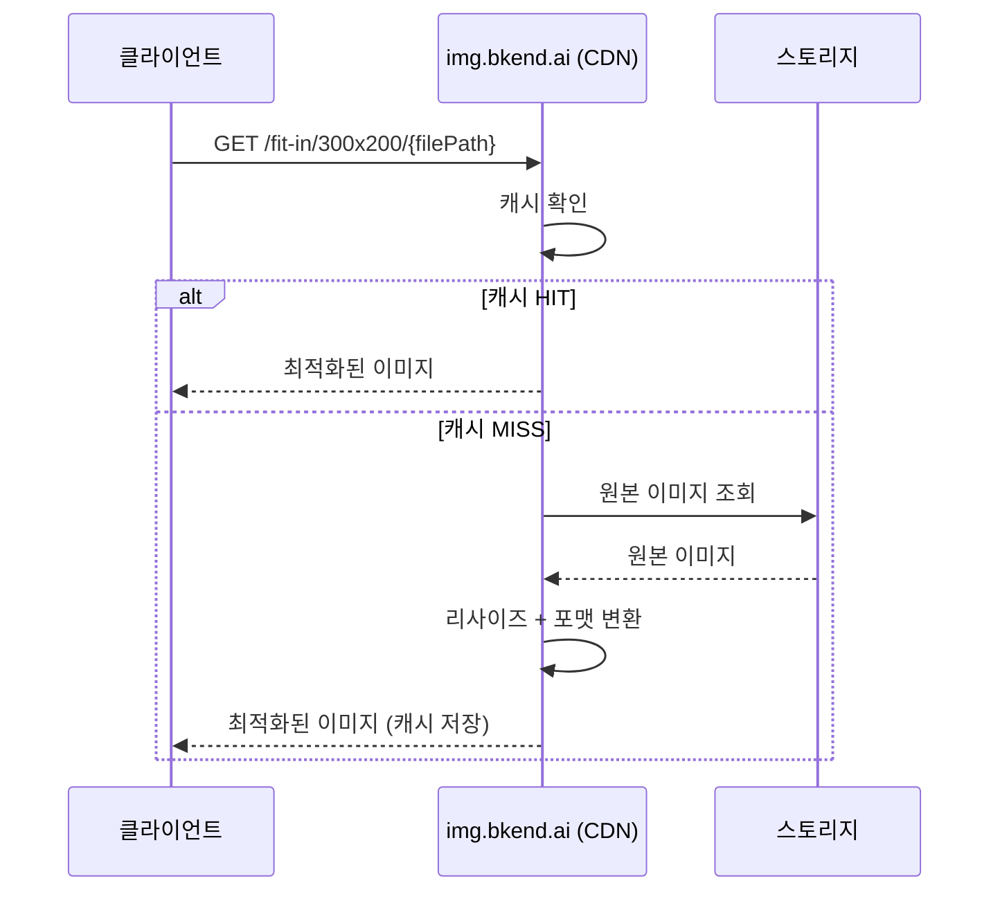

# 이미지 최적화


💡 업로드한 이미지를 URL만으로 리사이즈하고, 포맷을 변환하세요. 별도 API 호출 없이 CDN이 자동으로 처리합니다.



💡 **시작하기 전에** — 이 기능을 사용하려면 다음이 필요합니다:
- 파일 업로드 완료 ([단일 파일 업로드](02-upload-single.md) 참고)
- 파일의 `visibility`가 `public`으로 설정 ([파일 접근 권한](08-permissions.md) 참고)


## 개요

bkend는 이미지 최적화 CDN(`img.bkend.ai`)을 제공합니다. 업로드한 이미지의 경로를 알면, URL을 구성하는 것만으로 리사이즈, 포맷 변환, 품질 조절이 가능합니다.



### 핵심 특징

| 특징 | 설명 |
|------|------|
| **URL 기반 변환** | API 호출 없이 URL만 구성하면 자동 처리 |
| **자동 WebP 변환** | 브라우저가 WebP를 지원하면 자동으로 WebP로 변환 |
| **CDN 캐시** | 한 번 생성된 이미지는 CDN에 캐시되어 빠르게 제공 |
| **원본 보존** | 원본 이미지는 변경되지 않음 |

***

## URL 패턴

### 기본 구조

```
https://img.bkend.ai/{변환 옵션}/{파일 경로}
```

- **변환 옵션**: 리사이즈, 필터 등을 URL 경로에 포함
- **파일 경로**: 업로드 시 반환된 `key` 값

### 리사이즈

| 기능 | URL 패턴 | 설명 |
|------|---------|------|
| 비율 유지 리사이즈 | `/fit-in/{width}x{height}/` | 비율을 유지하며 지정 크기 안에 맞춤 |
| 스마트 크롭 | `/{width}x{height}/smart/` | 주요 영역을 감지하여 크롭 |
| 너비만 지정 | `/fit-in/{width}x0/` | 높이는 비율에 맞게 자동 조절 |
| 높이만 지정 | `/fit-in/0x{height}/` | 너비는 비율에 맞게 자동 조절 |



```
https://img.bkend.ai/fit-in/300x200/{filePath}
```

원본 비율을 유지하면서 300x200 안에 맞춥니다. 카드 썸네일에 적합합니다.


```
https://img.bkend.ai/300x200/smart/{filePath}
```

이미지의 주요 영역(얼굴, 텍스트 등)을 감지하여 크롭합니다. 프로필 이미지에 적합합니다.


```
https://img.bkend.ai/fit-in/600x0/{filePath}
```

너비를 600px로 고정하고, 높이는 비율에 맞게 조절합니다. 상세 페이지 이미지에 적합합니다.



### 필터

필터는 `/filters:` 접두사로 시작하며, 여러 필터를 `:` 로 연결할 수 있습니다.

| 필터 | 패턴 | 설명 |
|------|------|------|
| 품질 | `filters:quality({1-100})` | JPEG/WebP 품질 (기본 80 권장) |
| 포맷 변환 | `filters:format({ext})` | `webp`, `jpeg`, `png` 등 |
| 블러 | `filters:blur({radius})` | 배경 블러 효과 |

```
https://img.bkend.ai/fit-in/300x200/filters:quality(80):format(webp)/{filePath}
```


💡 `filters:format(webp)`를 명시하지 않아도, 브라우저가 WebP를 지원하면 자동으로 WebP로 변환됩니다.


***

## 실전 예제

### 프로필 이미지 (아바타)

```
https://img.bkend.ai/80x80/smart/{filePath}
```

80x80 크기로 스마트 크롭하여 얼굴 영역을 중심으로 잘라냅니다.

### 카드 썸네일

```
https://img.bkend.ai/fit-in/400x300/filters:quality(80)/{filePath}
```

카드 UI에 사용할 400x300 썸네일을 생성합니다.

### 상세 페이지 이미지

```
https://img.bkend.ai/fit-in/800x0/filters:quality(85)/{filePath}
```

너비 800px로 고정하고, 높이는 원본 비율에 맞게 조절합니다.

### 갤러리 그리드

```
https://img.bkend.ai/fit-in/200x200/filters:quality(75)/{filePath}
```

갤러리에 사용할 200x200 정사각형 썸네일입니다.

***

## 앱에서 사용하기

### JavaScript/TypeScript 헬퍼

```typescript
const IMAGE_BASE_URL = process.env.NEXT_PUBLIC_IMAGE_URL || 'https://img.bkend.ai';

interface ImageOptions {
  width?: number;
  height?: number;
  quality?: number;
  format?: 'webp' | 'jpeg' | 'png';
  mode?: 'fit' | 'smart';
}

/**
 * 최적화된 이미지 URL을 생성합니다.
 * @param filePath - 업로드 시 반환된 key 값
 * @param options - 리사이즈/필터 옵션
 */
function getImageUrl(filePath: string, options: ImageOptions = {}): string {
  const { width = 0, height = 0, quality, format, mode = 'fit' } = options;

  const parts: string[] = [];

  // 리사이즈
  if (width || height) {
    if (mode === 'smart') {
      parts.push(`${width}x${height}`, 'smart');
    } else {
      parts.push(`fit-in/${width}x${height}`);
    }
  }

  // 필터
  const filters: string[] = [];
  if (quality) filters.push(`quality(${quality})`);
  if (format) filters.push(`format(${format})`);

  if (filters.length > 0) {
    parts.push(`filters:${filters.join(':')}`);
  }

  const path = parts.length > 0 ? `${parts.join('/')}/${filePath}` : filePath;
  return `${IMAGE_BASE_URL}/${path}`;
}
```

#### 사용 예시

```typescript
// 프로필 아바타 (80x80, 스마트 크롭)
const avatarUrl = getImageUrl(user.avatarKey, {
  width: 80,
  height: 80,
  mode: 'smart',
});

// 카드 썸네일 (400x300, 품질 80)
const thumbnailUrl = getImageUrl(recipe.imageKey, {
  width: 400,
  height: 300,
  quality: 80,
});

// 상세 페이지 (너비 800px)
const detailUrl = getImageUrl(product.imageKey, {
  width: 800,
  quality: 85,
});
```

### Flutter 헬퍼

```dart
const String _imageBaseUrl = String.fromEnvironment(
  'IMAGE_BASE_URL',
  defaultValue: 'https://img.bkend.ai',
);

String getImageUrl(
  String filePath, {
  int width = 0,
  int height = 0,
  int? quality,
  String? format,
  bool smartCrop = false,
}) {
  final parts = <String>[];

  // 리사이즈
  if (width > 0 || height > 0) {
    if (smartCrop) {
      parts.addAll(['${width}x$height', 'smart']);
    } else {
      parts.add('fit-in/${width}x$height');
    }
  }

  // 필터
  final filters = <String>[];
  if (quality != null) filters.add('quality($quality)');
  if (format != null) filters.add('format($format)');

  if (filters.isNotEmpty) {
    parts.add('filters:${filters.join(":")}');
  }

  final path = parts.isNotEmpty ? '${parts.join("/")}/$filePath' : filePath;
  return '$_imageBaseUrl/$path';
}
```

***

## 반응형 이미지

### HTML srcset 활용

여러 크기의 이미지를 제공하면 브라우저가 화면 크기에 맞는 이미지를 자동으로 선택합니다.

```html

```

### React/Next.js 컴포넌트

```tsx
function OptimizedImage({
  filePath,
  alt,
  widths = [400, 800, 1200],
  className,
}: {
  filePath: string;
  alt: string;
  widths?: number[];
  className?: string;
}) {
  const src = getImageUrl(filePath, { width: widths[1] });
  const srcSet = widths
    .map((w) => `${getImageUrl(filePath, { width: w })} ${w}w`)
    .join(', ');

  return (
    
  );
}
```

***

## 주의사항


⚠️ 이미지 최적화 CDN은 **`public` visibility 파일만** 지원합니다. `private`, `protected`, `shared` 파일에는 사용할 수 없습니다.


| 조건 | 이미지 표시 방법 |
|------|----------------|
| `visibility: public` | `img.bkend.ai` 최적화 URL 사용 |
| `visibility: private/protected/shared` | Presigned URL로 다운로드 ([파일 다운로드](06-download.md) 참고) |


💡 프로필 사진, 게시글 이미지 등 공개 이미지는 `public`으로 설정하면 CDN 최적화를 활용할 수 있습니다.


***

## 성능 최적화 팁

| 팁 | 설명 |
|----|------|
| **적절한 크기 사용** | 화면에 표시되는 크기보다 큰 이미지를 요청하지 마세요 |
| **`loading="lazy"` 사용** | 뷰포트 밖 이미지는 지연 로딩으로 초기 로딩 속도를 개선합니다 |
| **품질 80 권장** | 대부분의 경우 `quality(80)`이면 시각적 차이 없이 파일 크기를 줄일 수 있습니다 |
| **srcset 활용** | 모바일/데스크톱에 맞는 크기를 제공하여 대역폭을 절약합니다 |

***

## 다음 단계

- [단일 파일 업로드](02-upload-single.md) — 이미지 업로드
- [파일 접근 권한](08-permissions.md) — `public` visibility 설정
- [파일 업로드 앱 패턴](10-upload-app-patterns.md) — 업로드 후 최적화 URL 사용
- [파일 다운로드](06-download.md) — private 파일 다운로드
