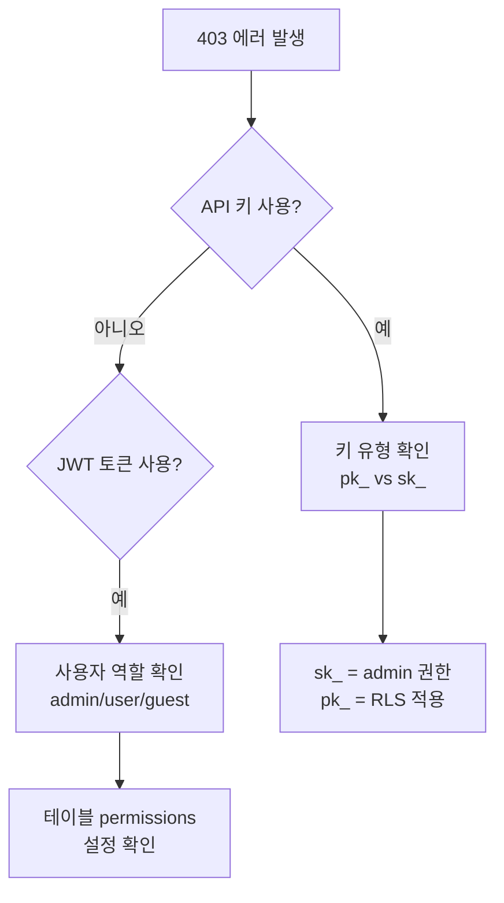

# 공통 에러 코드


💡 bkend API 사용 중 자주 발생하는 에러와 해결 방법을 확인합니다.


## 개요

이 문서에서는 HTTP 상태 코드별 에러 원인과 해결 방법을 정리합니다. 모든 에러 응답은 표준 형식을 따릅니다:

```json
{
  "success": false,
  "error": {
    "code": "auth/invalid-credentials",
    "message": "이메일 또는 비밀번호가 올바르지 않습니다"
  }
}
```

에러 코드는 `{도메인}/{에러명}` 형식을 따릅니다. `도메인`은 에러가 발생한 모듈을, `에러명`은 구체적인 원인을 나타냅니다.

***

## 400 Bad Request

요청 형식이 올바르지 않을 때 발생합니다.

| 에러 코드 | 원인 | 해결 방법 |
|----------|------|---------|
| `data/validation-error` | 스키마 검증 실패 (필수 필드 누락, 잘못된 타입) | 요청 body의 필수 필드와 타입을 확인하세요 |
| `auth/invalid-email-format` | 잘못된 이메일 형식 | 유효한 이메일 형식을 입력하세요 (예: `user@example.com`) |
| `auth/invalid-password-format` | 비밀번호 요구사항 미충족 | 비밀번호 길이와 복잡도 요구사항을 확인하세요 |
| `auth/invalid-request` | 잘못된 요청 파라미터 | 모든 요청 파라미터의 형식을 확인하세요 |
| `common/invalid-parameters` | 필수 파라미터 누락 또는 잘못된 형식 | 필수 파라미터가 모두 올바르게 포함되어 있는지 확인하세요 |

### 에러 확인 방법

```javascript
const response = await fetch('https://api-client.bkend.ai/v1/data/posts', {
  method: 'POST',
  headers: {
    'Content-Type': 'application/json',
    'X-API-Key': '{pk_publishable_key}',
  },
  body: JSON.stringify({
    title: '제목', // 필수 필드 포함 확인
  }),
});

if (!response.ok) {
  const result = await response.json();
  // result.success === false
  console.error('에러 코드:', result.error.code);
  console.error('에러 메시지:', result.error.message);
}
```

***

## 401 Unauthorized

인증 정보가 없거나 유효하지 않을 때 발생합니다.

| 에러 코드 | 원인 | 해결 방법 |
|----------|------|---------|
| `auth/unauthorized` | 인증 토큰 누락 또는 유효하지 않음 | `Authorization` 헤더에 유효한 토큰을 포함하세요 |
| `auth/access-token-expired` | Access Token 만료 | Refresh Token으로 새 Access Token을 발급받으세요 |
| `auth/invalid-access-token` | 유효하지 않거나 만료된 Access Token | 토큰 값을 확인하세요 |
| `auth/invalid-refresh-token` | 유효하지 않은 Refresh Token | 재로그인하여 새 Refresh Token을 발급받으세요 |
| `auth/invalid-token-format` | 잘못된 토큰 형식 | 토큰 값을 확인하세요 (`pk_`/`sk_` 접두사 또는 유효한 JWT) |
| `auth/missing-authorization-header` | Authorization 헤더 누락 | `Authorization: Bearer {accessToken}` 헤더를 추가하세요 |

### Access Token 갱신

```javascript
async function refreshAccessToken(refreshToken) {
  const response = await fetch('https://api-client.bkend.ai/v1/auth/refresh', {
    method: 'POST',
    headers: {
      'Content-Type': 'application/json',
      'X-API-Key': '{pk_publishable_key}',
    },
    body: JSON.stringify({ refreshToken }),
  });

  if (!response.ok) {
    // Refresh Token도 만료된 경우 → 재로그인 필요
    throw new Error('재로그인이 필요합니다');
  }

  const result = await response.json();
  return result.accessToken;
}
```

***

## 403 Forbidden

인증은 되었지만 권한이 없을 때 발생합니다.

| 에러 코드 | 원인 | 해결 방법 |
|----------|------|---------|
| `data/permission-denied` | RLS 권한 부족 | 테이블의 `permissions` 설정을 확인하세요 |
| `data/system-table-access` | 시스템 테이블 접근 차단 | admin 인증(Secret Key)을 사용하세요 |
| `data/scope-insufficient` | API Key scope에 이 작업이 포함되지 않음 | 필요한 scope가 포함된 API 키를 사용하세요 |
| `auth/forbidden` | 접근 권한 거부 | 사용자의 역할과 권한을 확인하세요 |
| `file/access-denied` | 파일 접근 권한 없음 | 파일 접근 권한을 확인하세요 |

### 권한 확인 방법



***

## 404 Not Found

요청한 리소스가 존재하지 않을 때 발생합니다.

| 에러 코드 | 원인 | 해결 방법 |
|----------|------|---------|
| `data/table-not-found` | 테이블이 존재하지 않음 | 테이블 이름의 대소문자와 철자를 확인하세요 |
| `data/not-found` | 레코드가 존재하지 않음 | 레코드 ID를 확인하세요 |
| `data/environment-not-found` | API Key의 환경이 잘못됨 | 해당 환경에서 발급한 API Key를 사용하세요 |
| `auth/account-not-found` | 사용자 계정을 찾을 수 없음 | 이메일 또는 사용자 ID를 확인하세요 |
| `file/not-found` | 파일이 존재하지 않음 | 파일 ID를 확인하세요 |


💡 테이블 이름은 대소문자를 구분합니다. `Posts`와 `posts`는 다른 테이블입니다.


***

## 409 Conflict

리소스 충돌이 발생했을 때 나타납니다.

| 에러 코드 | 원인 | 해결 방법 |
|----------|------|---------|
| `auth/email-already-exists` | 이미 등록된 이메일 | 다른 이메일을 사용하거나 로그인을 시도하세요 |
| `data/duplicate-value` | Unique 인덱스 위반 | 중복되지 않는 값을 사용하세요 |
| `auth/account-already-linked` | 이미 연결된 소셜 계정 | 기존 연결된 계정을 확인하세요 |

***

## 429 Too Many Requests

API 호출 한도를 초과했을 때 발생합니다.

| 에러 코드 | 원인 | 해결 방법 |
|----------|------|---------|
| `data/rate-limit-exceeded` | API 호출 한도 초과 | 호출 빈도를 줄이거나 플랜을 업그레이드하세요 |
| `auth/too-many-requests` | 너무 많은 요청 | 잠시 후 재시도하세요 |
| `auth/too-many-login-attempts` | 로그인 시도 한도 초과 | 잠시 후 재시도하세요 |
| `auth/too-many-code-requests` | 인증 코드 요청 한도 초과 | 잠시 후 재시도하세요 |

### 재시도 처리

```javascript
async function fetchWithRetry(url, options, maxRetries = 3) {
  for (let i = 0; i < maxRetries; i++) {
    const response = await fetch(url, options);

    if (response.status === 429) {
      const retryAfter = response.headers.get('Retry-After');
      const delay = retryAfter ? parseInt(retryAfter) * 1000 : (i + 1) * 2000;
      await new Promise(resolve => setTimeout(resolve, delay));
      continue;
    }

    return response;
  }
  throw new Error('최대 재시도 횟수 초과');
}
```

***

## 500 Internal Server Error

서버 내부 오류입니다.

| 대응 | 설명 |
|------|------|
| **재시도** | 일시적 오류일 수 있으므로 잠시 후 재시도하세요 |
| **지속 발생 시** | 동일한 요청에서 반복 발생하면 요청 내용을 점검하세요 |
| **문의** | 문제가 지속되면 지원팀에 문의하세요 |

***

## 에러 응답 형식

모든 API 에러는 일관된 구조를 따릅니다:

```json
{
  "success": false,
  "error": {
    "code": "{도메인}/{에러명}",
    "message": "사람이 읽을 수 있는 에러 설명"
  }
}
```

| 필드 | 타입 | 설명 |
|------|------|------|
| `success` | `boolean` | 에러 응답에서는 항상 `false` |
| `error.code` | `string` | 기계가 읽을 수 있는 에러 코드 (`{도메인}/{에러명}` 형식) |
| `error.message` | `string` | 사람이 읽을 수 있는 에러 메시지 |

### HTTP 상태 코드 매핑

에러 코드는 패턴 기반으로 HTTP 상태 코드에 자동 매핑됩니다:

| 에러 코드 패턴 | HTTP 상태 |
|---|:---:|
| `unauthorized`, `invalid-token`, `token-expired` | 401 |
| `forbidden`, `permission-denied`, `access-denied` | 403 |
| `not-found` | 404 |
| `too-many`, `rate-limit` | 429 |
| 기타 에러 | 400 |

***

## 에러 디버깅 팁

1. **응답 body 확인** -- `error.code`와 `error.message` 필드를 확인하세요
2. **요청 헤더 확인** -- `Content-Type`과 `X-API-Key` 헤더를 확인하세요
3. **환경 확인** -- 올바른 환경(`dev` / `staging` / `prod`)의 API Key를 사용하고 있는지 확인하세요
4. **curl로 직접 테스트** -- 클라이언트 코드 문제인지 API 문제인지 구분하세요

***

## 다음 단계

- [연결 문제 해결](02-connection-issues.md) -- 연결 관련 문제
- [인증 문제 해결](03-auth-issues.md) -- 인증 에러 해결
- [FAQ](05-faq.md) -- 자주 묻는 질문
