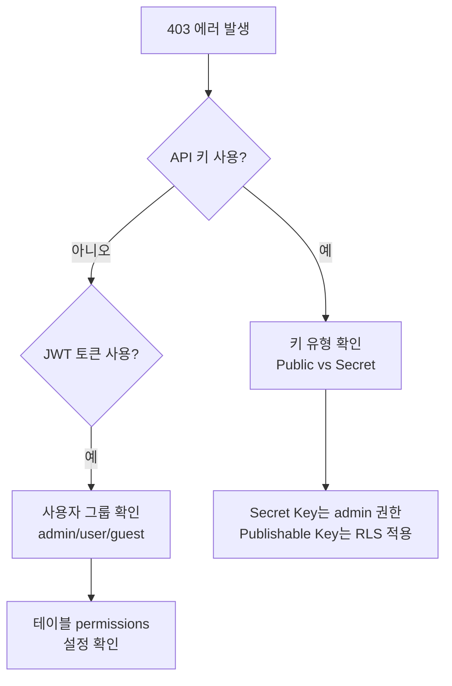

# 공통 에러 코드


💡 bkend API 사용 중 자주 발생하는 에러와 해결 방법을 확인합니다.


## 개요

이 문서에서는 HTTP 상태 코드별 에러 원인과 해결 방법을 정리합니다.

***

## 400 Bad Request

요청 형식이 올바르지 않을 때 발생합니다.

| 에러 코드 | 원인 | 해결 방법 |
|----------|------|---------|
| `VALIDATION_ERROR` | 필수 파라미터 누락 또는 잘못된 타입 | 요청 body의 필수 필드와 타입을 확인하세요 |
| `INVALID_COLUMN_TYPE` | 지원하지 않는 컬럼 타입 | String, Number, Boolean, Date, Array, Object, Mixed 중 선택하세요 |
| `INVALID_FILTER` | 잘못된 필터 형식 | 필터 연산자를 확인하세요 |
| `MISSING_API_KEY` | `X-API-Key` 헤더 누락 | 요청에 `X-API-Key` 헤더를 추가하고 올바른 API 키를 확인하세요 |

### 에러 확인 방법

```javascript
const response = await fetch('https://api-client.bkend.ai/v1/data/posts', {
  method: 'POST',
  headers: {
    'Content-Type': 'application/json',
    'X-API-Key': '{pk_publishable_key}',
    'Authorization': `Bearer ${apiKey}`,
  },
  body: JSON.stringify({
    title: '제목', // 필수 필드 포함 확인
  }),
});

if (!response.ok) {
  const error = await response.json();
  console.error('에러 코드:', error.error);
  console.error('에러 메시지:', error.message);
}
```

***

## 401 Unauthorized

인증 정보가 없거나 유효하지 않을 때 발생합니다.

| 에러 코드 | 원인 | 해결 방법 |
|----------|------|---------|
| `UNAUTHORIZED` | 인증 토큰 누락 | `Authorization` 헤더에 토큰을 포함하세요 |
| `TOKEN_EXPIRED` | Access Token 만료 | Refresh Token으로 새 Access Token을 발급받으세요 |
| `INVALID_TOKEN` | 잘못된 토큰 형식 | 토큰 값을 확인하세요 (`pk_` / `sk_` prefix 또는 유효한 JWT) |
| `TOKEN_REVOKED` | 폐기된 API 키 | 새 API 키를 생성하세요 |

### Access Token 갱신

```javascript
async function refreshAccessToken(refreshToken) {
  const response = await fetch('https://api-client.bkend.ai/v1/auth/refresh', {
    method: 'POST',
    headers: {
      'Content-Type': 'application/json',
      'X-API-Key': '{pk_publishable_key}',
    },
    body: JSON.stringify({ refreshToken }),
  });

  if (!response.ok) {
    // Refresh Token도 만료된 경우 → 재로그인 필요
    throw new Error('재로그인이 필요합니다');
  }

  const { accessToken } = await response.json();
  return accessToken;
}
```

***

## 403 Forbidden

인증은 되었지만 권한이 없을 때 발생합니다.

| 에러 코드 | 원인 | 해결 방법 |
|----------|------|---------|
| `PERMISSION_DENIED` | RLS 권한 부족 | 테이블의 `permissions` 설정을 확인하세요 |
| `SYSTEM_TABLE_ACCESS` | 시스템 테이블 접근 차단 | admin 인증(Secret Key)을 사용하세요 |

### 권한 확인 방법



***

## 404 Not Found

요청한 리소스가 존재하지 않을 때 발생합니다.

| 에러 코드 | 원인 | 해결 방법 |
|----------|------|---------|
| `TABLE_NOT_FOUND` | 테이블이 존재하지 않음 | 테이블 이름의 대소문자와 철자를 확인하세요 |
| `RECORD_NOT_FOUND` | 레코드가 존재하지 않음 | 레코드 ID를 확인하세요 |
| `PROJECT_NOT_FOUND` | API Key의 프로젝트가 잘못됨 | 올바른 API Key(`pk_` / `sk_`)를 사용하고 있는지 확인하세요 |
| `ENVIRONMENT_NOT_FOUND` | API Key의 환경이 잘못됨 | 해당 환경에서 발급한 API Key를 사용하세요 |


💡 테이블 이름은 대소문자를 구분합니다. `Posts`와 `posts`는 다른 테이블입니다.


***

## 409 Conflict

리소스 충돌이 발생했을 때 나타납니다.

| 에러 코드 | 원인 | 해결 방법 |
|----------|------|---------|
| `DUPLICATE_TABLE` | 같은 이름의 테이블이 존재 | 다른 이름을 사용하거나 기존 테이블을 확인하세요 |
| `EMAIL_ALREADY_EXISTS` | 이미 등록된 이메일 | 다른 이메일을 사용하거나 로그인을 시도하세요 |
| `UNIQUE_CONSTRAINT` | Unique 인덱스 위반 | 중복되지 않는 값을 사용하세요 |

***

## 429 Too Many Requests

API 호출 한도를 초과했을 때 발생합니다.

| 에러 코드 | 원인 | 해결 방법 |
|----------|------|---------|
| `RATE_LIMIT_EXCEEDED` | API 호출 한도 초과 | 호출 빈도를 줄이거나 플랜을 업그레이드하세요 |
| `EMAIL_RATE_LIMIT` | 이메일 발송 한도 초과 | 잠시 후 재시도하세요 |

### 재시도 처리

```javascript
async function fetchWithRetry(url, options, maxRetries = 3) {
  for (let i = 0; i < maxRetries; i++) {
    const response = await fetch(url, options);

    if (response.status === 429) {
      const retryAfter = response.headers.get('Retry-After');
      const delay = retryAfter ? parseInt(retryAfter) * 1000 : (i + 1) * 2000;
      await new Promise(resolve => setTimeout(resolve, delay));
      continue;
    }

    return response;
  }
  throw new Error('최대 재시도 횟수 초과');
}
```

***

## 500 Internal Server Error

서버 내부 오류입니다.

| 대응 | 설명 |
|------|------|
| **재시도** | 일시적 오류일 수 있으므로 잠시 후 재시도하세요 |
| **지속 발생 시** | 동일한 요청에서 반복 발생하면 요청 내용을 점검하세요 |
| **문의** | 문제가 지속되면 지원팀에 문의하세요 |

***

## 에러 디버깅 팁

1. **응답 body 확인** — `error`와 `message` 필드를 확인하세요
2. **요청 헤더 확인** — `Content-Type`, `X-API-Key`, `Authorization` 헤더를 확인하세요
3. **환경 확인** — 올바른 환경의 API Key를 사용하고 있는지 확인하세요
4. **curl로 직접 테스트** — 클라이언트 코드 문제인지 API 문제인지 구분하세요

***

## 다음 단계

- [연결 문제 해결](02-connection-issues.md) — 연결 관련 문제
- [인증 문제 해결](03-auth-issues.md) — 인증 에러 해결
- [FAQ](05-faq.md) — 자주 묻는 질문
