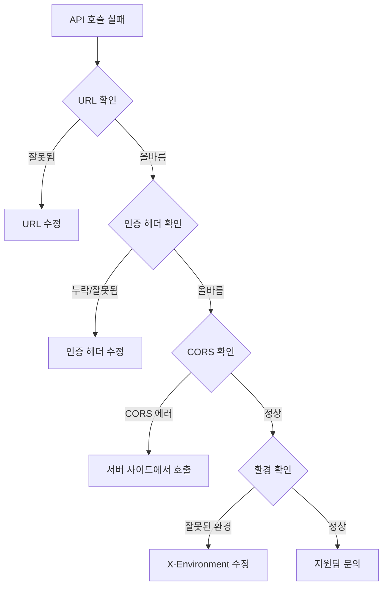

# 연결 문제 해결


💡 bkend API 연결 시 발생할 수 있는 문제와 해결 방법을 안내합니다.


## 개요

API 호출 실패 시 아래 진단 순서를 따르세요.



***

## API URL 확인

올바른 API URL을 사용하고 있는지 확인하세요.

| 항목 | 올바른 값 |
|------|----------|
| **REST API** | `https://api-client.bkend.ai` |
| **MCP 서버** | `https://api.bkend.ai/mcp` |

### 자주 하는 실수

| 잘못된 URL | 올바른 URL |
|-----------|----------|
| `http://api-client.bkend.ai` | `https://api-client.bkend.ai` |
| `api-client.bkend.ai/data/posts` | `https://api-client.bkend.ai/v1/data/posts` |
| `/data/posts` (v1 누락) | `/v1/data/posts` |

***

## 인증 헤더 확인

### 필수 헤더

```bash
curl -X GET https://api-client.bkend.ai/v1/data/posts \
  -H "Authorization: Bearer {api_key_or_jwt}" \
  -H "X-Project-Id: {project_id}" \
  -H "X-Environment: prod"
```

| 헤더 | 필수 | 주의 |
|------|:----:|------|
| `Authorization` | 조건부 | `Bearer ` 접두사 필수 (공백 주의) |
| `X-Project-Id` | ✅ | 프로젝트 ID (콘솔에서 확인) |
| `X-Environment` | ✅ | `dev`, `staging`, `prod` 중 하나 |


⚠️ `Authorization: Bearer {token}`에서 `Bearer`와 토큰 사이에 **공백**이 있어야 합니다. `Bearer{token}`은 잘못된 형식입니다.


***

## CORS 문제

브라우저에서 직접 API를 호출할 때 CORS 에러가 발생할 수 있습니다.

### 증상

```
Access to fetch at 'https://api-client.bkend.ai/...'
from origin 'http://localhost:3000' has been blocked by CORS policy
```

### 해결 방법

| 방법 | 설명 |
|------|------|
| **서버 사이드 호출** | Next.js API Routes, Express 등에서 호출 |
| **프록시 설정** | 개발 서버의 프록시 기능 활용 |

```javascript
// Next.js API Route 예시
// pages/api/posts.ts
export default async function handler(req, res) {
  const response = await fetch('https://api-client.bkend.ai/v1/data/posts', {
    headers: {
      'Authorization': `Bearer ${process.env.BKEND_API_KEY}`,
      'X-Project-Id': process.env.BKEND_PROJECT_ID,
      'X-Environment': 'prod',
    },
  });
  const data = await response.json();
  res.json(data);
}
```

***

## 타임아웃 문제

### 증상

요청이 오래 걸리거나 타임아웃 에러가 발생합니다.

### 해결 방법

| 원인 | 해결 |
|------|------|
| 대량 데이터 조회 | `limit` 파라미터로 조회 수 제한 |
| 인덱스 미설정 | 자주 필터링하는 필드에 인덱스 추가 |
| 네트워크 문제 | 네트워크 연결 상태 확인 |

***

## MCP 연결 문제

### MCP 서버가 연결되지 않을 때

1. **Node.js 버전 확인** — Node.js 18 이상이 필요합니다
2. **MCP URL 확인** — `https://api.bkend.ai/mcp`가 올바른지 확인하세요
3. **인증 확인** — OAuth 인증이 완료되었는지 확인하세요
4. **AI 도구 재시작** — 도구를 재시작하고 다시 시도하세요

### MCP 도구 목록이 비어있을 때

1. OAuth 인증이 완료되었는지 확인하세요
2. Organization에 프로젝트가 있는지 확인하세요
3. 프로젝트에 활성 환경이 있는지 확인하세요

***

## curl로 직접 테스트하기

문제 발생 시 curl로 직접 API를 테스트하여 클라이언트 코드 문제인지 API 문제인지 구분하세요.

```bash
# 데이터 조회 테스트
curl -v -X GET "https://api-client.bkend.ai/v1/data/posts?limit=1" \
  -H "Authorization: Bearer ak_{your_api_key}" \
  -H "X-Project-Id: {project_id}" \
  -H "X-Environment: dev"
```

`-v` 옵션으로 요청/응답 헤더를 확인할 수 있습니다.

***

## 다음 단계

- [공통 에러 코드](01-common-errors.md) — HTTP 상태 코드별 해결
- [인증 문제 해결](03-auth-issues.md) — 인증 관련 문제
- [FAQ](05-faq.md) — 자주 묻는 질문
