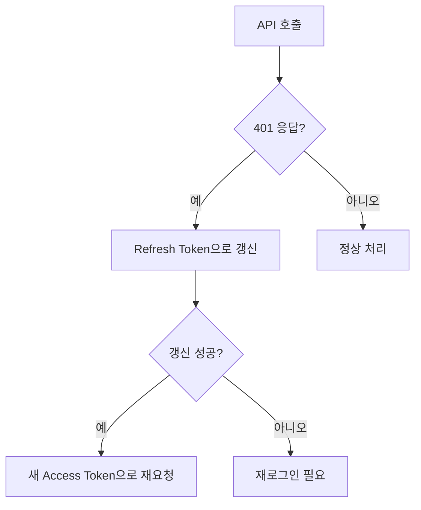

# 인증 문제 해결


💡 bkend 인증 관련 문제와 해결 방법을 안내합니다.


## 개요

인증 관련 문제는 회원가입, 로그인, 토큰 관리, 소셜 로그인 영역에서 발생합니다. 각 영역별 진단과 해결 방법을 정리합니다.

***

## 회원가입 문제

### 이메일 중복 에러 (409)

```json
{ "statusCode": 409, "error": "EMAIL_ALREADY_EXISTS" }
```

**해결:** 이미 등록된 이메일입니다. 로그인을 시도하거나 비밀번호 재설정을 사용하세요.

### 비밀번호 유효성 에러 (400)

비밀번호는 다음 규칙을 만족해야 합니다.

| 항목 | 조건 |
|------|------|
| 최소 길이 | 8자 이상 |
| 최대 길이 | 128자 이하 |

### 이메일 형식 에러 (400)

유효한 이메일 형식인지 확인하세요 (예: `user@example.com`).

***

## 로그인 문제

### 잘못된 비밀번호 (401)

```json
{ "statusCode": 401, "error": "INVALID_CREDENTIALS" }
```

**해결:** 이메일과 비밀번호를 확인하세요. 비밀번호를 잊었다면 비밀번호 재설정을 사용하세요.

### 이메일 미인증 (403)

이메일 인증이 활성화된 프로젝트에서 인증을 완료하지 않은 사용자가 로그인을 시도한 경우입니다.

**해결:** 이메일 인증 링크를 확인하세요. 이메일을 받지 못했다면 인증 이메일 재발송을 요청하세요.

***

## 토큰 관리 문제

### Access Token 만료

| 토큰 | 유효 기간 |
|------|---------|
| Access Token | 1시간 |
| Refresh Token | 30일 |

Access Token이 만료되면 Refresh Token으로 갱신하세요.



### 자동 토큰 갱신 구현

```javascript
const PUBLISHABLE_KEY = '{pk_publishable_key}'; // 콘솔에서 발급

async function fetchWithAuth(url, options = {}) {
  let accessToken = getStoredAccessToken();

  const response = await fetch(url, {
    ...options,
    headers: {
      ...options.headers,
      'X-API-Key': PUBLISHABLE_KEY,
      'Authorization': `Bearer ${accessToken}`,
    },
  });

  if (response.status === 401) {
    // Access Token 만료 → 갱신 시도
    const refreshToken = getStoredRefreshToken();
    const refreshResponse = await fetch(
      'https://api-client.bkend.ai/v1/auth/refresh',
      {
        method: 'POST',
        headers: {
          'Content-Type': 'application/json',
          'X-API-Key': PUBLISHABLE_KEY,
        },
        body: JSON.stringify({ refreshToken }),
      }
    );

    if (refreshResponse.ok) {
      const { accessToken: newToken } = await refreshResponse.json();
      storeAccessToken(newToken);

      // 새 토큰으로 원래 요청 재시도
      return fetch(url, {
        ...options,
        headers: {
          ...options.headers,
          'X-API-Key': PUBLISHABLE_KEY,
          'Authorization': `Bearer ${newToken}`,
        },
      });
    }

    // Refresh Token도 만료 → 재로그인
    redirectToLogin();
  }

  return response;
}
```

***

## 소셜 로그인 문제

### OAuth Callback 에러

| 원인 | 해결 |
|------|------|
| Redirect URI 불일치 | OAuth 프로바이더 설정에서 Redirect URI를 확인하세요 |
| Client ID/Secret 잘못됨 | 프로바이더 콘솔에서 값을 재확인하세요 |
| Scope 부족 | 필요한 scope(email, profile)를 추가하세요 |

### Google OAuth 설정 확인

1. [Google Cloud Console](https://console.cloud.google.com/)에서 OAuth 동의 화면 설정을 확인하세요
2. **승인된 리다이렉트 URI**에 bkend 콜백 URL이 포함되어 있는지 확인하세요
3. 테스트 모드인 경우 테스트 사용자가 등록되어 있는지 확인하세요

### GitHub OAuth 설정 확인

1. [GitHub Developer Settings](https://github.com/settings/developers)에서 OAuth App을 확인하세요
2. **Authorization callback URL**이 올바른지 확인하세요

***

## 비밀번호 재설정 문제

### 재설정 이메일을 받지 못할 때

1. **스팸 폴더**를 확인하세요
2. 등록된 이메일 주소가 맞는지 확인하세요
3. 이메일 발송 한도(시간당 제한)를 초과하지 않았는지 확인하세요
4. 잠시 후 다시 시도하세요

### 재설정 링크가 만료되었을 때

비밀번호 재설정 링크는 유효 기간이 있습니다. 만료된 경우 새 재설정 요청을 보내세요.

***


⚠️ 인증 토큰(`accessToken`)은 클라이언트 저장소(localStorage, cookie)에 안전하게 보관하세요. 토큰이 만료되면 Refresh Token으로 자동 갱신하는 로직을 구현하는 것을 권장합니다. → [토큰 관리](../authentication/20-token-management.md)


## 다음 단계

- [공통 에러 코드](01-common-errors.md) — 에러 코드 상세
- [연결 문제 해결](02-connection-issues.md) — API 연결 문제
- [보안 모범 사례](../security/07-best-practices.md) — 인증 보안 권장 사항
