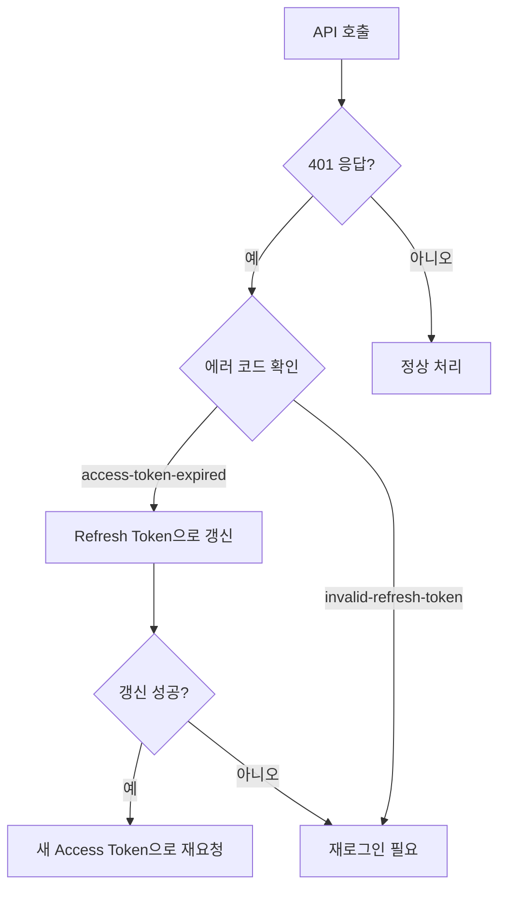

# 인증 문제 해결


💡 bkend 인증 관련 문제와 해결 방법을 안내합니다.


## 개요

인증 관련 문제는 회원가입, 로그인, 토큰 관리, 소셜 로그인, MFA 영역에서 발생합니다. 각 영역별 진단과 해결 방법을 정리합니다.

***

## 회원가입 문제

### 이메일 중복 에러 (409)

```json
{
  "success": false,
  "error": {
    "code": "auth/email-already-exists",
    "message": "이미 사용 중인 이메일입니다"
  }
}
```

**해결:** 이미 등록된 이메일입니다. 로그인을 시도하거나 비밀번호 재설정을 사용하세요.

### 비밀번호 유효성 에러 (400)

```json
{
  "success": false,
  "error": {
    "code": "auth/invalid-password-format",
    "message": "유효하지 않은 비밀번호 형식입니다"
  }
}
```

비밀번호는 다음 규칙을 만족해야 합니다.

| 항목 | 조건 |
|------|------|
| 최소 길이 | 8자 이상 |
| 최대 길이 | 128자 이하 |


⚠️ 프로젝트에 커스텀 비밀번호 정책이 설정되어 있으면 최소/최대 길이 요구사항이 다를 수 있습니다.


### 이메일 형식 에러 (400)

```json
{
  "success": false,
  "error": {
    "code": "auth/invalid-email-format",
    "message": "유효하지 않은 이메일 형식입니다"
  }
}
```

유효한 이메일 형식인지 확인하세요 (예: `user@example.com`).

***

## 로그인 문제

### 잘못된 비밀번호 (401)

```json
{
  "success": false,
  "error": {
    "code": "auth/invalid-credentials",
    "message": "이메일 또는 비밀번호가 올바르지 않습니다"
  }
}
```

**해결:** 이메일과 비밀번호를 확인하세요. 비밀번호를 잊었다면 비밀번호 재설정을 사용하세요.

### 이메일 미인증 (403)

```json
{
  "success": false,
  "error": {
    "code": "auth/email-not-verified",
    "message": "이메일이 인증되지 않았습니다"
  }
}
```

이메일 인증이 활성화된 프로젝트에서 인증을 완료하지 않은 사용자가 로그인을 시도한 경우입니다.

**해결:** 이메일 인증 링크를 확인하세요. 이메일을 받지 못했다면 인증 이메일 재발송을 요청하세요.

### 계정 잠금 (429)

```json
{
  "success": false,
  "error": {
    "code": "auth/account-locked",
    "message": "계정이 잠겼습니다"
  }
}
```

**해결:** 로그인 실패 횟수 초과로 계정이 잠겼습니다. 잠시 후 재시도하거나 비밀번호 재설정을 사용하세요.

***

## 토큰 관리 문제

### Access Token 만료

| 토큰 | 유효 기간 |
|------|---------|
| Access Token | 1시간 |
| Refresh Token | 30일 |

Access Token이 만료되면 Refresh Token으로 갱신하세요.



### 주요 토큰 에러

| 에러 코드 | 원인 | 해결 방법 |
|----------|------|---------|
| `auth/access-token-expired` | Access Token 만료 | Refresh Token으로 갱신하세요 |
| `auth/invalid-refresh-token` | 유효하지 않은 Refresh Token | 재로그인이 필요합니다 |
| `auth/invalid-token-format` | 잘못된 토큰 형식 | 토큰 형식을 확인하세요 |
| `auth/missing-authorization-header` | Authorization 헤더 누락 | `Authorization: Bearer {accessToken}` 헤더를 추가하세요 |

### 자동 토큰 갱신 구현

```javascript
const PUBLISHABLE_KEY = '{pk_publishable_key}'; // 콘솔에서 발급

async function fetchWithAuth(url, options = {}) {
  let accessToken = getStoredAccessToken();

  const response = await fetch(url, {
    ...options,
    headers: {
      ...options.headers,
      'X-API-Key': PUBLISHABLE_KEY,
      'Authorization': `Bearer ${accessToken}`,
    },
  });

  if (response.status === 401) {
    // Access Token 만료 → 갱신 시도
    const refreshToken = getStoredRefreshToken();
    const refreshResponse = await fetch(
      'https://api-client.bkend.ai/v1/auth/refresh',
      {
        method: 'POST',
        headers: {
          'Content-Type': 'application/json',
          'X-API-Key': PUBLISHABLE_KEY,
        },
        body: JSON.stringify({ refreshToken }),
      }
    );

    if (refreshResponse.ok) {
      const result = await refreshResponse.json();
      storeAccessToken(result.accessToken);

      // 새 토큰으로 원래 요청 재시도
      return fetch(url, {
        ...options,
        headers: {
          ...options.headers,
          'X-API-Key': PUBLISHABLE_KEY,
          'Authorization': `Bearer ${result.accessToken}`,
        },
      });
    }

    // Refresh Token도 만료 → 재로그인
    redirectToLogin();
  }

  return response;
}
```

***

## 소셜 로그인 문제

### OAuth Callback 에러

| 에러 코드 | 원인 | 해결 방법 |
|----------|------|---------|
| `auth/invalid-oauth-code` | 유효하지 않은 OAuth 인증 코드 | OAuth 플로우를 처음부터 재시도하세요 |
| `auth/oauth-not-configured` | OAuth 프로바이더가 설정되지 않음 | 콘솔에서 OAuth 프로바이더를 설정하세요 |
| `auth/unsupported-provider` | 지원하지 않는 OAuth 프로바이더 | 지원하는 프로바이더를 확인하세요 (Google, GitHub) |
| `auth/account-exists-different-provider` | 다른 방식으로 가입된 이메일 | 기존 가입 방식으로 로그인하거나 계정을 연결하세요 |

### Google OAuth 설정 확인

1. [Google Cloud Console](https://console.cloud.google.com/)에서 OAuth 동의 화면 설정을 확인하세요
2. **승인된 리다이렉트 URI**에 bkend 콜백 URL이 포함되어 있는지 확인하세요
3. 테스트 모드인 경우 테스트 사용자가 등록되어 있는지 확인하세요

### GitHub OAuth 설정 확인

1. [GitHub Developer Settings](https://github.com/settings/developers)에서 OAuth App을 확인하세요
2. **Authorization callback URL**이 올바른지 확인하세요

***

## MFA (다단계 인증) 문제

### 로그인 시 MFA 요구

```json
{
  "success": false,
  "error": {
    "code": "auth/mfa-required",
    "message": "2단계 인증이 필요합니다"
  }
}
```

**해결:** 사용자가 MFA를 활성화한 상태입니다. 인증 앱의 TOTP 코드를 제출하여 인증을 완료하세요.

### 주요 MFA 에러

| 에러 코드 | 원인 | 해결 방법 |
|----------|------|---------|
| `auth/invalid-mfa-code` | 잘못된 TOTP 코드 | 인증 앱의 올바른 6자리 코드를 입력하세요 |
| `auth/mfa-already-enabled` | MFA가 이미 활성화됨 | 추가 조치가 불필요합니다. MFA가 이미 설정되어 있습니다 |
| `auth/mfa-not-enabled` | MFA가 활성화되지 않음 | MFA 기능 사용 전 먼저 MFA를 활성화하세요 |
| `auth/mfa-setup-expired` | MFA 설정 세션 만료 | MFA 설정 과정을 다시 시작하세요 |
| `auth/mfa-backup-codes-exhausted` | 모든 백업 코드 사용 완료 | MFA를 비활성화 후 재활성화하여 새 백업 코드를 생성하세요 |

***

## 매직링크 문제

### 토큰 에러

| 에러 코드 | 원인 | 해결 방법 |
|----------|------|---------|
| `auth/magic-token-expired` | 매직링크 만료 | 새 매직링크를 요청하세요 |
| `auth/magic-token-missing` | 매직 토큰이 제공되지 않음 | 전체 링크 URL이 올바르게 사용되고 있는지 확인하세요 |
| `auth/magiclink-not-available-for-social` | 소셜 로그인으로 가입된 이메일 | 소셜 로그인을 사용하세요 |

***

## 비밀번호 재설정 문제

### 재설정 이메일을 받지 못할 때

1. **스팸 폴더**를 확인하세요
2. 등록된 이메일 주소가 맞는지 확인하세요
3. 이메일 발송 한도(시간당 제한)를 초과하지 않았는지 확인하세요
4. 잠시 후 다시 시도하세요

### 재설정 링크가 만료되었을 때

```json
{
  "success": false,
  "error": {
    "code": "auth/expired-password-reset-token",
    "message": "만료된 패스워드 재설정 토큰입니다"
  }
}
```

비밀번호 재설정 링크는 유효 기간이 있습니다. 만료된 경우 새 재설정 요청을 보내세요.

### 동일 비밀번호 에러

```json
{
  "success": false,
  "error": {
    "code": "auth/same-as-previous-password",
    "message": "이전과 다른 비밀번호를 사용하세요"
  }
}
```

**해결:** 현재 비밀번호와 다른 새 비밀번호를 선택하세요.

***


⚠️ 인증 토큰(`accessToken`)은 클라이언트 저장소(localStorage, cookie)에 안전하게 보관하세요. 토큰이 만료되면 Refresh Token으로 자동 갱신하는 로직을 구현하는 것을 권장합니다. → [토큰 관리](../authentication/20-token-management.md)


## 다음 단계

- [공통 에러 코드](01-common-errors.md) -- 에러 코드 상세
- [연결 문제 해결](02-connection-issues.md) -- API 연결 문제
- [보안 모범 사례](../security/07-best-practices.md) -- 인증 보안 권장 사항
