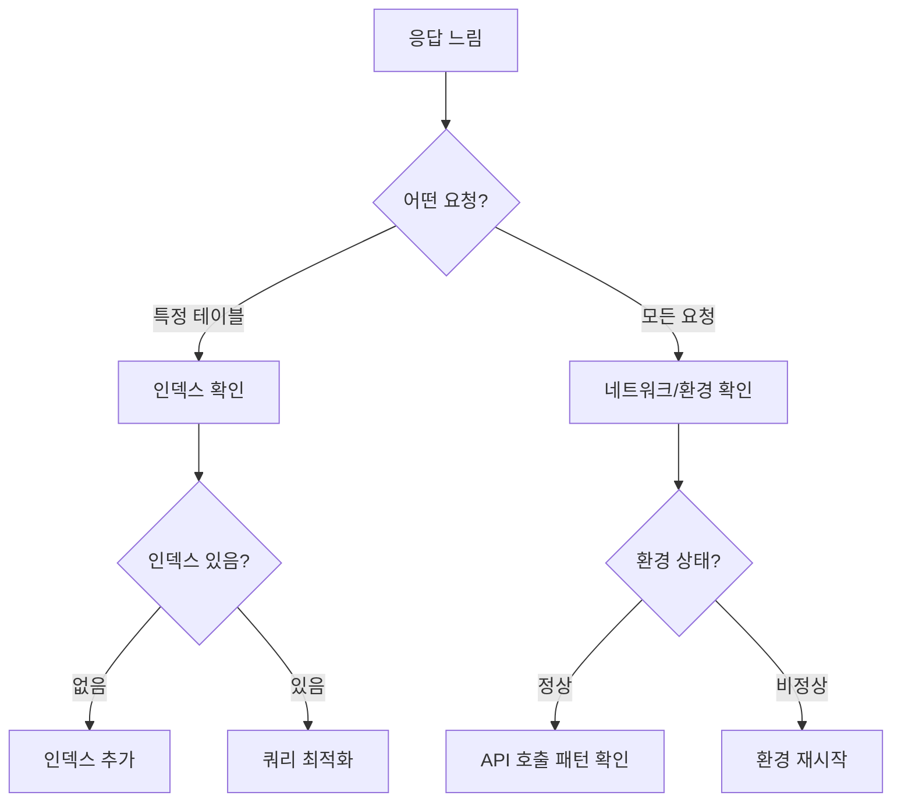

# 성능 문제

> API 응답이 느리거나 성능이 저하되었을 때 진단하고 해결하는 방법을 안내합니다.

## 개요

API 응답이 느려지는 원인을 진단하고, 성능을 개선하는 방법을 안내합니다.

---

## 성능 진단 순서



---

## 느린 쿼리 해결하기

### 인덱스 누락

가장 흔한 성능 문제는 인덱스 누락입니다.

**증상:** 특정 테이블의 조회가 느림

**진단:**
- 필터링에 사용하는 필드에 인덱스가 있는지 확인하세요.
- 정렬에 사용하는 필드에 인덱스가 있는지 확인하세요.

**해결:**
```json
{
  "name": "idx_status_createdAt",
  "fields": {
    "status": 1,
    "createdAt": -1
  }
}
```

### 대용량 데이터 조회

**증상:** 데이터가 많은 테이블에서 전체 조회 시 느림

**해결:**

| 방법 | 설명 |
|------|------|
| **페이지네이션** | `limit`과 `offset`으로 나눠서 조회 |
| **필드 선택** | 필요한 필드만 `fields` 파라미터로 지정 |
| **필터링** | 조건을 추가하여 결과 범위 축소 |

```typescript
// 나쁜 예 — 전체 데이터 조회
const response = await fetch('/data/posts');

// 좋은 예 — 필터 + 페이지네이션 + 필드 선택
const response = await fetch(
  '/data/posts?status=published&limit=20&offset=0&fields=title,status,createdAt&sort=-createdAt',
  { headers: { 'X-API-Key': '{your_api_key}' } }
);
```

### 복잡한 조인 쿼리

**증상:** 관계 데이터를 포함한 조회가 느림

**해결:**
- 조인 깊이를 최소화하세요 (1단계 권장).
- 자주 필요한 데이터는 비정규화를 고려하세요.

---

## API 호출 한도 문제

### 429 에러 빈번 발생

**증상:** Rate Limit 에러가 자주 발생

**원인 분석:**

| 원인 | 확인 방법 | 해결 방법 |
|------|---------|---------|
| 불필요한 반복 호출 | API 호출 로그 확인 | 클라이언트 캐싱 적용 |
| 짧은 폴링 간격 | 폴링 간격 확인 | 간격을 늘리거나 웹훅 활용 |
| 배치 처리 미사용 | 개별 호출 패턴 확인 | 배열로 한 번에 전송 |
| 플랜 한도 부족 | 사용량 대시보드 확인 | 플랜 업그레이드 |

### API 호출 최적화

```typescript
// 나쁜 예 — 1초마다 폴링
setInterval(() => fetchData(), 1000);

// 좋은 예 — 스마트 폴링 (변경 시에만 UI 갱신, 적응형 간격)
let interval = 5000;
function smartPoll() {
  fetchData().then(hasChanges => {
    interval = hasChanges ? 5000 : Math.min(interval * 1.5, 60000);
    setTimeout(smartPoll, interval);
  });
}
```

---

## 파일 업로드 느림

### 단일 파일 업로드 최적화

| 파일 크기 | 권장 방식 |
|----------|---------|
| ~10 MB | 단일 Presigned URL 업로드 |
| 10~100 MB | 멀티파트 업로드 |
| 100 MB+ | 멀티파트 업로드 + 파트 크기 조정 |

### 다중 파일 업로드 최적화

```typescript
// 나쁜 예 — 순차 업로드
for (const file of files) {
  await uploadFile(file);
}

// 좋은 예 — 병렬 업로드 (동시 3개)
async function uploadBatch(files: File[], concurrency = 3) {
  const results = [];
  for (let i = 0; i < files.length; i += concurrency) {
    const batch = files.slice(i, i + concurrency);
    const batchResults = await Promise.allSettled(
      batch.map(file => uploadFile(file))
    );
    results.push(...batchResults);
  }
  return results;
}
```

---

## 환경 성능 문제

### Dev 환경 느림

Dev 환경은 공유 클러스터를 사용하므로 다른 프로젝트의 영향을 받을 수 있습니다.

| 문제 | 해결 방법 |
|------|---------|
| 공유 클러스터 경합 | 일시적, 잠시 후 재시도 |
| 데이터량 증가 | 불필요한 테스트 데이터 정리 |
| 인덱스 부족 | 인덱스 추가 |

### Staging/Prod 환경 느림

전용 클러스터를 사용하므로 성능 문제는 주로 쿼리 최적화로 해결됩니다.

| 문제 | 확인 방법 | 해결 방법 |
|------|---------|---------|
| 인덱스 누락 | 인덱스 목록 확인 | 자주 사용하는 필터 필드에 인덱스 추가 |
| 데이터량 급증 | 레코드 수 확인 | 페이지네이션 적용, 인덱스 최적화 |
| 동시 요청 급증 | 에러율 확인 | API 호출 패턴 최적화 |

---

## 성능 개선 체크리스트

- [ ] 자주 필터링하는 필드에 인덱스가 있는지 확인
- [ ] 모든 목록 조회에 `limit`이 설정되어 있는지 확인
- [ ] 불필요한 필드 없이 조회하는지 확인
- [ ] 클라이언트 캐싱이 적용되어 있는지 확인
- [ ] 폴링 간격이 적절한지 확인
- [ ] 파일 업로드 시 적절한 방식을 사용하는지 확인
- [ ] 사용량이 플랜 한도의 80% 미만인지 확인

---

## 관련 문서

- [성능 최적화](../guides/04-performance.md) — 성능 최적화 상세 가이드
- [인덱스 & 성능](../database/14-indexes.md) — 인덱스 관리
- [사용량 분석](../platform/06-usage-analytics.md) — 사용량 모니터링
- [스케일링 가이드](../guides/05-scaling.md) — 서비스 확장 전략
