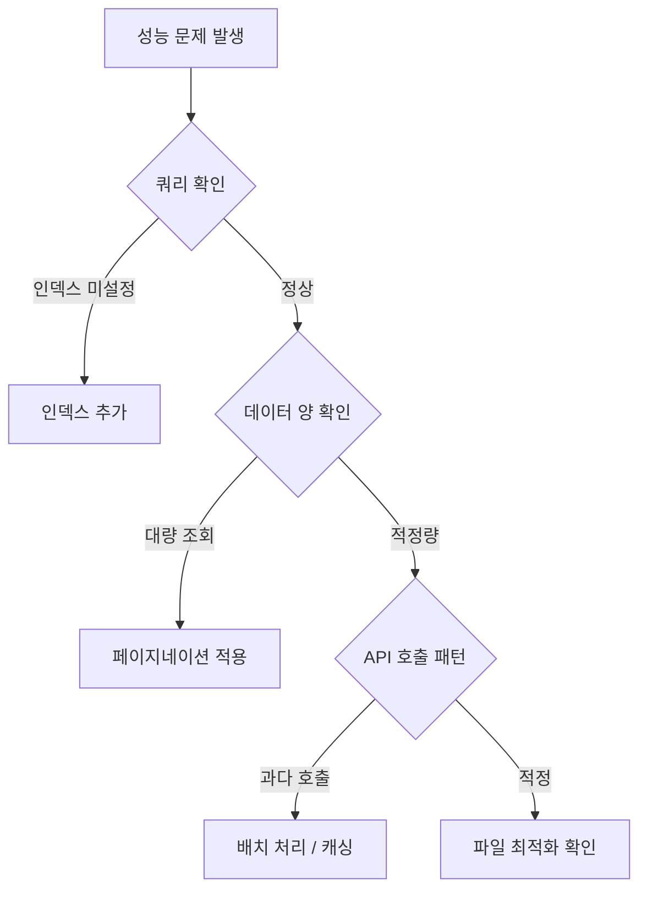

# 성능 문제 해결


💡 bkend API의 성능 문제를 진단하고 해결하는 방법을 안내합니다.


## 개요

API 응답이 느리거나 타임아웃이 발생하면 아래 진단 순서를 따르세요.



***

## 느린 쿼리 해결

### 원인: 인덱스 미설정

자주 필터링하는 필드에 인덱스가 없으면 전체 컬렉션을 스캔합니다.

**진단:**

```bash
# 필터링하는 필드 확인
curl -X GET "https://api-client.bkend.ai/v1/data/posts?andFilters[status]=published" \
  -H "Authorization: Bearer {api_key}" \
  -H "X-Project-Id: {project_id}" \
  -H "X-Environment: dev"
```

응답이 느리다면 `status` 필드에 인덱스를 추가하세요.

**해결:**

콘솔 또는 MCP 도구에서 인덱스를 추가하세요.

```json
{
  "name": "idx_status",
  "fields": { "status": 1 }
}
```

### 인덱스 추가 권장 필드

| 상황 | 추가할 인덱스 |
|------|-------------|
| 상태별 필터링 | `{ "status": 1 }` |
| 카테고리별 최신순 | `{ "category": 1, "createdAt": -1 }` |
| 사용자별 조회 | `{ "userId": 1 }` |
| 검색 + 정렬 | `{ "title": 1, "createdAt": -1 }` |

***

## 대량 데이터 조회

### 원인: 페이지네이션 미적용

`limit` 없이 조회하면 전체 데이터를 반환합니다.

**해결:**

```javascript
// ❌ 나쁜 예 — 전체 데이터 조회
const response = await fetch('/v1/data/posts');

// ✅ 좋은 예 — 페이지네이션 적용
const response = await fetch('/v1/data/posts?limit=20&offset=0');
```

### 권장 limit 값

| 데이터 유형 | 권장 limit |
|-----------|:---------:|
| 목록 페이지 | 10~20 |
| 무한 스크롤 | 20~50 |
| 검색 결과 | 10~20 |
| 자동완성 | 5~10 |

***

## API 호출 최적화

### 원인: 과다 API 호출

| 문제 패턴 | 해결 방법 |
|----------|---------|
| 루프 내 개별 API 호출 | 배치 처리로 1회 호출 |
| 동일 데이터 반복 조회 | 클라이언트 캐싱 적용 |
| 불필요한 필드 포함 | `fields` 파라미터로 필요한 필드만 선택 |

### 배치 처리

```javascript
// ❌ 나쁜 예 — 개별 삽입 (10번 호출)
for (const item of items) {
  await fetch('/v1/data/posts', {
    method: 'POST',
    body: JSON.stringify(item),
  });
}

// ✅ 좋은 예 — 배치 삽입 (1번 호출)
await fetch('/v1/data/posts', {
  method: 'POST',
  body: JSON.stringify(items), // 배열로 전달
});
```

***

## 파일 업로드 최적화

| 문제 | 해결 |
|------|------|
| 대용량 파일 업로드 실패 | 멀티파트 업로드 사용 |
| 이미지 로딩 느림 | WebP 형식 사용, 압축 후 업로드 |
| public 파일 느림 | CDN URL 사용 확인 |

***

## 환경별 성능 특성

| 환경 | 특성 | 참고 |
|------|------|------|
| `dev` | 기본 성능 | 개발 및 테스트용 |
| `staging` | dev와 동일 | 통합 테스트용 |
| `prod` | 프로덕션 최적화 | 실서비스용 |

***

## 성능 진단 체크리스트

- [ ] 필터링 필드에 인덱스가 설정되어 있는지 확인
- [ ] `limit`으로 조회 수를 제한하고 있는지 확인
- [ ] 불필요한 필드 없이 `fields`로 선택 조회하는지 확인
- [ ] 배치 처리로 API 호출을 최소화했는지 확인
- [ ] 자주 변경되지 않는 데이터를 캐싱하고 있는지 확인
- [ ] 대용량 파일에 멀티파트 업로드를 사용하는지 확인

***

## 다음 단계

- [성능 최적화 가이드](../guides/04-performance.md) — 상세 최적화 전략
- [필터링](../database/08-filtering.md) — 효율적인 쿼리 작성
- [공통 에러 코드](01-common-errors.md) — 에러 해결
