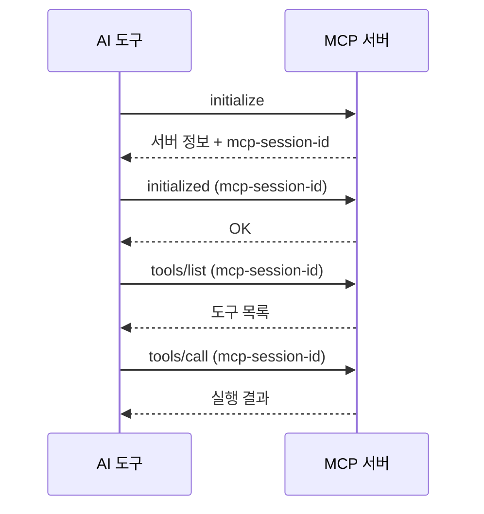
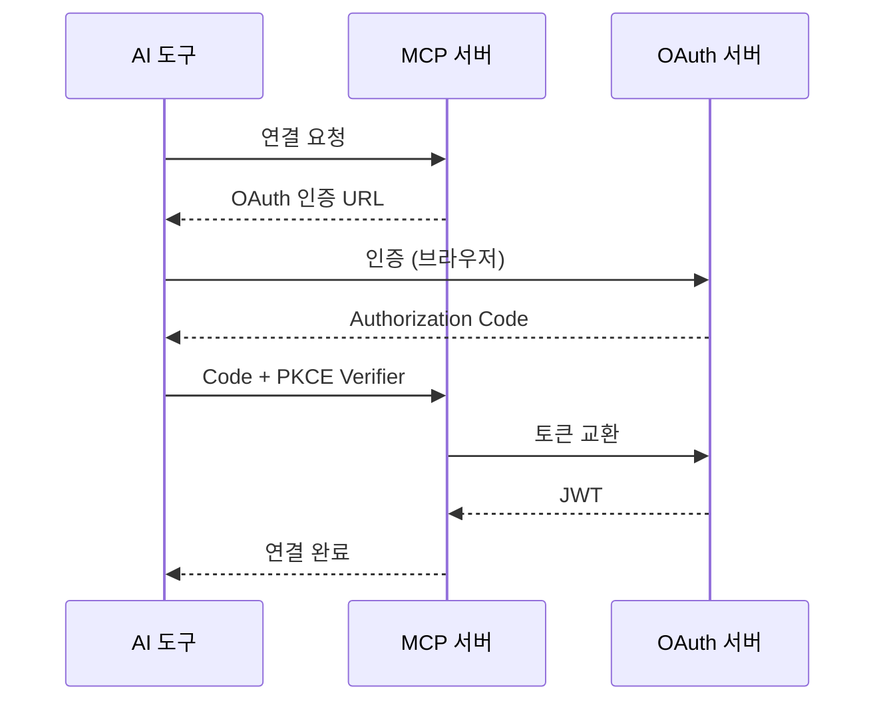

# MCP 프로토콜

> bkend MCP 서버의 프로토콜 구현과 통신 방식을 안내합니다.

## 개요

bkend MCP 서버는 [Model Context Protocol](https://spec.modelcontextprotocol.io/2025-03-26) 표준을 따릅니다. Streamable HTTP 전송 방식과 JSON-RPC 2.0 프로토콜을 사용하며, OAuth 2.1 + PKCE로 인증합니다.

---

## 프로토콜 사양

| 항목 | 스펙 |
|------|------|
| **전송 방식** | Streamable HTTP |
| **메시지 형식** | [JSON-RPC 2.0](https://www.jsonrpc.org/specification) |
| **인증** | [OAuth 2.1](https://datatracker.ietf.org/doc/html/draft-ietf-oauth-v2-1-12) + PKCE |
| **세션 관리** | `mcp-session-id` 헤더 |

---

## JSON-RPC 메서드

| 메서드 | 설명 | 세션 필수 |
|--------|------|:--------:|
| `initialize` | 클라이언트 초기화, 도구/리소스 로드 | - |
| `initialized` | 초기화 완료 알림 | ✅ |
| `tools/list` | 사용 가능한 도구 목록 조회 | ✅ |
| `tools/call` | 도구 실행 | ✅ |
| `resources/list` | 리소스 목록 조회 | ✅ |
| `resources/read` | 리소스 읽기 | ✅ |

---

## 세션 흐름



---

## 요청 형식

### initialize

```json
{
  "jsonrpc": "2.0",
  "id": 1,
  "method": "initialize",
  "params": {
    "protocolVersion": "2025-03-26",
    "capabilities": {},
    "clientInfo": {
      "name": "claude-code",
      "version": "1.0.0"
    }
  }
}
```

### tools/call

```json
{
  "jsonrpc": "2.0",
  "id": 2,
  "method": "tools/call",
  "params": {
    "name": "backend_table_list",
    "arguments": {
      "projectId": "{project_id}",
      "environment": "dev"
    }
  }
}
```

---

## 응답 형식

### 성공 응답

```json
{
  "jsonrpc": "2.0",
  "id": 2,
  "result": {
    "content": [
      {
        "type": "text",
        "text": "{\"items\": [...], \"pagination\": {...}}"
      }
    ],
    "isError": false
  }
}
```

### 에러 응답

```json
{
  "jsonrpc": "2.0",
  "id": 2,
  "error": {
    "code": -32602,
    "message": "Invalid parameters"
  }
}
```

---

## JSON-RPC 에러 코드

| 코드 | 설명 |
|------|------|
| `-32700` | JSON 파싱 에러 |
| `-32600` | 잘못된 요청 형식 |
| `-32601` | 존재하지 않는 메서드 |
| `-32602` | 잘못된 파라미터 |
| `-32603` | 내부 에러 |
| `-32001` | 인증 실패 |
| `-32002` | 리소스를 찾을 수 없음 |

---

## 인증 흐름

MCP 서버 연결 시 OAuth 2.1 + PKCE 인증이 자동으로 수행됩니다.



---

## 스코프 (권한)

MCP 도구 실행 시 스코프에 따라 권한이 제어됩니다.

| 스코프 | 설명 |
|--------|------|
| `organization:read` | 조직 정보 조회 |
| `project:read` | 프로젝트 조회 |
| `project:create` | 프로젝트 생성 |
| `environment:read` | 환경 조회 |
| `environment:create` | 환경 생성 |
| `table:read` | 테이블 스키마 조회 |
| `table:create` | 테이블 생성 |
| `table:update` | 테이블 스키마 수정 |
| `table:delete` | 테이블 삭제 |
| `table:data:read` | 데이터 조회 |
| `table:data:create` | 데이터 생성 |
| `table:data:update` | 데이터 수정 |
| `table:data:delete` | 데이터 삭제 |

와일드카드 패턴도 지원합니다: `project:*`, `table:data:*`, `*:read`

---

## 관련 문서

- [API 개요](01-overview.md) — API 종류 소개
- [Database MCP 도구](03-db-tools.md) — Database 관련 도구
- [Auth MCP 도구](04-auth-tools.md) — Auth 관련 도구
- [Storage MCP 도구](05-storage-tools.md) — Storage 관련 도구
