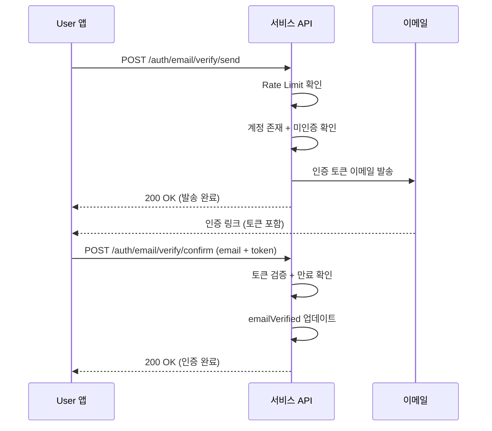

# 이메일 인증

> 회원가입 후 이메일 주소의 소유권을 확인하는 방법을 안내합니다.

## 개요

이메일 인증은 User가 입력한 이메일 주소가 실제로 본인 소유인지 확인하는 절차입니다. 인증 이메일에 포함된 토큰을 통해 소유권을 검증합니다.

---

## 인증 이메일 발송하기

### 요청

```bash
curl -X POST "https://api.bkend.ai/v1/auth/email/verify/send" \
  -H "x-project-id: {project_id}" \
  -H "x-environment: dev" \
  -H "Content-Type: application/json" \
  -d '{
    "email": "user@example.com",
    "callbackUrl": "https://myapp.com/verify"
  }'
```

### 파라미터

| 파라미터 | 타입 | 필수 | 설명 |
|---------|------|------|------|
| `email` | string | ✅ | 인증할 이메일 주소 |
| `callbackUrl` | string | - | 인증 완료 후 리다이렉트 URL |

### 응답 (200 OK)

```json
{
  "message": "이메일 인증 링크를 발송했습니다",
  "email": "user@example.com"
}
```

---

## 인증 확인하기

이메일에 포함된 토큰으로 인증을 완료합니다.

### 요청

```bash
curl -X POST "https://api.bkend.ai/v1/auth/email/verify/confirm" \
  -H "x-project-id: {project_id}" \
  -H "x-environment: dev" \
  -H "Content-Type: application/json" \
  -d '{
    "email": "user@example.com",
    "token": "{verification_token}"
  }'
```

### 파라미터

| 파라미터 | 타입 | 필수 | 설명 |
|---------|------|------|------|
| `email` | string | ✅ | 인증할 이메일 주소 |
| `token` | string | ✅ | 이메일로 받은 인증 토큰 |

### 응답 (200 OK)

```json
{
  "message": "이메일이 인증되었습니다",
  "verified": true
}
```

---

## 인증 이메일 재발송하기

인증 이메일을 받지 못했거나 토큰이 만료된 경우 재발송할 수 있습니다.

### 요청

```bash
curl -X POST "https://api.bkend.ai/v1/auth/email/verify/resend" \
  -H "x-project-id: {project_id}" \
  -H "x-environment: dev" \
  -H "Content-Type: application/json" \
  -d '{
    "email": "user@example.com",
    "callbackUrl": "https://myapp.com/verify"
  }'
```

### 응답 (200 OK)

```json
{
  "message": "이메일 인증 링크를 재발송했습니다",
  "email": "user@example.com"
}
```

---

## 처리 흐름



---

## Rate Limit

이메일 인증 API는 남용 방지를 위해 요청 횟수를 제한합니다.

| 항목 | 값 |
|------|-----|
| 요청 제한 | 1시간당 3회 |
| 차단 기간 | 2시간 |

> ⚠️ **주의** - Rate Limit 초과 시 2시간 동안 해당 이메일로의 인증 요청이 차단됩니다.

---

## 에러 응답

| 에러 코드 | HTTP 상태 | 설명 |
|----------|----------|------|
| `auth/verification-token-not-found` | 400 | 인증 토큰을 찾을 수 없음 |
| `auth/verification-token-expired` | 400 | 만료된 인증 토큰 |
| `auth/email-already-verified` | 400 | 이미 인증된 이메일 |
| `auth/account-not-found` | 404 | 계정을 찾을 수 없음 |
| `auth/too-many-requests` | 429 | 요청 횟수 초과 |
| `auth/invalid-email` | 400 | 유효하지 않은 이메일 형식 |
| `auth/invalid-url` | 400 | 유효하지 않은 callbackUrl 형식 |

---

## 관련 문서

- [이메일 회원가입](03-signup-email.md) — 회원가입 시 이메일 인증 흐름
- [비밀번호 재설정](05-password-reset.md) — 비밀번호 재설정
- [Auth 개요](01-overview.md) — Authentication 기능 소개
