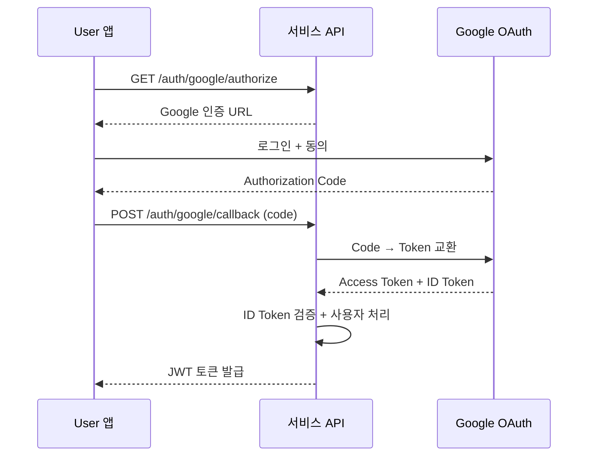

# Google 로그인

> Google OAuth 2.0을 설정하고 Google 계정으로 로그인하는 방법을 안내합니다.

## 개요

Google 로그인은 [OAuth 2.0](https://datatracker.ietf.org/doc/html/rfc6749) 프로토콜을 사용합니다. User는 Google 계정으로 별도 회원가입 없이 로그인할 수 있습니다.

---

## 사전 준비

### Google Cloud Console 설정

1. [Google Cloud Console](https://console.cloud.google.com/)에서 프로젝트를 생성하세요.
2. **API 및 서비스** > **사용자 인증 정보**로 이동하세요.
3. **사용자 인증 정보 만들기** > **OAuth 클라이언트 ID**를 클릭하세요.
4. 애플리케이션 유형을 선택하세요 (웹 애플리케이션).
5. **승인된 리디렉션 URI**에 bkend 콜백 URL을 추가하세요.
6. **Client ID**와 **Client Secret**을 복사하세요.

### bkend 콘솔 설정

1. 콘솔에서 **Auth** > **소셜 로그인**으로 이동하세요.
2. **Google**을 선택하세요.
3. **Client ID**와 **Client Secret**을 입력하세요.
4. 표시된 **Redirect URI**를 Google Cloud Console에 등록하세요.
5. **활성화** 토글을 켜세요.

---

## 인증 흐름



---

## API로 로그인하기

### 1단계: 인증 URL 요청

```bash
curl -X GET "https://api.bkend.ai/v1/auth/google/authorize?redirect=https://myapp.com/callback" \
  -H "x-project-id: {project_id}" \
  -H "x-environment: dev"
```

### 2단계: 콜백 처리

```bash
curl -X POST "https://api.bkend.ai/v1/auth/google/callback" \
  -H "x-project-id: {project_id}" \
  -H "x-environment: dev" \
  -H "Content-Type: application/json" \
  -d '{
    "code": "{authorization_code}",
    "redirectUri": "https://myapp.com/callback"
  }'
```

### 응답 (200 OK)

```json
{
  "accessToken": "eyJhbGciOiJIUzI1NiIs...",
  "refreshToken": "eyJhbGciOiJIUzI1NiIs...",
  "tokenType": "Bearer",
  "expiresIn": 3600,
  "is_new_user": true
}
```

---

## Google 제공 정보

| Scope | 설명 |
|-------|------|
| `openid` | OpenID Connect 인증 |
| `email` | 이메일 주소 |
| `profile` | 이름, 프로필 이미지 |

Google ID Token에서 다음 정보를 가져옵니다:

| 필드 | 설명 |
|------|------|
| `sub` | Google 사용자 ID |
| `email` | 이메일 주소 |
| `email_verified` | 이메일 인증 여부 |
| `name` | 이름 |

---

## 에러 응답

| 에러 코드 | HTTP 상태 | 설명 |
|----------|----------|------|
| `auth/oauth-not-configured` | 400 | Google OAuth 미설정 |
| `auth/google-token-exchange-failed` | 400 | Code → Token 교환 실패 |
| `auth/google-id-token-invalid` | 400 | ID Token 검증 실패 |
| `auth/account-exists-different-provider` | 409 | 다른 방식으로 가입된 이메일 |

---

## 관련 문서

- [소셜 로그인 개요](07-social-overview.md) — 소셜 로그인 공통 흐름
- [GitHub 로그인](09-social-github.md) — GitHub OAuth 설정
- [계정 연동](14-user-profile.md) — 여러 소셜 계정 연결
