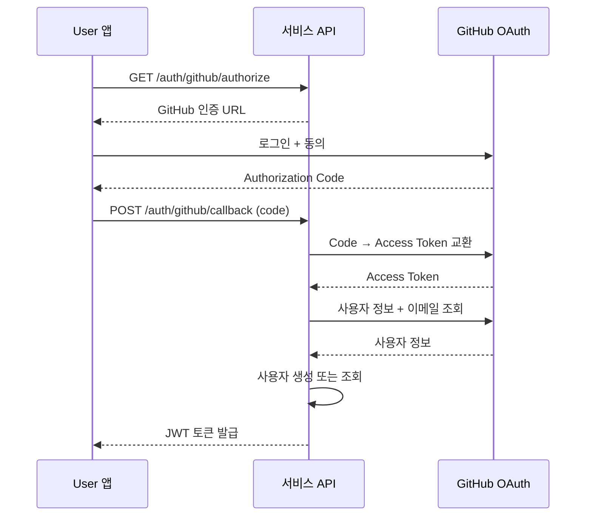

# GitHub 로그인

> GitHub OAuth를 설정하고 GitHub 계정으로 로그인하는 방법을 안내합니다.

## 개요

GitHub 로그인은 [OAuth 2.0](https://datatracker.ietf.org/doc/html/rfc6749) 프로토콜을 사용합니다. User는 GitHub 계정으로 별도 회원가입 없이 로그인할 수 있습니다.

---

## 사전 준비

### GitHub OAuth App 설정

1. [GitHub Developer Settings](https://github.com/settings/developers)로 이동하세요.
2. **OAuth Apps** > **New OAuth App**을 클릭하세요.
3. 다음 정보를 입력하세요:
   - **Application name**: 앱 이름
   - **Homepage URL**: 앱 URL
   - **Authorization callback URL**: bkend 콜백 URL
4. **Register application**을 클릭하세요.
5. **Client ID**를 확인하고, **Generate a new client secret**을 클릭하여 **Client Secret**을 생성하세요.

### bkend 콘솔 설정

1. 콘솔에서 **Auth** > **소셜 로그인**으로 이동하세요.
2. **GitHub**를 선택하세요.
3. **Client ID**와 **Client Secret**을 입력하세요.
4. 표시된 **Redirect URI**를 GitHub OAuth App에 등록하세요.
5. **활성화** 토글을 켜세요.

---

## 인증 흐름



---

## API로 로그인하기

### 1단계: 인증 URL 요청

```bash
curl -X GET "https://api.bkend.ai/v1/auth/github/authorize?redirect=https://myapp.com/callback" \
  -H "x-project-id: {project_id}" \
  -H "x-environment: dev"
```

### 2단계: 콜백 처리

```bash
curl -X POST "https://api.bkend.ai/v1/auth/github/callback" \
  -H "x-project-id: {project_id}" \
  -H "x-environment: dev" \
  -H "Content-Type: application/json" \
  -d '{
    "code": "{authorization_code}",
    "redirectUri": "https://myapp.com/callback"
  }'
```

### 응답 (200 OK)

```json
{
  "accessToken": "eyJhbGciOiJIUzI1NiIs...",
  "refreshToken": "eyJhbGciOiJIUzI1NiIs...",
  "tokenType": "Bearer",
  "expiresIn": 3600,
  "is_new_user": true
}
```

---

## GitHub 제공 정보

| Scope | 설명 |
|-------|------|
| `read:user` | 사용자 프로필 정보 읽기 |
| `user:email` | 이메일 주소 읽기 |

GitHub API에서 다음 정보를 가져옵니다:

| 필드 | 설명 |
|------|------|
| `id` | GitHub 사용자 ID |
| `login` | GitHub 사용자명 |
| `name` | 이름 |
| `email` | 기본 이메일 (비공개일 수 있음) |
| `avatar_url` | 프로필 이미지 URL |

> 💡 **Tip** - GitHub에서 이메일을 비공개로 설정한 경우, `user:email` scope를 통해 이메일 목록에서 primary 이메일을 가져옵니다.

---

## 에러 응답

| 에러 코드 | HTTP 상태 | 설명 |
|----------|----------|------|
| `auth/oauth-not-configured` | 400 | GitHub OAuth 미설정 |
| `auth/github-token-exchange-failed` | 400 | Code → Token 교환 실패 |
| `auth/github-user-info-failed` | 400 | 사용자 정보 조회 실패 |
| `auth/github-email-not-found` | 400 | 이메일을 찾을 수 없음 |
| `auth/account-exists-different-provider` | 409 | 다른 방식으로 가입된 이메일 |

---

## 관련 문서

- [소셜 로그인 개요](07-social-overview.md) — 소셜 로그인 공통 흐름
- [Google 로그인](08-social-google.md) — Google OAuth 설정
- [계정 연동](14-user-profile.md) — 여러 소셜 계정 연결
