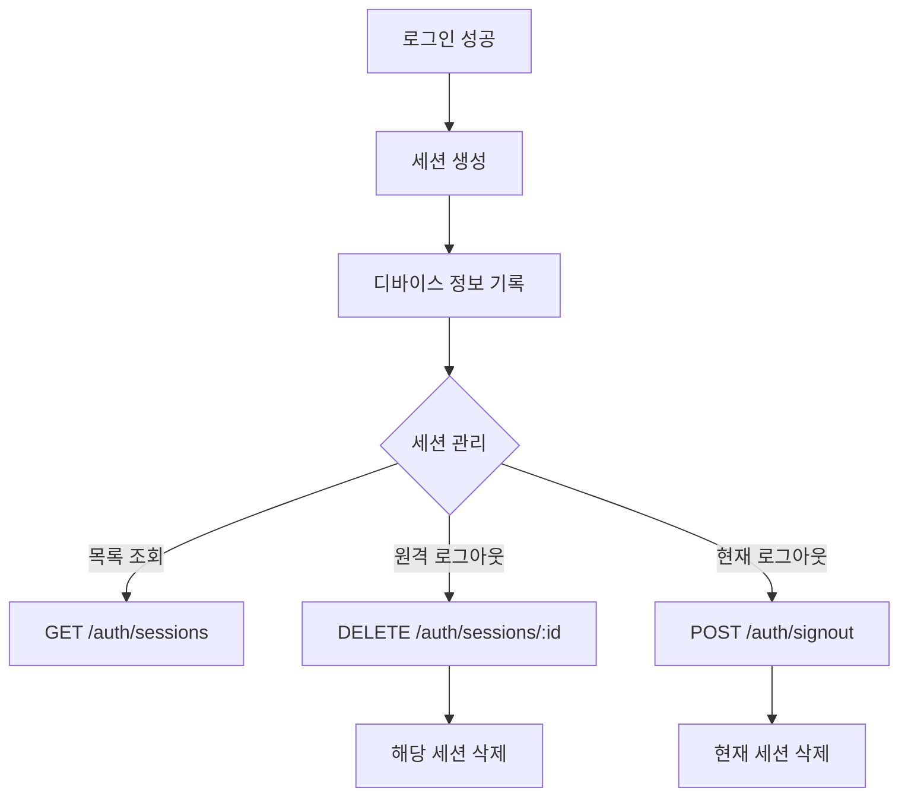

# 세션 관리

> 로그인 세션을 조회하고 관리하는 방법을 안내합니다.

## 개요

bkend는 User의 로그인 세션을 디바이스별로 추적합니다. 세션 목록을 조회하고, 특정 세션을 삭제(로그아웃)하거나, 현재 세션에서 로그아웃할 수 있습니다.

---

## 세션 목록 조회하기

### 요청

```bash
curl -X GET "https://api.bkend.ai/v1/auth/sessions?page=1&limit=10" \
  -H "x-project-id: {project_id}" \
  -H "x-environment: dev" \
  -H "Authorization: Bearer {accessToken}"
```

### 파라미터

| 파라미터 | 타입 | 필수 | 설명 |
|---------|------|------|------|
| `page` | number | - | 페이지 번호 (기본값: 1) |
| `limit` | number | - | 페이지당 항목 수 (기본값: 10) |

### 응답 (200 OK)

```json
{
  "items": [
    {
      "id": "session_abc123",
      "userId": "user_xyz789",
      "deviceInfo": {
        "userAgent": "Mozilla/5.0 (Macintosh; Intel Mac OS X 10_15_7)...",
        "ipAddress": "192.168.1.1",
        "deviceType": "desktop",
        "browser": "Chrome",
        "os": "macOS"
      },
      "lastActivityAt": "2024-01-15T10:30:00Z",
      "createdAt": "2024-01-10T08:00:00Z",
      "updatedAt": "2024-01-15T10:30:00Z"
    }
  ],
  "pagination": {
    "total": 3,
    "page": 1,
    "limit": 10
  }
}
```

### 디바이스 정보

| 필드 | 타입 | 설명 |
|------|------|------|
| `userAgent` | string | User-Agent 문자열 |
| `ipAddress` | string | 접속 IP 주소 |
| `fingerprint` | string | 디바이스 고유 식별값 |
| `deviceType` | string | 디바이스 타입 (desktop, mobile 등) |
| `browser` | string | 브라우저 이름 |
| `os` | string | 운영체제 |

---

## 특정 세션 삭제하기 (원격 로그아웃)

다른 디바이스의 세션을 삭제하여 원격으로 로그아웃할 수 있습니다.

### 요청

```bash
curl -X DELETE "https://api.bkend.ai/v1/auth/sessions/{sessionId}" \
  -H "x-project-id: {project_id}" \
  -H "x-environment: dev" \
  -H "Authorization: Bearer {accessToken}"
```

### 응답 (200 OK)

```json
{}
```

---

## 현재 세션 로그아웃하기

### 요청

```bash
curl -X POST "https://api.bkend.ai/v1/auth/signout" \
  -H "x-project-id: {project_id}" \
  -H "x-environment: dev" \
  -H "Authorization: Bearer {accessToken}"
```

### 응답 (200 OK)

```json
{}
```

> 💡 **Tip** - 로그아웃은 현재 세션만 삭제합니다. 다른 디바이스의 세션은 유지됩니다.

---

## 세션 관리 흐름



---

## 에러 응답

| 에러 코드 | HTTP 상태 | 설명 |
|----------|----------|------|
| `auth/unauthorized` | 401 | 인증되지 않은 요청 |
| `auth/session-not-found` | 404 | 세션을 찾을 수 없음 |
| `auth/session-expired` | 401 | 만료된 세션 |

---

## 관련 문서

- [JWT 토큰](12-jwt-tokens.md) — 토큰 구조와 만료 시간
- [토큰 갱신](13-refresh-tokens.md) — Refresh Token으로 세션 유지
- [Auth 개요](01-overview.md) — Authentication 기능 소개
