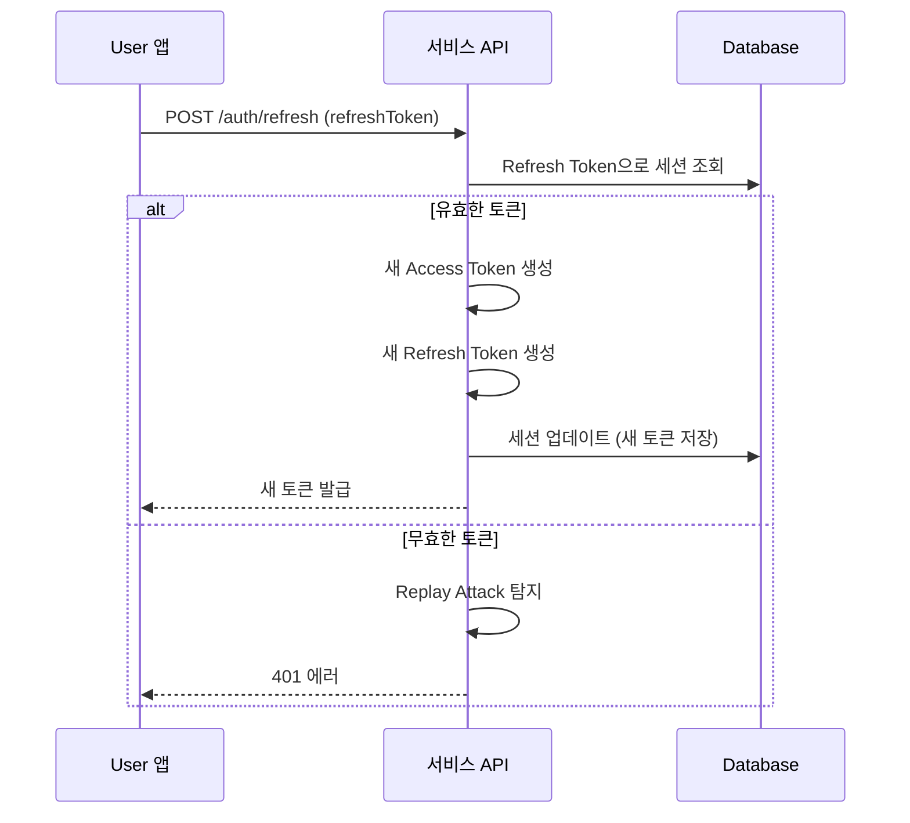

# 토큰 갱신

> Refresh Token으로 만료된 Access Token을 갱신하는 방법을 안내합니다.

## 개요

Access Token이 만료되면(1시간) Refresh Token을 사용하여 새 토큰을 발급받을 수 있습니다. Refresh Token의 유효 기간은 7일이며, 갱신 시 Access Token과 Refresh Token이 모두 새로 발급됩니다.

---

## 토큰 갱신하기

### 요청

```bash
curl -X POST "https://api.bkend.ai/v1/auth/refresh" \
  -H "x-project-id: {project_id}" \
  -H "x-environment: dev" \
  -H "Content-Type: application/json" \
  -d '{
    "refreshToken": "{refresh_token}"
  }'
```

### 파라미터

| 파라미터 | 타입 | 필수 | 설명 |
|---------|------|------|------|
| `refreshToken` | string | ✅ | 로그인 시 발급받은 Refresh Token |

### 응답 (200 OK)

```json
{
  "accessToken": "eyJhbGciOiJIUzI1NiIs...",
  "refreshToken": "eyJhbGciOiJIUzI1NiIs...",
  "tokenType": "Bearer",
  "expiresIn": 3600
}
```

> ⚠️ **주의** - 갱신 시 이전 Refresh Token은 즉시 무효화됩니다. 새로 발급받은 Refresh Token을 저장하세요.

---

## 토큰 갱신 흐름



---

## Replay Attack 방지

bkend는 Refresh Token Rotation을 적용하여 토큰 탈취를 방지합니다.

| 보안 메커니즘 | 설명 |
|-------------|------|
| **Token Rotation** | 갱신 시 새 Refresh Token 발급, 이전 토큰 무효화 |
| **Replay Detection** | 이미 사용된 Refresh Token으로 갱신 시도 시 탐지 |
| **Token Family** | 동일 세션의 토큰 체인 추적 |

> ❌ **위험** - 이미 사용된 Refresh Token으로 갱신을 시도하면, 보안을 위해 해당 세션의 모든 토큰이 무효화될 수 있습니다.

---

## 자동 갱신 구현 예시

```typescript
async function fetchWithAuth(url: string, options: RequestInit = {}) {
  let response = await fetch(url, {
    ...options,
    headers: {
      ...options.headers,
      'Authorization': `Bearer ${getAccessToken()}`,
      'x-project-id': PROJECT_ID,
    },
  });

  // Access Token 만료 시 자동 갱신
  if (response.status === 401) {
    const refreshResponse = await fetch(
      'https://api.bkend.ai/v1/auth/refresh',
      {
        method: 'POST',
        headers: {
          'Content-Type': 'application/json',
          'x-project-id': PROJECT_ID,
        },
        body: JSON.stringify({
          refreshToken: getRefreshToken(),
        }),
      }
    );

    if (refreshResponse.ok) {
      const tokens = await refreshResponse.json();
      saveAccessToken(tokens.accessToken);
      saveRefreshToken(tokens.refreshToken);

      // 원래 요청 재시도
      response = await fetch(url, {
        ...options,
        headers: {
          ...options.headers,
          'Authorization': `Bearer ${tokens.accessToken}`,
          'x-project-id': PROJECT_ID,
        },
      });
    }
  }

  return response;
}
```

---

## 에러 응답

| 에러 코드 | HTTP 상태 | 설명 |
|----------|----------|------|
| `auth/invalid-refresh-token` | 401 | 유효하지 않은 Refresh Token |
| `auth/session-expired` | 401 | 세션이 만료됨 (Refresh Token 7일 초과) |
| `auth/invalid-token-format` | 400 | 잘못된 토큰 형식 |

---

## 관련 문서

- [JWT 토큰](12-jwt-tokens.md) — 토큰 구조 상세
- [세션 관리](11-session-management.md) — 세션 관리 가이드
- [이메일 로그인](04-login-email.md) — 로그인으로 토큰 발급
