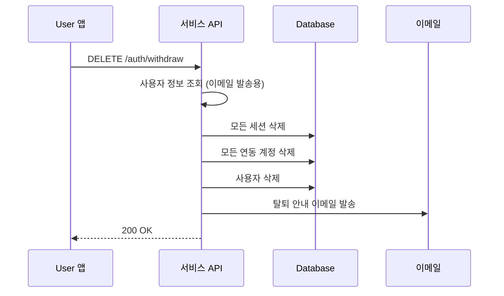

# 계정 삭제

> User 계정을 영구적으로 삭제(탈퇴)하는 방법을 안내합니다.

## 개요

User는 자신의 계정을 직접 삭제(탈퇴)할 수 있습니다. 계정 삭제 시 모든 세션, 연동된 소셜 계정, 사용자 정보가 영구적으로 삭제됩니다.

> ❌ **위험** - 계정 삭제는 되돌릴 수 없습니다. 삭제된 데이터는 복구할 수 없으니 신중하게 진행하세요.

---

## 계정 삭제하기

### 요청

```bash
curl -X DELETE "https://api.bkend.ai/v1/auth/withdraw" \
  -H "x-project-id: {project_id}" \
  -H "x-environment: dev" \
  -H "Authorization: Bearer {accessToken}"
```

### 응답 (200 OK)

```json
{}
```

---

## 삭제 처리 흐름



---

## 삭제되는 데이터

| 데이터 | 설명 |
|--------|------|
| **사용자 정보** | 이름, 이메일, 프로필 등 모든 개인정보 |
| **모든 세션** | 모든 디바이스의 로그인 세션 |
| **연동 계정** | 이메일 계정, 소셜 계정(Google, GitHub 등) 연동 정보 |
| **인증 토큰** | Access Token, Refresh Token 모두 무효화 |

> ⚠️ **주의** - User가 생성한 데이터(Database에 저장된 레코드 등)는 별도로 삭제되지 않습니다. 필요한 경우 계정 삭제 전에 데이터를 직접 삭제하세요.

---

## 계정 삭제 전 확인 사항

계정 삭제를 구현할 때 다음 사항을 고려하세요:

1. **확인 절차 추가** — User에게 삭제 의사를 한 번 더 확인하세요.
2. **데이터 백업** — 필요한 데이터가 있다면 삭제 전에 백업하세요.
3. **연동 해제** — 삭제 후에도 소셜 제공자 측에서 앱 연결이 남아있을 수 있습니다.

---

## 에러 응답

| 에러 코드 | HTTP 상태 | 설명 |
|----------|----------|------|
| `auth/unauthorized` | 401 | 인증되지 않은 요청 |

---

## 관련 문서

- [유저 프로필 관리](14-user-profile.md) — 프로필 조회 및 계정 연동
- [세션 관리](11-session-management.md) — 세션 관리 가이드
- [Auth 개요](01-overview.md) — Authentication 기능 소개
