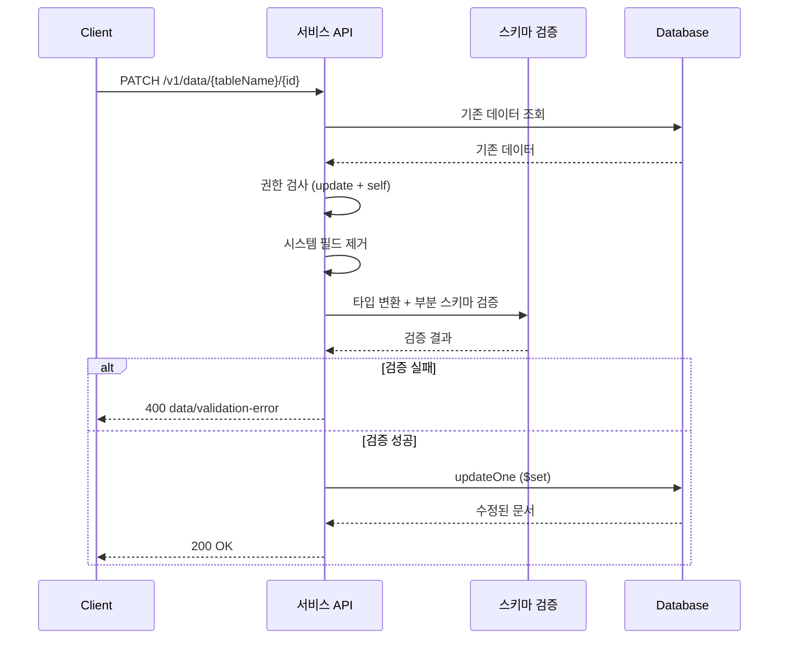

# 데이터 수정

> 테이블의 기존 데이터를 수정하는 방법을 안내합니다.

## 개요

데이터 수정(Update)은 기존 데이터의 특정 필드만 변경하는 **부분 수정(Partial Update)** 방식으로 동작합니다. 요청에 포함된 필드만 업데이트되고, 나머지 필드는 그대로 유지됩니다.

---

## 콘솔에서 수정하기

1. **Database** 메뉴에서 테이블을 선택하세요.
2. **Data** 탭에서 수정할 행을 클릭하세요.
3. 필드 값을 수정하세요.
4. **저장**을 클릭하세요.

---

## MCP 도구로 수정하기

AI 도구에서 자연어로 데이터를 수정할 수 있습니다:

```
"users 테이블에서 ID가 data_abc123인 데이터의 name을 '김철수'로, age를 25로 변경해줘"
```

---

## REST API로 수정하기

### 요청

```bash
curl -X PATCH "https://api.bkend.ai/v1/data/{tableName}/{id}" \
  -H "x-project-id: {project_id}" \
  -H "x-environment: dev" \
  -H "Authorization: Bearer {token}" \
  -H "Content-Type: application/json" \
  -d '{
    "name": "김철수",
    "age": 25
  }'
```

> 💡 **Tip** - 수정할 필드만 요청 본문에 포함하세요. 포함하지 않은 필드는 변경되지 않습니다.

### 응답 (200 OK)

```json
{
  "id": "data_550e8400-e29b-41d4-a716-446655440000",
  "name": "김철수",
  "email": "hong@example.com",
  "age": 25,
  "active": true,
  "createdBy": "user_abc123",
  "createdAt": "2026-02-06T10:00:00Z",
  "updatedAt": "2026-02-06T11:30:00Z"
}
```

---

## 파라미터

| 파라미터 | 위치 | 타입 | 필수 | 설명 |
|---------|------|------|------|------|
| `tableName` | path | string | ✅ | 테이블 이름 |
| `id` | path | string | ✅ | 데이터 ID |
| `{fields}` | body | object | ✅ | 수정할 필드와 값 |

---

## 필수 헤더

| 헤더 | 필수 | 설명 |
|------|------|------|
| `x-project-id` | ✅ | 프로젝트 ID |
| `x-environment` | - | 환경 이름 (기본값: `development`) |
| `Authorization` | ✅ | `Bearer {JWT 또는 Access Token}` |
| `Content-Type` | ✅ | `application/json` |

---

## 처리 흐름



1. **기존 데이터 조회** — 데이터 존재 여부 확인 및 `self` 권한 검사용 `createdBy` 확인
2. **권한 검사** — `update` 권한 확인, `self` 그룹이면 `createdBy === requesterId` 확인
3. **시스템 필드 제거** — 입력에서 시스템 필드 자동 제거
4. **타입 변환 + 부분 검증** — 수정할 필드만 스키마 검증 (필수 필드 누락은 에러가 아님)
5. **MongoDB 업데이트** — `$set` 연산자로 해당 필드만 수정, `updatedAt` 자동 갱신

---

## 자동 갱신 필드

| 필드 | 동작 |
|------|------|
| `updatedAt` | 수정 시 현재 시간으로 자동 갱신 |
| `createdBy` | 수정해도 변경되지 않음 (생성자 유지) |
| `createdAt` | 수정해도 변경되지 않음 |

---

## 에러 응답

| 에러 코드 | HTTP 상태 | 설명 | 해결 방법 |
|----------|----------|------|----------|
| `data/not-found` | 404 | 데이터를 찾을 수 없음 | ID를 확인하세요 |
| `data/validation-error` | 400 | 스키마 검증 실패 | 타입과 제약 조건을 확인하세요 |
| `data/duplicate-value` | 409 | 유니크 제약 위반 | 중복되지 않는 값을 입력하세요 |
| `data/permission-denied` | 403 | update 권한 없음 | 권한 설정을 확인하세요 |
| `data/table-not-found` | 404 | 테이블이 존재하지 않음 | 테이블 이름을 확인하세요 |

---

## 관련 문서

- [데이터 삽입](06-insert.md) — 데이터 추가
- [데이터 삭제](09-delete.md) — 데이터 삭제
- [데이터 조회](07-select.md) — 데이터 조회
- [제약 조건](05-constraints.md) — 필드 제약 조건
