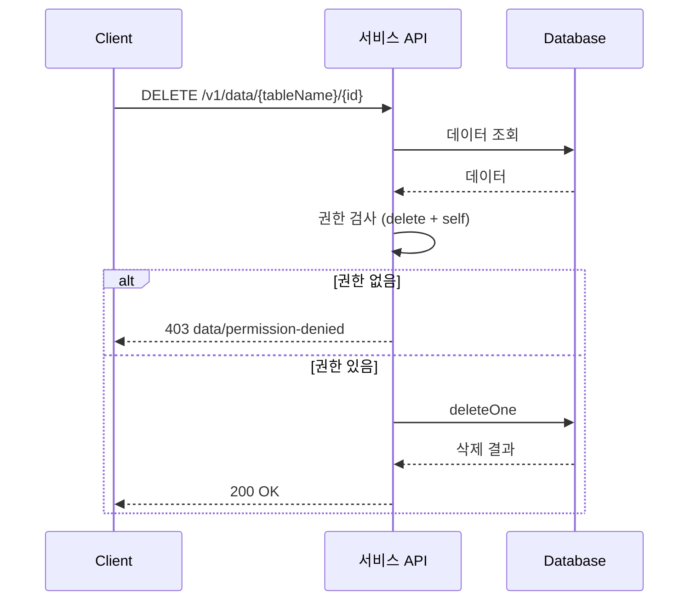

# 데이터 삭제

> 테이블의 데이터를 삭제하는 방법을 안내합니다.

## 개요

데이터 삭제(Delete)는 지정한 ID의 데이터를 영구적으로 제거합니다. 삭제된 데이터는 복구할 수 없으므로 신중하게 실행하세요.

---

## 콘솔에서 삭제하기

1. **Database** 메뉴에서 테이블을 선택하세요.
2. **Data** 탭에서 삭제할 행을 찾으세요.
3. 행의 **액션** 메뉴에서 **삭제**를 클릭하세요.
4. 확인 다이얼로그에서 **삭제**를 클릭하세요.

---

## MCP 도구로 삭제하기

AI 도구에서 자연어로 데이터를 삭제할 수 있습니다:

```
"users 테이블에서 ID가 data_abc123인 데이터를 삭제해줘"
```

---

## REST API로 삭제하기

### 요청

```bash
curl -X DELETE "https://api.bkend.ai/v1/data/{tableName}/{id}" \
  -H "x-project-id: {project_id}" \
  -H "x-environment: dev" \
  -H "Authorization: Bearer {token}"
```

### 응답 (200 OK)

```json
{
  "success": true
}
```

---

## 파라미터

| 파라미터 | 위치 | 타입 | 필수 | 설명 |
|---------|------|------|------|------|
| `tableName` | path | string | ✅ | 테이블 이름 |
| `id` | path | string | ✅ | 데이터 ID |

---

## 필수 헤더

| 헤더 | 필수 | 설명 |
|------|------|------|
| `x-project-id` | ✅ | 프로젝트 ID |
| `x-environment` | - | 환경 이름 (기본값: `development`) |
| `Authorization` | ✅ | `Bearer {JWT 또는 Access Token}` |

---

## 처리 흐름



1. **데이터 조회** — 삭제 대상 데이터의 존재 여부 확인 및 `createdBy` 확인
2. **권한 검사** — `delete` 권한 확인, `self` 그룹이면 본인 데이터인지 확인
3. **영구 삭제** — MongoDB에서 문서를 완전히 삭제

> ❌ **위험** - 삭제된 데이터는 복구할 수 없습니다. 삭제 전에 데이터를 확인하세요.

---

## 에러 응답

| 에러 코드 | HTTP 상태 | 설명 | 해결 방법 |
|----------|----------|------|----------|
| `data/not-found` | 404 | 데이터를 찾을 수 없음 | ID를 확인하세요 |
| `data/permission-denied` | 403 | delete 권한 없음 | 권한 설정을 확인하세요 |
| `data/table-not-found` | 404 | 테이블이 존재하지 않음 | 테이블 이름을 확인하세요 |

---

## 관련 문서

- [데이터 조회](07-select.md) — 데이터 조회
- [데이터 수정](08-update.md) — 데이터 수정
- [데이터 삽입](06-insert.md) — 데이터 추가
