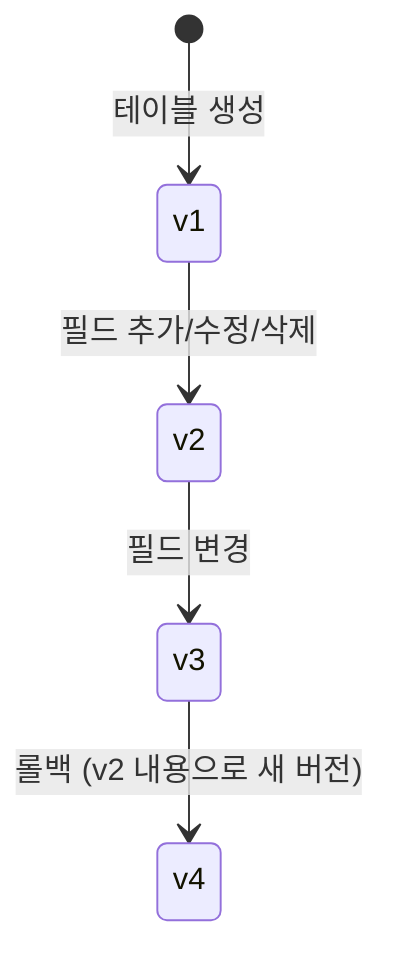

# 마이그레이션

> 스키마 버전 관리와 마이그레이션 방법을 안내합니다.

## 개요

bkend Database는 스키마와 인덱스 변경 이력을 버전 단위로 자동 관리합니다. 모든 변경은 새 버전으로 기록되며, 필요 시 이전 버전으로 롤백할 수 있습니다.

---

## 스키마 버전 관리

### 동작 방식



- 테이블 생성 시 스키마 버전 1(v1)이 생성됩니다
- 필드를 추가, 수정, 삭제할 때마다 새 버전이 생성됩니다
- 롤백은 이전 버전의 내용으로 **새 버전을 생성**하는 방식입니다 (이력 보존)

### 버전 정보

| 필드 | 타입 | 설명 |
|------|------|------|
| `version` | number | 버전 번호 (1부터 자동 증가) |
| `schema` | object | 해당 버전의 BSON 스키마 정의 |
| `isActive` | boolean | 현재 활성 버전 여부 |
| `createdBy` | string | 변경한 사용자 |
| `createdAt` | Date | 버전 생성 일시 |

---

## 필드 관리 (스키마 변경)

### 필드 추가

```bash
curl -X POST "https://api.bkend.ai/v1/projects/{project_id}/environments/{environment}/tables/{tableName}/fields/manage" \
  -H "Authorization: Bearer {your_token}" \
  -H "Content-Type: application/json" \
  -d '{
    "fieldsToAddOrUpdate": {
      "phone": { "bsonType": "string", "pattern": "^010-[0-9]{4}-[0-9]{4}$" },
      "address": { "bsonType": "object" }
    },
    "requiredFieldsToAdd": ["phone"]
  }'
```

### 필드 수정

기존 필드의 속성을 부분 업데이트합니다. 기존 속성은 유지되고 새 속성이 병합됩니다.

```bash
curl -X POST "https://api.bkend.ai/v1/projects/{project_id}/environments/{environment}/tables/{tableName}/fields/manage" \
  -H "Authorization: Bearer {your_token}" \
  -H "Content-Type: application/json" \
  -d '{
    "fieldsToAddOrUpdate": {
      "name": { "maxLength": 200 }
    }
  }'
```

### 필드 삭제

```bash
curl -X POST "https://api.bkend.ai/v1/projects/{project_id}/environments/{environment}/tables/{tableName}/fields/manage" \
  -H "Authorization: Bearer {your_token}" \
  -H "Content-Type: application/json" \
  -d '{
    "fieldsToRemove": ["phone", "address"]
  }'
```

> ⚠️ **주의** - 필드를 삭제하면 해당 필드가 `required` 목록에서도 자동으로 제거됩니다.

### 응답

```json
{
  "_id": "tbl_abc123",
  "projectId": "{project_id}",
  "environment": "dev",
  "tableName": "users",
  "schemaVersion": 3,
  "previousVersion": 2,
  "schema": { ... },
  "appliedFields": {
    "added": ["phone", "address"],
    "updated": [],
    "removed": []
  },
  "appliedRequired": {
    "added": ["phone"],
    "removed": []
  },
  "updatedAt": "2026-02-06T10:00:00Z"
}
```

---

## 파라미터

| 파라미터 | 타입 | 설명 |
|---------|------|------|
| `fieldsToAddOrUpdate` | object | 추가하거나 수정할 필드 (필드명 → 스키마) |
| `fieldsToRemove` | string[] | 삭제할 필드명 목록 |
| `requiredFieldsToAdd` | string[] | 필수로 설정할 필드명 목록 |
| `requiredFieldsToRemove` | string[] | 필수 해제할 필드명 목록 |

---

## 콘솔에서 버전 관리하기

1. **Database** 메뉴에서 테이블을 선택하세요.
2. **Schema** 탭으로 이동하세요.
3. 스키마 버전 이력을 확인할 수 있습니다.
4. 이전 버전을 선택하고 **롤백**을 클릭하면 해당 버전의 스키마로 복원됩니다.

---

## 스키마 롤백

특정 버전의 스키마로 롤백합니다. 롤백은 이전 버전의 내용을 복사한 **새 버전**을 생성하므로, 이력이 보존됩니다.

### 요청

```bash
curl -X POST "https://api.bkend.ai/v1/projects/{project_id}/environments/{environment}/tables/{tableName}/schema/rollback" \
  -H "Authorization: Bearer {your_token}" \
  -H "Content-Type: application/json" \
  -d '{
    "targetVersion": 2
  }'
```

### 롤백 흐름


> 💡 **Tip** - 롤백 후에도 v3, v4, v5 버전 이력은 그대로 보존됩니다. 필요하면 다시 다른 버전으로 롤백할 수 있습니다.

---

## 인덱스 버전 관리

인덱스 변경도 스키마와 동일하게 버전 관리됩니다. 인덱스 추가, 수정, 삭제 시 새 버전이 생성됩니다.

콘솔의 **Indexes** 탭에서 인덱스 버전 이력을 확인하고 롤백할 수 있습니다.

---

## 검증 규칙

필드 관리 시 다음 규칙이 적용됩니다:

| 규칙 | 설명 |
|------|------|
| 충돌 방지 | 같은 필드를 `fieldsToAddOrUpdate`와 `fieldsToRemove`에 동시에 포함할 수 없습니다 |
| Required 충돌 방지 | 같은 필드를 `requiredFieldsToAdd`와 `requiredFieldsToRemove`에 동시에 포함할 수 없습니다 |
| 시스템 필드 보호 | `_id`, `createdBy`, `createdAt`, `updatedAt` 등 시스템 필드는 수정/삭제할 수 없습니다 |

---

## 에러 응답

| 에러 코드 | 설명 |
|----------|------|
| `FIELD_CONFLICT` | 추가/수정과 삭제에 같은 필드가 포함됨 |
| `REQUIRED_CONFLICT` | required 추가와 삭제에 같은 필드가 포함됨 |
| `SYSTEM_FIELD_PROTECTED` | 시스템 필드를 수정/삭제하려고 함 |
| `table/schema-version-not-found` | 롤백 대상 버전이 존재하지 않음 |

---

## 관련 문서

- [테이블 생성](03-create-table.md) — 테이블 생성 시 스키마 정의
- [컬럼 타입](04-column-types.md) — 필드 타입 상세
- [제약 조건](05-constraints.md) — 필드 제약 조건
- [인덱스 & 성능](14-indexes.md) — 인덱스 버전 관리
