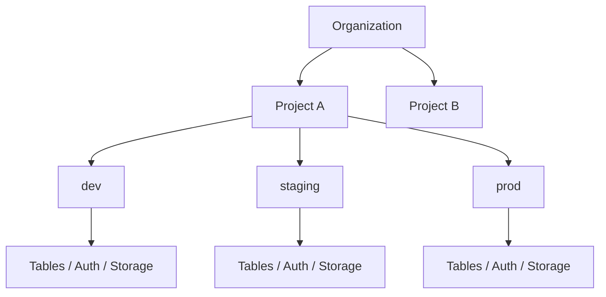
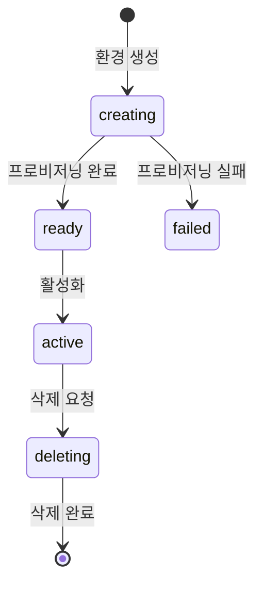

# Organization & Project

> bkend의 리소스 계층 구조인 Organization, Project, Environment를 이해합니다.

## 개요

bkend는 **Organization → Project → Environment** 계층 구조로 리소스를 관리합니다. 이 구조를 통해 팀 단위 협업, 서비스별 분리, 환경별 데이터 격리를 제공합니다.



---

## Organization

### Organization이란?

Organization은 bkend의 **최상위 리소스 단위**입니다. 팀 또는 회사 단위로 생성하며, 결제와 멤버 관리의 기본 단위가 됩니다.

### Organization 속성

| 속성 | 타입 | 설명 |
|------|------|------|
| `name` | string | 조직 표시 이름 (최대 100자) |
| `slug` | string | URL 식별자 (3-50자, 소문자/숫자/하이픈, 고유) |
| `displayName` | string | 표시 이름 (선택) |
| `description` | string | 조직 설명 (최대 1,000자) |
| `plan` | enum | 요금제 (FREE, STARTER, GROWTH, ENTERPRISE) |
| `status` | enum | 상태 (ACTIVE, SUSPENDED, DELETED) |

### Organization 생성하기

1. bkend 콘솔에 로그인하세요.
2. **Create Organization** 버튼을 클릭하세요.
3. Organization 이름과 Slug를 입력하세요.
4. **Create** 버튼을 클릭하세요.

> ⚠️ **주의** - Slug는 생성 후 변경할 수 없습니다. URL에 사용되므로 신중하게 입력하세요.

### 멤버 관리

Organization에 팀 멤버를 초대하고 역할을 부여할 수 있습니다:

| 역할 | 프로젝트 생성 | 프로젝트 조회 | 멤버 초대 | 결제 관리 | Organization 삭제 |
|------|:----------:|:----------:|:--------:|:--------:|:---------------:|
| **Owner** | ✅ | ✅ | ✅ | ✅ | ✅ |
| **Admin** | ✅ | ✅ | ✅ | - | - |
| **Billing** | - | ✅ | - | ✅ | - |
| **Member** | - | ✅ | - | - | - |

> 💡 **Tip** - Organization을 생성한 사람이 자동으로 Owner가 됩니다. Owner는 반드시 1명 이상이어야 합니다.

---

## Project

### Project란?

Project는 Organization 하위의 **서비스 단위**입니다. 하나의 앱 또는 서비스에 해당하며, 독립적인 Database, Auth, Storage를 포함합니다.

### Project 속성

| 속성 | 타입 | 설명 |
|------|------|------|
| `name` | string | 프로젝트 이름 (최대 100자) |
| `slug` | string | URL 식별자 (3-50자, Organization 내 고유) |
| `description` | string | 프로젝트 설명 (최대 1,000자) |
| `primaryCloud` | enum | 클라우드 제공자 (AWS, GCP, AZURE) |
| `primaryRegion` | string | 주 리전 (예: `ap-northeast-2`) |
| `status` | enum | 상태 (ACTIVE, INACTIVE, DELETED) |

### Project 생성하기

1. Organization 페이지에서 **Projects** 메뉴로 이동하세요.
2. **Create Project** 버튼을 클릭하세요.
3. 프로젝트 이름, Slug, 리전, 클라우드를 설정하세요.
4. **Create** 버튼을 클릭하세요.

프로젝트 생성 시 **dev 환경**이 자동으로 프로비저닝됩니다.


### Project 설정

프로젝트 설정에서 다음 항목을 관리할 수 있습니다:

| 설정 | 설명 |
|------|------|
| `apiCallLimit` | API 호출 제한 |
| `webhookUrl` | Webhook URL |
| `allowedOrigins` | CORS 허용 도메인 |
| `ipWhitelist` | IP 화이트리스트 |
| `notificationEmail` | 알림 이메일 |

---

## Environment

### Environment란?

Environment는 프로젝트 내 **배포 환경**입니다. 각 환경은 독립된 데이터베이스, 스토리지, 인증 시스템을 가지며, 환경 간 데이터는 완전히 격리됩니다.

### Environment 유형

| 유형 | 설명 | 용도 |
|------|------|------|
| **DEV** | 개발 환경 | 개발 및 테스트 |
| **STAGING** | 스테이징 환경 | 배포 전 검증 |
| **PROD** | 운영 환경 | 실제 서비스 |
| **CUSTOM** | 커스텀 환경 | 특수 용도 |

### Environment 속성

| 속성 | 타입 | 설명 |
|------|------|------|
| `name` | string | 환경 이름 (프로젝트 내 고유) |
| `type` | enum | 환경 유형 (DEV, STAGING, PROD, CUSTOM) |
| `cloud` | enum | 클라우드 제공자 |
| `region` | string | 리전 (기본: `ap-northeast-2`) |
| `deployment.status` | enum | 배포 상태 (creating, ready, active, failed, deleting) |

### 배포 상태



> ⚠️ **주의** - 환경을 삭제하면 해당 환경의 모든 데이터(테이블, User, 파일)가 영구 삭제됩니다. 이 작업은 되돌릴 수 없습니다.

---

## URL 구조

bkend 콘솔의 URL은 리소스 계층을 반영합니다:

```
https://console.bkend.ai/org/{org_slug}/project/{project_slug}
```

| URL 세그먼트 | 예시 | 설명 |
|-------------|------|------|
| `/org/{org_slug}` | `/org/my-startup` | Organization 페이지 |
| `/org/{org_slug}/projects` | `/org/my-startup/projects` | 프로젝트 목록 |
| `/org/{org_slug}/project/{project_slug}` | `/org/my-startup/project/my-app` | 프로젝트 대시보드 |
| `/org/{org_slug}/project/{project_slug}/database` | | Database 관리 |
| `/org/{org_slug}/project/{project_slug}/auth` | | Auth 관리 |
| `/org/{org_slug}/project/{project_slug}/storage` | | Storage 관리 |

---

## 자주 묻는 질문

### Organization을 여러 개 만들 수 있나요?

네, 한 계정으로 여러 Organization을 생성하거나 다른 Organization에 초대받을 수 있습니다.

### Project를 다른 Organization으로 옮길 수 있나요?

현재 프로젝트 이전 기능은 지원하지 않습니다. 🚧 확인 필요

### Environment 간 데이터를 복사할 수 있나요?

환경 간 데이터 복사는 직접 지원하지 않습니다. API를 통해 데이터를 내보내고 다른 환경에 가져오는 방식을 사용하세요.

---

## 관련 문서

- [핵심 개념](04-core-concepts.md) — bkend 전체 개념 이해
- [Tenant vs User](05-tenant-vs-user.md) — 사용자 유형 비교
- [환경 개요](../platform/01-environments.md) — 환경 관리 상세 가이드
- [팀 멤버 관리](../platform/07-team-management.md) — Organization 멤버 관리
- [결제 & 플랜](../platform/08-billing.md) — Organization 플랜 관리
