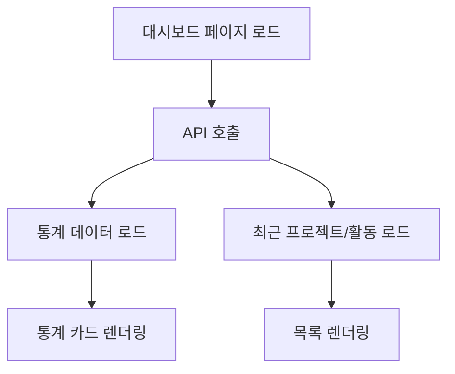

# 대시보드 사용법

> bkend 콘솔의 대시보드 위젯과 통계 화면을 활용하는 방법을 알아봅니다.

## 개요

bkend 콘솔은 Organization 대시보드와 Project 대시보드, 두 가지 대시보드를 제공합니다. 각 대시보드에서 리소스 현황, 최근 활동, 빠른 액션을 확인할 수 있습니다.

---

## Organization 대시보드

Organization을 선택하면 표시되는 홈 화면입니다.

### 빠른 통계 카드

화면 상단에 4개의 통계 카드가 표시됩니다:

| 카드 | 표시 내용 | 설명 |
|------|----------|------|
| **프로젝트** | 프로젝트 수 | Organization 내 전체 프로젝트 수 |
| **팀 멤버** | 멤버 수 | Organization에 속한 멤버 수 |
| **스토리지** | 사용량 | 전체 스토리지 사용량 |
| **테이블** | 테이블 수 | 전체 테이블 수 |

### 빠른 액션

다음 4개의 빠른 액션 버튼을 사용할 수 있습니다:

- **새 프로젝트 생성** — 프로젝트 생성 페이지로 이동합니다
- **팀 멤버 초대** — 멤버 초대 다이얼로그를 엽니다
- **프로젝트 목록 보기** — 전체 프로젝트 목록 페이지로 이동합니다
- **Organization 설정** — 설정 페이지로 이동합니다

### 최근 프로젝트

최대 6개의 최근 프로젝트가 카드 형태로 표시됩니다:

- 프로젝트 이름과 설명
- 리전 및 클라우드 정보
- 카드를 클릭하면 해당 프로젝트 대시보드로 이동합니다

### 최근 활동

Organization 내 최근 활동 로그가 시간순으로 표시됩니다:

- 이벤트 유형 (생성, 수정, 삭제 등)
- 활동 메시지
- 타임스탬프
- 페이지당 5개씩 표시되며, 다음/이전 버튼으로 탐색합니다

---

## Project 대시보드

프로젝트를 선택하면 표시되는 개요 화면입니다.

### 프로젝트 헤더

- 프로젝트 이름과 설명
- 프로젝트 ID (클릭하여 복사 가능)

### 빠른 통계 카드

| 카드 | 표시 내용 | 설명 |
|------|----------|------|
| **테이블** | 테이블 수 | 현재 환경의 테이블 수 |
| **스토리지** | 사용량 | 현재 환경의 스토리지 사용량 |
| **User** | 인증된 User 수 | 등록된 User 수 |

### 프로젝트 정보

| 항목 | 설명 |
|------|------|
| 리전 | 프로젝트의 배포 리전 |
| 클라우드 | 클라우드 제공자 (AWS, GCP 등) |
| 생성일 | 프로젝트 생성 날짜 |
| 환경 수 | 프로젝트 내 환경 수 |

### 빠른 액션

4개의 빠른 액션 카드를 통해 주요 기능에 바로 접근할 수 있습니다:

| 액션 | 이동 위치 | 설명 |
|------|----------|------|
| **Database 관리** | Database 페이지 | 테이블 생성, 데이터 조회 |
| **Authentication 관리** | Auth 페이지 | User 관리, 인증 설정 |
| **File Storage 관리** | Storage 페이지 | 파일 업로드, 버킷 관리 |
| **Environments 관리** | Environments 페이지 | 환경 생성, 전환 |

### MCP 연결 배너

페이지 상단에 MCP 연결 상태를 나타내는 배너가 표시됩니다:

- **연결됨** — MCP가 정상적으로 연결된 상태
- **미연결** — MCP 설정 안내와 함께 연결 가이드 링크가 제공됩니다

### 최근 활동

프로젝트 내 최근 3개의 활동이 표시됩니다. **모두 보기** 링크를 클릭하면 **Activities** 페이지로 이동합니다.

---

## 대시보드 데이터 흐름

> 💡 **Tip** - 대시보드의 데이터는 페이지 접근 시 자동으로 새로고침됩니다. 수동 새로고침이 필요하면 브라우저의 새로고침 버튼을 사용하세요.

---

## 환경별 데이터 확인하기

대시보드의 통계는 현재 선택된 환경의 데이터를 기반으로 합니다.

환경을 전환하려면:

1. TopBar의 **Environment 선택기**에서 원하는 환경을 선택하세요.
2. 대시보드의 모든 통계가 해당 환경의 데이터로 갱신됩니다.

> ⚠️ **주의** - dev 환경과 prod 환경의 데이터는 완전히 격리되어 있습니다. 환경을 전환하면 다른 데이터가 표시됩니다.

---

## 관련 문서

- [콘솔 화면 구성](03-console-overview.md) — 콘솔 전체 레이아웃 이해
- [환경 전환](../platform/02-env-switching.md) — 환경 전환 상세 가이드
- [사용량 분석](../platform/06-usage-analytics.md) — 상세 사용량 통계
- [모니터링 대시보드](../platform/05-monitoring.md) — 모니터링 기능
